# Introduction

Changes in local labor market conditions alter both the opportunity cost of schooling and the resources available for early-life investment, making the net effect on human capital theoretically ambiguous. A large literature documents the link between economic conditions and educational attainment: exposure to better employment opportunities tends to reduce schooling for students at the margin between completing an additional year of education and entering the labor force in the context of industry growth [@charles2015housing; @atkin2016endogenous], natural resource booms [@black2005tight; @emery2012long; @cascio2022needs; @kovalenko2023natural], and manpower shortages [@jaworski2014you].[^1]

Yet improved labor market conditions also increase parental wages and household resources, potentially raising early-life investments [@shah2017drought; @shah2021workfare]. In the presence of dynamic complementarities in skill formation, early investments increase the returns to subsequent educational inputs [@cunha2007technology; @heckman2007economics; @caucutt2020early; @johnson2019reducing]. Where child labor is prevalent, however, early investments that raise a child's productivity may increase the marginal return to work and ultimately reduce lifetime schooling [@edmonds2005child; @bau2020human; @malpede2025dark]. Which mechanism dominates depends on the child's age and productivity, and the structure of local labor markets. We exploit the large agricultural commodity boom triggered by World War I to trace how labor market shocks at different points in childhood shaped human capital accumulation over the subsequent three decades.

The agricultural boom of the 1910s was driven by global disruptions to production and trade caused by World War I. At the 1919 peak, cotton prices were 300 percent above their prewar average and farm wages had more than doubled. Regions differed in their exposure depending on prewar crop specialization and agro-climatic conditions. Following @jaremski2020banking, @kitchens2023impact, and @rajan2015anatomy, we construct a county-level index of crop revenue that combines pre-World War I output shares from the 1910 Census of Agriculture [@hainesAg] with annual international commodity prices [@carterHSUS]. Because quantities are fixed at prewar levels, the index captures variation in local revenue driven by global price movements rather than endogenous changes in local production.

We first document the short-run effects of the boom on schooling. To do this, we construct new county-level data on enrollment and average daily attendance for more than 20 states between 1910 and 1930, building on recent work documenting access to schooling in this period [@carruthers2017separate; @card2022intergenerational]. At the peak of the boom in 1919 and 1920, enrollment and average daily attendance reversed several years of growth associated with the high school movement.

We then examine long-run human capital outcomes using linked census data between 1910 and 1940 [@price2021combining]. For older children residing on farms in 1910 (with exposure averaged over ages 11 to 14), a doubling of the crop revenue index reduced completed schooling by 0.40 years for white men, 0.47 years for Black men, 0.27 years for white women, and 0.32 years for Black women, with effects concentrated in high school. For children aged 0 to 4 at exposure, the net effect of increased household resources on completed schooling depends on local child labor intensity. In 1910, child labor participation was substantial: approximately 18 percent of 10 to 14 year-olds reported a gainful occupation nationally, with shares considerably higher in agricultural counties. For boys, the direct effect of higher parental resources on completed schooling is statistically indistinguishable from zero once we account for child labor intensity, and the negative overall effect is driven by counties with high child labor. For girls, the direct effect is weakly positive and less sensitive to local child labor demand, consistent with lower opportunity costs for girls in agricultural labor markets.

Taken together, our estimates are consistent with a model in which higher wages raise the opportunity cost of schooling for older children, while for younger children, the interaction between increased household resources and child labor intensity determines whether early-life resource gains translate into higher completed schooling [@shah2017drought; @bau2020human].[^2] Even temporary labor demand expansions during periods of structural change can permanently reshape the distribution of human capital across cohorts and regions.

Our paper makes four contributions. First, we provide new evidence on the effects of local labor demand shocks on human capital accumulation during a period of rapid structural transformation [@goldin1998america; @goldin1999egalitarianism; @fiszbein2022agricultural]. The agricultural setting connects our work to research linking shocks to Southern agriculture with educational attainment [@baker2015field; @baker2020long]. The heterogeneity in our estimates, with larger responses for Black men and women, highlights how differences in opportunity costs and labor market access shaped long-run educational attainment.

Second, we contribute to the development economics literature on agricultural shocks and child labor [@bau2020human; @beegle2006child; @kruger2007coffee; @duryea2007effects]. While prior work focuses primarily on contemporaneous schooling and labor supply responses, we link early-life exposure to completed educational attainment decades later. In the spirit of [@bau2020human], our results provide evidence that local child labor intensity can attenuate or reverse the gains from additional household resources.

Third, we extend the literature on the domestic consequences of the world wars. Prior work has examined marriage and fertility [@abramitzky2011marrying; @vandenbroucke2014fertility; @kitchens2023impact], labor force participation [@boehnke2022missing; @gay2023intergenerational], and discrimination [@ferrara2024discrimination; @ang2026vanguard], but relatively little attention has been paid to educational attainment in the United States. Our findings complement research on World War II mobilization and skill upgrading [@jaworski2014you; @goldin1991role; @goldin2013shocking; @carrRosie2019; @lennon2023women; @ferrara2022world].

Finally, we contribute new data on the early twentieth-century expansion of American schooling. We construct a county-level panel of enrollment and average daily attendance from state education reports for more than 20 states between 1910 and 1930. These data reveal a sharp decline in enrollment and attendance at the peak of the boom in 1919 and 1920 that has not been previously documented. The decline reversed several years of sustained growth in enrollment associated with the high school movement, complementing previous work on this period [@goldin1998america; @carruthers2017separate; @card2022intergenerational; @bleemer2025changes; @doxey2022democratization].

# Investing in Human Capital {#sec:theory}

In this section, we describe a simple household model of human capital investment, drawing on @shah2017drought, that guides our empirical analysis of the World War I agricultural boom. The model highlights how wage shocks at different points in childhood generate competing effects on schooling. Then, following @bau2020human, we extend the framework to incorporate child labor, showing how the local intensity of child labor mediates these effects.

Households consist of one parent and one child. The parent makes consumption and investment decisions to maximize the lifetime utility of the family.[^3] Children live for three periods: in the first period, the child only consumes resources; in the second period, the child consumes resources and has time to either attend school or work; in the third period, the child works and receives a wage determined by their level of human capital. Household utility depends on consumption in the first two periods and on the child's terminal human capital: $$\begin{align*}
  U(c_1,c_2,e_3) = u_1(c_1)+\beta u_2(c_2)+\beta^2 e_3
\end{align*}$$ where $c_t$ is consumption, $e_t$ is the child's human capital in period $t$, and $\beta$ is a discount factor.

Income is determined by an exogenously given wage in each period, $w_t$, human capital of the parent, $h$, and human capital of the child in each period, $e_t$. In the first period, household income equals parent earnings, $w_1 h$, and households spend all income on consumption, $c_1 = w_1 h$. In the second period, the child spends $s_2$ time in school and the remainder of their time working. This means that income in the second period is $w_2[h+(1-s_2)e_2]$, which is available for consumption. The child's human capital evolves as follows: in the first period, $e_1=0$; in the second period, human capital depends on early-life consumption, $e_2=f_2(c_1)$; and in the third period, human capital depends on prior human capital, consumption, and schooling, $e_3=f_3(e_2, c_2, s_2)$. The link between $c_1$ and $e_2$ captures the idea that household resources during early childhood raise the child's later productivity. We assume that $f_2$ and $f_3$ are increasing and concave in each argument.

Since there are no choice variables in the first period, we consider the parent's problem starting in period 2. Substituting the budget constraint and the human capital production function into the objective yields: $$\begin{align*}
    \max\limits_{s_2\in[0,1]}u_2(c_2)+\beta f_3(e_2, c_2, s_2) \text{ s.t. } c_2\leq w_2[h+(1-s_2)e_2].
\end{align*}$$ At an interior solution ($c_2^*, s_2^*$), parents equate the marginal cost of schooling (forgone child earnings) with the discounted marginal benefit of additional human capital:[^4] $$\begin{align}
     w_2 e_2 \frac{\partial u_2}{\partial c_2} = \beta \underbrace{\left(\frac{\partial f_3}{\partial s_2}-w_2 e_2 \frac{\partial f_3}{\partial c_2} \right )}_{\Theta(w_2, e_2, c_2^*, s_2^*)}.
\end{align}$$

Our interest is in how the optimal schooling level, $s_2^*$, changes in response to wage increases at different points over the life cycle. Taking the total derivative of the first-order condition and solving for $\frac{\partial s_2^*}{\partial w_2}$:

$$\begin{align}
    \frac{\partial s_2^*}{\partial w_2} \propto 
    \underbrace{-e_2 \left(\frac{\partial u_2}{\partial c_2}+\beta \frac{\partial f_3}{\partial c_2} \right)}_\text{Substitution Effect (-)}
    - \underbrace{(h+ (1-s_2^*)e_2) w_2 e_2 \frac{\partial^2u_2}{\partial c_2^2}}_\text{Income Effect (+)} 
    + \underbrace{(h+ (1-s_2^*)e_2) \beta \frac{\partial \Theta}{\partial c_2}}_\text{Net Effect of $c_2$ on Schooling}
\end{align}$$

The net effect of higher wages on schooling for working-age children is ambiguous. Higher wages raise the opportunity cost of time in school (substitution effect), but they also increase household income, which reduces the marginal utility of consumption and makes forgone child earnings less costly (income effect). The third term is assumed to be positive if, as consumption increases and the marginal utility of consumption falls, schooling becomes a more productive way to generate human capital. Ultimately, the sign of $\frac{\partial s_2^*}{\partial w_2}$, and therefore the effect on lifetime human capital, depends on which channels dominate.

For young children, an increase in the period 1 wage unambiguously raises human capital in period 2, since $e_2 = f_2(c_1)$ and $c_1 = w_1 h$ ($\frac{\partial e_2^*}{\partial w_1}=h \frac{\partial f_2}{\partial c_1} > 0$). The question is how this early human capital gain affects the schooling decision in period 2. The effect of $w_1$ on $s_2^*$ operates through $\frac{\partial s_2^*}{\partial e_2}$: children with more human capital are more productive, which raises the return to work (substitution effect), but higher productivity also increases household income and may raise the return to further schooling through dynamic complementarities [@cunha2007technology; @heckman2007economics; @caucutt2020early]. Formally, $$\begin{align}
    \frac{\partial s_2^*}{\partial w_1} = h\frac{\partial f_2}{\partial c_1} \frac{\partial s_2^*}{\partial e_2}
\end{align}$$ $$\begin{align}
    \text{where}\hspace{.1in} \frac{\partial s_2^*}{\partial e_2}  \propto 
    \underbrace{-w_2 \frac{\partial u_2}{\partial c_2}}_\text{Substitution Effect (-)}
          - \underbrace{w_2^2 e_2 (1-s_2^*) \frac{\partial^2 u_2}{\partial c_2^2}}_\text{Income Effect (+)}
    + \beta \underbrace{\left[\frac{\partial \Theta}{\partial e_2} + w_2(1-s_2^*)\frac{\partial \Theta}{\partial c_2}\right]}_{\text{Net effect of $e_2$ on } \Theta}.
\end{align}$$

Increased human capital affects the optimal choice of schooling by making children more productive in the labor market. In settings where children are especially productive, such as in the cultivation of cacao and coffee [@dammert2008child; @bai2020returns], the literature has shown that the substitution effect is more likely to dominate. At the same time, higher human capital increases income, resulting in higher consumption, which reduces the marginal utility of consumption (income effect). Finally, higher human capital could make children better learners via dynamic complementarities, or through increased consumption at younger ages. Ex ante, these different channels lead to an ambiguous prediction. In our context, children in the early twentieth-century American South were similarly productive in cotton cultivation and other labor-intensive crops, making this a natural setting to test these predictions. Our empirical framework estimates $\frac{\partial s_2^*}{\partial w_1}$ and $\frac{\partial s_2^*}{\partial w_2}$ using variation in exposure to crop revenue shocks due to World War I.

@bau2020human extend this framework by allowing the return to child labor to vary across locations. In areas with high child labor intensity, the child's increased productivity from early human capital investment ($e_2$) translates more directly into higher child labor earnings, amplifying the substitution effect within $\frac{\partial s_2^*}{\partial e_2}$. This generates a testable prediction: in high-child-labor locations, the substitution effect is more likely to dominate the income and dynamic complementarity effects, so that early resource shocks reduce completed schooling. In low-child-labor locations, where children cannot easily convert higher productivity into labor market earnings, the income effect and dynamic complementarities are more likely to prevail, and early resource shocks should weakly increase schooling. In our empirical analysis, this prediction maps to the interaction between early exposure and local child labor intensity [\[eq:estimating_young\]](#eq:estimating_young){reference-type="eqref" reference="eq:estimating_young"}, while the effect of the boom on older children maps to equation [\[eq:estimating\]](#eq:estimating){reference-type="eqref" reference="eq:estimating"}.

# World War I and Agricultural Boom {#sec:background}

Following the assassination of Archduke Franz Ferdinand on June 28, 1914, World War I escalated with fighting that destroyed agricultural production in Europe, reallocated labor from farms to the battlefield, depleted inventories, and disrupted international trade flows [@hibbard1919effects; @nourse1924american; @tinley1942behavior]. As a result, the United States and Canada supplied much of the allies' foodstuffs rather than traditional trading partners such as Argentina, Australia, and Russia [@nourse1924american]. These forces led to large increases in the price of agricultural commodities. For example, cotton prices, at their 1919 peak, were 300 percent higher than the prewar average, while wheat prices were 260 percent higher than before the war.

**Figure 1: Agricultural Prices and Wages, 1910-1930**

Panel A: Agricultural Commodity Prices
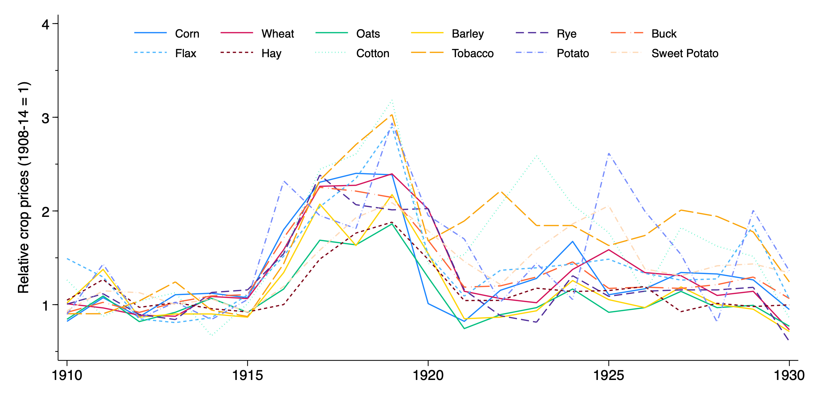

Panel B: Crop Revenue Index and Farm Wage Index
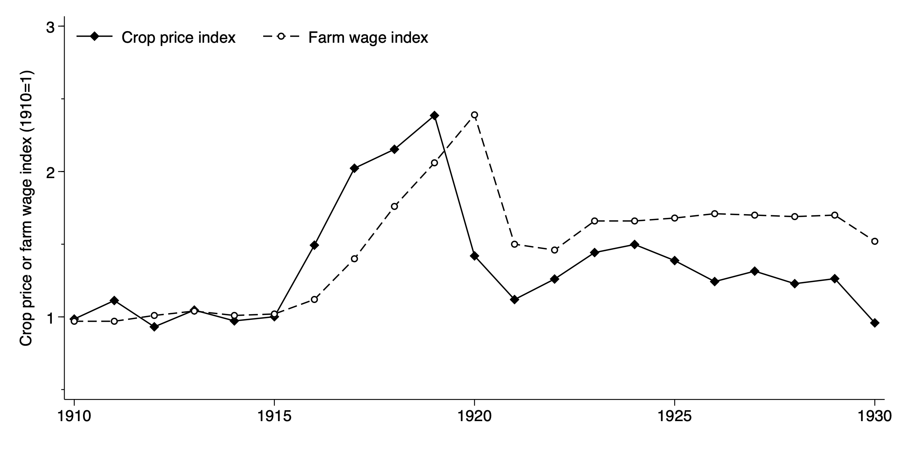

*Notes:* Panel A shows national prices for 12 crops used to construct the crop revenue index, relative to their 1908-1914 average. Panel B shows the crop revenue index and a farm wage index.

[\[fig:cropPrices\]](#fig:cropPrices){reference-type="ref+label" reference="fig:cropPrices"} shows prices for twelve agricultural commodities between 1910 and 1930, normalized to their 1908-1914 average. [\[fig:wageIndex\]](#fig:wageIndex){reference-type="ref+label" reference="fig:wageIndex"} plots the crop revenue index alongside a national farm wage index, confirming that wages closely tracked crop revenues over this period. The spike in agricultural prices also led to a substantial expansion of production: during the war, up to 50 million acres were brought into cultivation [@carterHSUS; @nourse1924american]. Wheat exports increased by approximately 30 percent by 1918; barley exports increased by over 350 percent. The boom increased demand for agricultural labor at all levels, including children, who were widely employed in cotton picking, tobacco cultivation, and other labor-intensive tasks.

Contemporary newspapers documented the connection between bumper crops, high prices, and labor scarcity. The *Birmingham Age-Herald* reported in January 1918 that "Bumper crops were produced in 1917 and Alabama's prosperity today is due in great measure to the large harvests and the high prices which the farmers received for their products. With still further increase in production the labor problem will become more acute" [@birminghamageherald1918]. The *Public Ledger* of Maysville, Kentucky similarly noted that "in 1917 there was an advance of farm wages over the figures of 1916 of an average of 24.2 per cent," attributing the increase to "the demand for labor and, of course, to high prices for farm products" [@publicledger1918].

Systematic county-level wage data do not exist for this period, so we construct indices of agricultural revenues to proxy for changes in local labor market conditions. We describe their construction in [4](#sec:data){reference-type="ref+label" reference="sec:data"}. At the peak of the boom in 1919, agricultural wages were 2.3 times their prewar level. Following the war, wages fell but remained elevated. [@kitchens2023impact] provide additional evidence that agricultural crop revenues track national wages and county-level retail sales.

# Data {#sec:data}

Our analysis draws on three main sources of data. First, we use county-level agricultural output data and national commodity prices to construct the measures of exposure to the agricultural boom described in [3](#sec:background){reference-type="ref+label" reference="sec:background"}. Second, we use individual-level data from complete count censuses of population linked across decades. Third, we construct a new county-level panel of school enrollment and average daily attendance from state education reports.

## Agricultural Revenue and Exposure Index

The crop revenue index and exposure index rely on two primary data sources. County-level output for twelve crops comes from the 1910 Census of Agriculture [@hainesAg], and annual national prices for each commodity come from @carterHSUS. The index is normalized by the average revenue calculated using prices from 1908 to 1914. The exposure index averages this county-level revenue measure over a time window corresponding to the ages at which each birth cohort experienced the boom.

To construct a measure of exposure to changes in local economic conditions across birth cohorts, we draw on previous work by @kitchens2023impact.[^5] The index combines county-level information on output for twelve crops from the 1910 Census of Agriculture [@hainesAg] with annual prices for each commodity from @carterHSUS. We normalize the annual county-level crop revenue by the average revenue using the average price, $\overline{P_i}$, from 1908 to 1914. Formally, the index is defined as: $$\begin{align}
    R_{ct} = \frac{\sum_{i=1}^{12} Q_{i,c,1910} \times P_{i,t}}{\sum_{i=1}^{12} Q_{i,c,1910} \times \overline{P_{i}}}
\end{align}$$ where $R_{ct}$ is the crop revenue index for county $c$ in year $t$, $Q_{i,c,1910}$ is the output of crop $i$ in county $c$ in 1910, and $P_{i,t}$ is the price of crop $i$ in year $t$. The index has several useful properties. First, by fixing output at 1910 levels, we prevent endogenous changes in crop patterns from entering the index. Second, prices are determined in international commodity markets and therefore do not reflect local economic conditions.[^6]

[1](#fig:AgIndexSpace){reference-type="ref+label" reference="fig:AgIndexSpace"} shows the variation over time and across counties in our crop revenue index. For example, the South (specialized in cotton and tobacco) experienced larger increases in the crop index at the peak in 1919 relative to the Midwest (specialized in wheat and oats) and the Great Plains (focused on livestock production). The regions most exposed to the boom, particularly the cotton South, were also home to the largest Black populations and had among the highest rates of child labor in the country. The boom thus fell disproportionately on agricultural families in the South, where Black children made up a substantial share of the farm labor force. Moreover, because boys and girls faced different opportunity costs in agricultural labor markets, with boys more likely to work in the fields and girls more likely to substitute for household labor or work in less physically demanding tasks, the boom may have altered schooling decisions differently by gender. After the war, in both 1924 and 1929, the cross-county variation in the index diminishes. The key source of identification is thus differential exposure across locations and cohorts driven by the wartime spike in international commodity prices.

**Figure 2: Crop Revenue Index by County, 1914-1929**

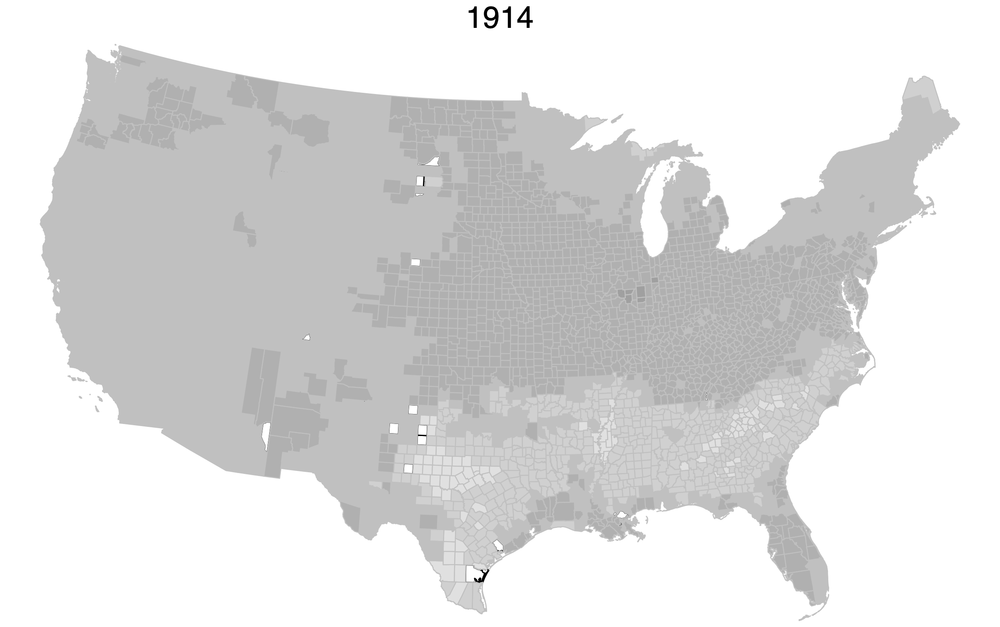 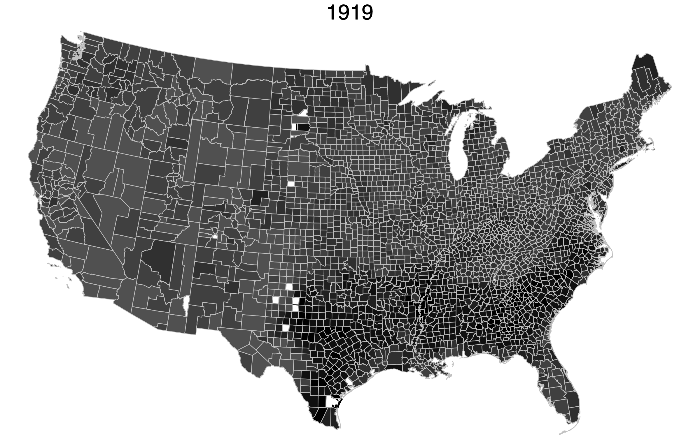

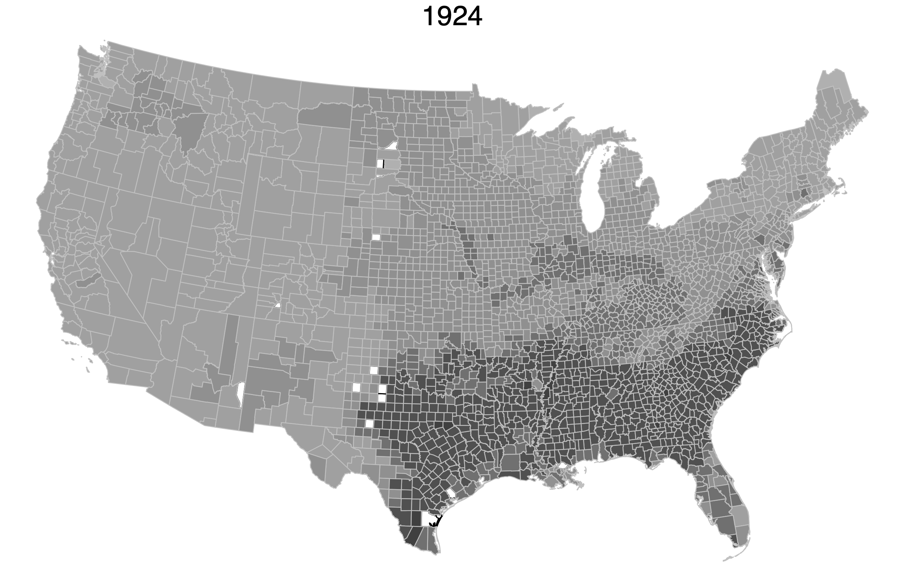 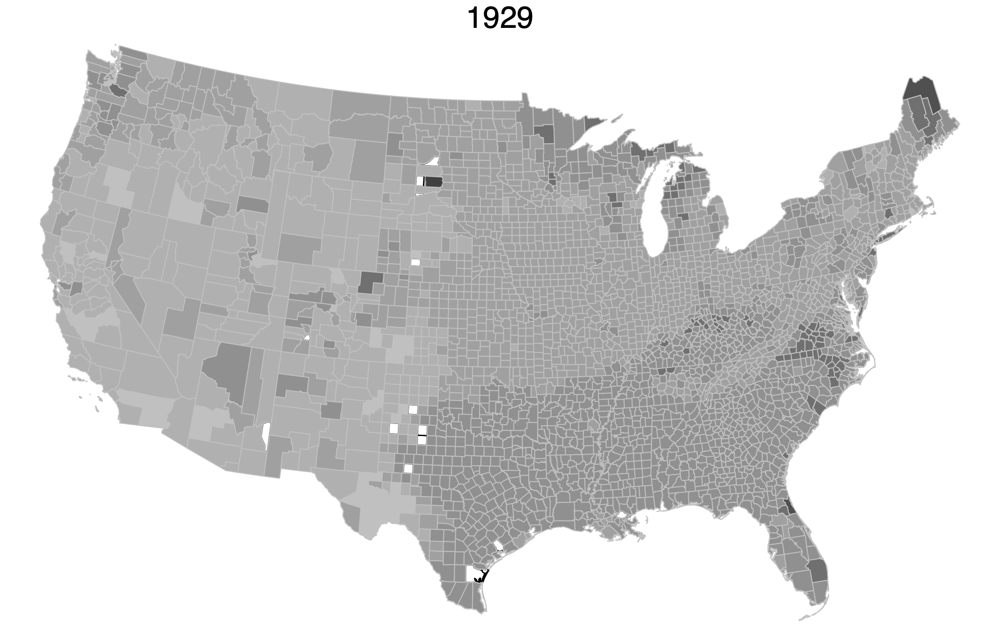

*Notes:* The figure shows four snapshots of the geographic variation in the crop index over a 15-year period. Darker shades indicate higher values of the crop revenue index.

Because the boom was temporary and regions differed in their crop specialization, individuals born in different years and living in different counties experienced distinct local economic conditions during childhood. We measure differential exposure of each cohort by averaging the agricultural index over a window of $T$ years starting at age $z$. For older cohorts, we average the index over ages 11 to 14, corresponding to the years when most individuals are at risk of completing or foregoing high school. For young children, we construct an analogous measure for ages 0 to 4, capturing the early-life resource shocks emphasized in [2](#sec:theory){reference-type="ref+label" reference="sec:theory"}. Our measure is similar in spirit to the measure of war mobilization described in @jaworski2014you. Formally, the exposure index is constructed according to: $$\begin{align}
    {E_{hc} = \frac{1}{T} \sum_{\tau=0}^{T-1} R_{c,h+z+\tau}}
\end{align}$$

The exposure index, $E_{hc}$, varies across counties through differences in prewar crop specialization and across cohorts through the timing of the wartime price spike. For a given county, children who were teenagers during the boom years faced elevated opportunity costs of schooling, while children who were infants experienced higher household resources during a critical period of early development. This variation allows us to estimate the competing effects of wage shocks at different ages formalized in [2](#sec:theory){reference-type="ref+label" reference="sec:theory"}.

## Linked Census Data

Outcome data are derived from the 1940 complete count of the Census of Population [@ruggles2024ipums]. The 1940 census only provides information on previous location based on state-of-birth. In order to better reflect exposure to local economic conditions during the World War I agricultural commodity price boom, we use information from @price2021combining to link individuals from the 1940 Census back to earlier census years when we can observe county-of-residence and therefore the probable location of exposure to changing economic conditions. In what follows, our empirical tests focus on two sets of cohorts that were living on farms when first observed.[^7] First, we focus on cohorts born between 1890 and 1910, using their 1910 Census record linked to 1940. These individuals would have been slightly older at the outbreak of World War I (ages 4 to 24). These older cohorts allow us to focus on the set of comparative statics that test changes in increasing wages during school age on lifetime human capital. Second, we focus on a slightly younger (and overlapping) set of cohorts born 1900 to 1920, linking their 1910 or 1920 Census record (whichever includes their first record) to 1940, which allows us to focus on comparative statics related to changes in household resources during early childhood (ages 0 to 4) and their effects on lifetime human capital.

## County-Level Enrollment and Attendance Data

For this project we collected and digitized annual and biennial state-level education reports for each state in the contiguous United States between 1910 and 1930, building on prior data collection efforts by @carruthers2017separate and [@card2022intergenerational]. Utilizing our newly collected data and prior sources, we construct an annual county-level panel dataset that reports total enrollment and average daily attendance for 26 (22) states respectively, as shown in [6](#fig:state_sample_ADA){reference-type="ref+label" reference="fig:state_sample_ADA"}.

## Additional Data

To further isolate the effect of the World War I agricultural boom from other factors, we draw on a variety of datasets to control for the role of potential confounds. Importantly, we use information on compulsory schooling laws and work restrictions specific to each cohort. As noted by @goldin2008mass, work restrictions and compulsory schooling reinforce one another with the former preventing entry into the work force and the latter mandating school attendance. We also include information on conscription during World War I as reported in the US Provost Marshall's report [see @kitchens2023impact]. Controlling for changes in the labor supply due to the draft is important for isolating the effect of wage changes attributable to the agricultural price variation rather than other constraints on labor supply.

Focusing on changes specific to the American South, we control for a variety of factors that influenced the agricultural economy. First, we control for the arrival date of the boll weevil, which altered the crop production mix, drawing on data from [@bloome2017tenancy]. Recent work by [@baker2015field] and [@baker2020long] highlights how the pest's arrival improved educational attainment in the cotton South by altering the crop mix towards less child-labor intensive crops (i.e., from cotton to peanuts). Second, we include measures to capture changes in the public health investments that may have changed the returns to schooling. Specifically, motivated by previous work on the relationship between health and human capital in the South [e.g., @bleakley2007disease; @bleakley2009economic; @hoehn2021long], we control for the initial hookworm rate, malaria rate, and the opening of public health clinics. We also consider the potential effects of exposure to the Spanish flu for a subset of counties in 35 states and DC as described in [@kitchens2023impact]. Finally, we also control for changes in the access to schools for Black children in the South stemming from the construction of schools funded by Julius Rosenwald [@aaronson2011impact; @aaronson2014fertility].

# Empirical Analysis

Our empirical strategy exploits variation in the exposure index across counties and birth cohorts to estimate the effect of the World War I agricultural boom on educational attainment. The exposure index varies across counties through differences in prewar crop specialization and across cohorts through the timing of the wartime price spike. We focus on two samples of individuals linked to the 1940 Census, where we observe completed years of schooling. The first sample links cohorts born 1890 to 1910 from the 1910 Census to 1940, capturing individuals who were of school age during the boom. The second links cohorts born 1900 to 1920 from the 1910 or 1920 Census (whichever includes their first record) to 1940, capturing individuals who experienced the boom during early childhood.

The theoretical model outlined in [2](#sec:theory){reference-type="ref+label" reference="sec:theory"} highlights the potential for different responses across the life cycle. Older children face a higher opportunity cost of schooling when agricultural wages rise, while younger children may benefit from increased household resources during a critical period of development. We begin by documenting descriptive patterns in enrollment and attendance before turning to regression estimates that exploit the exposure index to identify causal effects.

## Trends in Enrollment and Attendance

We first examine aggregate patterns in county-level enrollment and attendance to motivate the regression analysis that follows.

[\[fig:descriptive\]](#fig:descriptive){reference-type="ref+label" reference="fig:descriptive"} plots the natural log of county-level enrollment and average daily attendance, normalized to 1913, by quartile of the peak World War I boom. Throughout the sample period, both enrollment and average daily attendance grew rapidly, consistent with prior evidence [@goldin1998america]. By 1930, enrollment grew by approximately 0.10 to 0.23 log points and attendance by 0.20 to 0.43 log points relative to 1913, depending on the quartile of exposure. In 1919 and 1920, at the peak of the agricultural boom, enrollment and average daily attendance fell by approximately 0.05 to 0.08 log points below the 1913 baseline. The decline in enrollment and attendance is consistent with contemporary accounts of children being pulled from school during the boom. The *St. Tammany Farmer* of Covington, Louisiana reported in 1916 that "the authorities are giving leave for boys of eleven years old to be taken out of school and put to farm work" [@sttammanyfarmer1916]. Similarly, the *Edgefield Advertiser* in South Carolina urged that "another session should not be lost to many boys and girls who have attained the school age and yet are kept out of school, or what is equally as bad, allowed to remain out of school, by their parents" [@edgefieldadvertiser1916]. While these patterns are descriptive in nature, the sharp decline is stark. The decline around 1919 and 1920 is so sharp that it is difficult to separate the time effect from the change in the agricultural index. These aggregate data cannot address whether students who left school or stopped attending completed at a later date, or whether the age composition of the student body changed over time.

<figure id="fig:ada_desc" data-latex-placement="p">
<figure id="fig:enroll_desc">
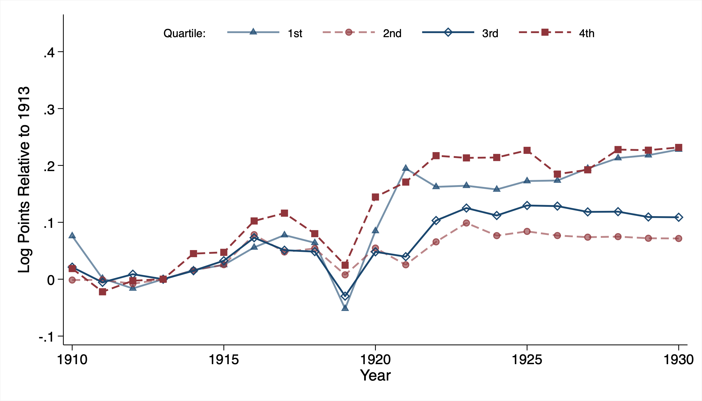
<figcaption>Enrollment</figcaption>
</figure>

 

<figure id="fig:ada_desc">
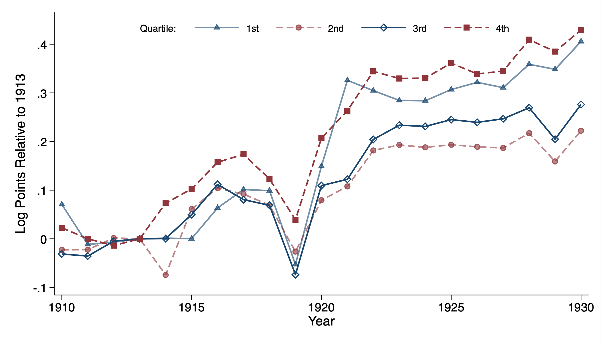
<figcaption>Daily Attendance</figcaption>
</figure>
<figcaption><em>Notes:</em> Panels A and B show average county-level enrollment and average daily attendance, normalized to 1913, across four groups based on the maximum of the 1919 agricultural boom. States included in the enrollment and attendance sample are shown in <a href="#fig:state_sample_ADA" data-reference-type="ref+label" data-reference="fig:state_sample_ADA">6</a>.</figcaption>
</figure>

## Opportunity Cost Channel

The theoretical model predicts that higher agricultural wages raise the opportunity cost of schooling for teenagers, reducing completed education. Our analysis begins by comparing educational attainment across individuals $i$ with year-of-birth $h$ and differential exposure to the agricultural boom based on residence in county $c$ in 1910. Formally, the estimating equation is given by: $$\begin{align}
\label{eq:estimating}
    Y_{ihc} = \beta E_{hc} + \mathbf{X}’_{ihc}\boldsymbol{\delta} + \mathbf{Z}’_c\boldsymbol{\lambda}_h + \alpha_c + \phi_h + \varepsilon_{ihc}
\end{align}$$ where $Y_{ihc}$ is years of schooling in 1940 for individual $i$ in birth cohort $h$ and county $c$, $E_{hc}$ is the exposure index defined in the previous section, $\mathbf{X}_{ihc}$ is a vector of parental characteristics measured in 1910, $\mathbf{Z}_c$ is a vector of county characteristics, $\alpha_c$ and $\phi_h$ are county and cohort fixed effects, respectively.[^8] The coefficient of interest, $\beta$, measures the response of years of schooling to changes in the local agricultural economy. The county characteristics in $\mathbf{Z}_c$ enter with cohort-specific coefficients $\boldsymbol{\lambda}_h$ to allow for differential trends across counties. Standard errors are clustered at the state level to allow arbitrary correlation across space and time, which is especially important given the spatial patterns of crop specialization [@conley2025standard].

The main concern that arises for the identification of $\beta$ is related to omitted variables. Omitted variables will introduce bias if there are additional factors that both affect educational attainment and are correlated with local economic conditions. Our exposure index is constructed to minimize this concern by using pre-World War I geographic variation in the crop distribution (in 1910) and focusing on variation in crop prices set in international commodity markets. In this way, we avoid relying on changes in local economic conditions (e.g., crop mix) in response to World War I-induced disruptions to global agriculture. In addition, we include cohort fixed effects to control for national changes in educational attainment and county fixed effects to net out time-invariant local factors.

In [1](#tab:main_results){reference-type="ref+label" reference="tab:main_results"}, we report our baseline estimates. We report estimates for white men in columns 1 through 3 of Panel A. Column 1 reports the estimate from a specification that includes only cohort and county fixed effects. We find that doubling the exposure index reduces educational attainment by 0.436 years of schooling; the estimate is statistically significant at the 1 percent level. The estimates in column 2 add parental characteristics, which reduces the estimated effect to 0.397. The estimates in column 3 include several potential confounds (i.e., boll weevil infestation, World War I inductions, public health conditions, Rosenwald school presence, and Prohibition). Controlling for these additional factors, we estimate that a doubling of the exposure index results in a 0.404 reduction in years of schooling.

::: {#tab:main_results}
+:------------------------------------------------------------------------------------------------------------------------------------------------------+:-----------------------------------------------------------------------------------------------------------------------------------------------------:+:-----------------------------------------------------------------------------------------------------------------------------------------------------:+:-----------------------------------------------------------------------------------------------------------------------------------------------------:+:-----------------------------------------------------------------------------------------------------------------------------------------------------:+:-----------------------------------------------------------------------------------------------------------------------------------------------------:+:-----------------------------------------------------------------------------------------------------------------------------------------------------:+
|                                                                                                                                                       | Men                                                                                                                                                                                                                                                                                                                                                                                                                                                                   | Women                                                                                                                                                                                                                                                                                                                                                                                                                                                                 |
+-------------------------------------------------------------------------------------------------------------------------------------------------------+-------------------------------------------------------------------------------------------------------------------------------------------------------+-------------------------------------------------------------------------------------------------------------------------------------------------------+-------------------------------------------------------------------------------------------------------------------------------------------------------+-------------------------------------------------------------------------------------------------------------------------------------------------------+-------------------------------------------------------------------------------------------------------------------------------------------------------+-------------------------------------------------------------------------------------------------------------------------------------------------------+
|                                                                                                                                                       | \(1\)                                                                                                                                                 | \(2\)                                                                                                                                                 | \(3\)                                                                                                                                                 | \(4\)                                                                                                                                                 | \(5\)                                                                                                                                                 | \(6\)                                                                                                                                                 |
+-------------------------------------------------------------------------------------------------------------------------------------------------------+-------------------------------------------------------------------------------------------------------------------------------------------------------+-------------------------------------------------------------------------------------------------------------------------------------------------------+-------------------------------------------------------------------------------------------------------------------------------------------------------+-------------------------------------------------------------------------------------------------------------------------------------------------------+-------------------------------------------------------------------------------------------------------------------------------------------------------+-------------------------------------------------------------------------------------------------------------------------------------------------------+
| *[Panel A: White]{.underline}*                                                                                                                        |                                                                                                                                                       |                                                                                                                                                       |                                                                                                                                                       |                                                                                                                                                       |                                                                                                                                                       |                                                                                                                                                       |
+-------------------------------------------------------------------------------------------------------------------------------------------------------+-------------------------------------------------------------------------------------------------------------------------------------------------------+-------------------------------------------------------------------------------------------------------------------------------------------------------+-------------------------------------------------------------------------------------------------------------------------------------------------------+-------------------------------------------------------------------------------------------------------------------------------------------------------+-------------------------------------------------------------------------------------------------------------------------------------------------------+-------------------------------------------------------------------------------------------------------------------------------------------------------+
| Exposure                                                                                                                                              | -0.436                                                                                                                                                | -0.397                                                                                                                                                | -0.404                                                                                                                                                | -0.223                                                                                                                                                | -0.254                                                                                                                                                | -0.274                                                                                                                                                |
+-------------------------------------------------------------------------------------------------------------------------------------------------------+-------------------------------------------------------------------------------------------------------------------------------------------------------+-------------------------------------------------------------------------------------------------------------------------------------------------------+-------------------------------------------------------------------------------------------------------------------------------------------------------+-------------------------------------------------------------------------------------------------------------------------------------------------------+-------------------------------------------------------------------------------------------------------------------------------------------------------+-------------------------------------------------------------------------------------------------------------------------------------------------------+
|                                                                                                                                                       | (0.130)                                                                                                                                               | (0.130)                                                                                                                                               | (0.089)                                                                                                                                               | (0.093)                                                                                                                                               | (0.092)                                                                                                                                               | (0.074)                                                                                                                                               |
+-------------------------------------------------------------------------------------------------------------------------------------------------------+-------------------------------------------------------------------------------------------------------------------------------------------------------+-------------------------------------------------------------------------------------------------------------------------------------------------------+-------------------------------------------------------------------------------------------------------------------------------------------------------+-------------------------------------------------------------------------------------------------------------------------------------------------------+-------------------------------------------------------------------------------------------------------------------------------------------------------+-------------------------------------------------------------------------------------------------------------------------------------------------------+
| Observations                                                                                                                                          | 4,228,438                                                                                                                                             | 3,888,223                                                                                                                                             | 3,888,223                                                                                                                                             | 3,033,169                                                                                                                                             | 2,760,954                                                                                                                                             | 2,760,954                                                                                                                                             |
+-------------------------------------------------------------------------------------------------------------------------------------------------------+-------------------------------------------------------------------------------------------------------------------------------------------------------+-------------------------------------------------------------------------------------------------------------------------------------------------------+-------------------------------------------------------------------------------------------------------------------------------------------------------+-------------------------------------------------------------------------------------------------------------------------------------------------------+-------------------------------------------------------------------------------------------------------------------------------------------------------+-------------------------------------------------------------------------------------------------------------------------------------------------------+
| *[Panel B: Black]{.underline}*                                                                                                                        |                                                                                                                                                       |                                                                                                                                                       |                                                                                                                                                       |                                                                                                                                                       |                                                                                                                                                       |                                                                                                                                                       |
+-------------------------------------------------------------------------------------------------------------------------------------------------------+-------------------------------------------------------------------------------------------------------------------------------------------------------+-------------------------------------------------------------------------------------------------------------------------------------------------------+-------------------------------------------------------------------------------------------------------------------------------------------------------+-------------------------------------------------------------------------------------------------------------------------------------------------------+-------------------------------------------------------------------------------------------------------------------------------------------------------+-------------------------------------------------------------------------------------------------------------------------------------------------------+
| Exposure                                                                                                                                              | -0.558                                                                                                                                                | -0.512                                                                                                                                                | -0.466                                                                                                                                                | -0.425                                                                                                                                                | -0.238                                                                                                                                                | -0.316                                                                                                                                                |
+-------------------------------------------------------------------------------------------------------------------------------------------------------+-------------------------------------------------------------------------------------------------------------------------------------------------------+-------------------------------------------------------------------------------------------------------------------------------------------------------+-------------------------------------------------------------------------------------------------------------------------------------------------------+-------------------------------------------------------------------------------------------------------------------------------------------------------+-------------------------------------------------------------------------------------------------------------------------------------------------------+-------------------------------------------------------------------------------------------------------------------------------------------------------+
|                                                                                                                                                       | (0.149)                                                                                                                                               | (0.158)                                                                                                                                               | (0.116)                                                                                                                                               | (0.147)                                                                                                                                               | (0.184)                                                                                                                                               | (0.157)                                                                                                                                               |
+-------------------------------------------------------------------------------------------------------------------------------------------------------+-------------------------------------------------------------------------------------------------------------------------------------------------------+-------------------------------------------------------------------------------------------------------------------------------------------------------+-------------------------------------------------------------------------------------------------------------------------------------------------------+-------------------------------------------------------------------------------------------------------------------------------------------------------+-------------------------------------------------------------------------------------------------------------------------------------------------------+-------------------------------------------------------------------------------------------------------------------------------------------------------+
| Observations                                                                                                                                          | 429,755                                                                                                                                               | 354,673                                                                                                                                               | 354,673                                                                                                                                               | 108,726                                                                                                                                               | 80,402                                                                                                                                                | 80,402                                                                                                                                                |
+-------------------------------------------------------------------------------------------------------------------------------------------------------+-------------------------------------------------------------------------------------------------------------------------------------------------------+-------------------------------------------------------------------------------------------------------------------------------------------------------+-------------------------------------------------------------------------------------------------------------------------------------------------------+-------------------------------------------------------------------------------------------------------------------------------------------------------+-------------------------------------------------------------------------------------------------------------------------------------------------------+-------------------------------------------------------------------------------------------------------------------------------------------------------+
| Cohort & county FE                                                                                                                                    | $\checkmark$                                                                                                                                          | $\checkmark$                                                                                                                                          | $\checkmark$                                                                                                                                          | $\checkmark$                                                                                                                                          | $\checkmark$                                                                                                                                          | $\checkmark$                                                                                                                                          |
+-------------------------------------------------------------------------------------------------------------------------------------------------------+-------------------------------------------------------------------------------------------------------------------------------------------------------+-------------------------------------------------------------------------------------------------------------------------------------------------------+-------------------------------------------------------------------------------------------------------------------------------------------------------+-------------------------------------------------------------------------------------------------------------------------------------------------------+-------------------------------------------------------------------------------------------------------------------------------------------------------+-------------------------------------------------------------------------------------------------------------------------------------------------------+
| Parental controls                                                                                                                                     |                                                                                                                                                       | $\checkmark$                                                                                                                                          | $\checkmark$                                                                                                                                          |                                                                                                                                                       | $\checkmark$                                                                                                                                          | $\checkmark$                                                                                                                                          |
+-------------------------------------------------------------------------------------------------------------------------------------------------------+-------------------------------------------------------------------------------------------------------------------------------------------------------+-------------------------------------------------------------------------------------------------------------------------------------------------------+-------------------------------------------------------------------------------------------------------------------------------------------------------+-------------------------------------------------------------------------------------------------------------------------------------------------------+-------------------------------------------------------------------------------------------------------------------------------------------------------+-------------------------------------------------------------------------------------------------------------------------------------------------------+
| Additional controls                                                                                                                                   |                                                                                                                                                       |                                                                                                                                                       | $\checkmark$                                                                                                                                          |                                                                                                                                                       |                                                                                                                                                       | $\checkmark$                                                                                                                                          |
+-------------------------------------------------------------------------------------------------------------------------------------------------------+-------------------------------------------------------------------------------------------------------------------------------------------------------+-------------------------------------------------------------------------------------------------------------------------------------------------------+-------------------------------------------------------------------------------------------------------------------------------------------------------+-------------------------------------------------------------------------------------------------------------------------------------------------------+-------------------------------------------------------------------------------------------------------------------------------------------------------+-------------------------------------------------------------------------------------------------------------------------------------------------------+
| *Notes:* Estimates are based on equation [\[eq:estimating\]](#eq:estimating){reference-type="eqref" reference="eq:estimating"} using the 1940 complete count census linked with the 1910 census using the Census Tree. The dependent variable is years of schooling. Panels A and B include whites and Blacks, respectively, with men in columns 1 through 3 and women in columns 4 through 6. Columns 1 and 4 include cohort and county fixed effects. Columns 2 and 5 add parental controls measured in 1910 and include father's occupational score, father's birthplace, mother's birthplace, father illiteracy, mother illiteracy, maternal labor force participation, and home ownership. Columns 3 and 6 add two-way interactions between birth cohort and World War I inductions, County Health Organization presence, hookworm infection, malaria death rate per 100,000, Rosenwald School presence, Boll Weevil infestation, and whether the birth county was dry (Prohibition). Standard errors in parentheses are clustered at the state-level.                                           |
+-------------------------------------------------------------------------------------------------------------------------------------------------------------------------------------------------------------------------------------------------------------------------------------------------------------------------------------------------------------------------------------------------------------------------------------------------------------------------------------------------------------------------------------------------------------------------------------------------------------------------------------------------------------------------------------------------------------------------------------------------------------------------------------------------------------------------------------------------------------------------------------------------------------------------------------------------------------------------------------------------------------------------------------------------------------------------------------------------------+

: **The Effect of Exposure to World War I Agricultural Boom**
:::

[]{#tab:main_results label="tab:main_results"}

Moving to Panel B, we consider the effects on Black men and women. For men, we estimate that a doubling of exposure reduces Black male educational attainment by 0.558 years of school, which is about 25 percent larger in magnitude than the estimated effect for white males (column 1). In columns 2 and 3, we see that including parental characteristics and controlling for other potential confounds reduces the estimates to 0.512 and 0.466, respectively. In each column, the estimated effects for Black men are larger than the effect sizes for white men. The stronger response is consistent with the notion that the returns to additional schooling were lower for Black men in this period.[^9]

A unique feature of the Census Tree [@price2021combining] is the ability to follow women over time. In columns 4 through 6, we estimate the effects of exposure for white (Panel A) and black (Panel B) women. For white women, we estimate a 0.223 reduction in years of schooling in column 4. The estimates remain negative and stable as we add controls in columns 5 and 6. In our sample of Black women, the point estimates remain negative as we add controls, but are noisier than our estimates for white women due to the relatively small sample size. At the time, women had more years of schooling than men, both on and off the farm. The smaller estimates for women are consistent with lower opportunity costs in agricultural labor markets: rather than leaving school entirely, women likely allocated more time to farm chores while continuing to attend.[^10]

We next explore the robustness of our results in [2](#tab:robust){reference-type="ref+label" reference="tab:robust"}. Focusing on white men in Panel A, we restrict the sample to those living in the same state of their birth (column 2) to ensure that we are properly measuring exposure to labor market conditions and not merely selection into areas with higher agricultural wages. Here we see that the baseline estimates and restricted sample are similar, although the restricted estimates are slightly more negative, consistent with attenuation bias from measurement error associated with the assignment of the index. In addition, ex ante it is unclear whether the agricultural boom should be seen strictly as a wage shock, as it also results in higher land values and wealth for landowners [@rajan2015anatomy]. In columns 3 and 4, we show that for most groups the large negative estimates are similar for the children of owners and the children of renters.[^11] At the peak of World War I, the 1918 Influenza ravaged the nation. The flu is therefore a potential confounder, as it varies at the local-cohort level. For a subset of states, we are able to directly control for the intensity of Spanish Flu, as measured by excess mortality. Within the subset of states where we can measure excess mortality, the point estimates are similar to the full-sample baseline, and adding controls for Spanish Flu has little impact. The patterns are similar for other groups across the different subsample analysis. Finally, our main set of estimates focuses on individuals observed on the farm in 1910. Yet, by 1910, over 60 percent of these cohorts lived off the farm. In column 6, we test whether the agricultural boom spilled over to those living off the farm. Here we find that in general, the agricultural boom had little effect off the farm, except for black males, who were more frequently hired as farm labor.

::: {#tab:robust}
+:-----------------------------------------------------------------------------------------------------------------------------------------------------------------+:----------------------------------------------------------------------------------------------------------------------------------------------------------------:+:----------------------------------------------------------------------------------------------------------------------------------------------------------------:+:----------------------------------------------------------------------------------------------------------------------------------------------------------------:+:----------------------------------------------------------------------------------------------------------------------------------------------------------------:+:----------------------------------------------------------------------------------------------------------------------------------------------------------------:+:----------------------------------------------------------------------------------------------------------------------------------------------------------------:+
|                                                                                                                                                                  |                                                                                                                                                                  | Same                                                                                                                                                             | Owns                                                                                                                                                             | Rents                                                                                                                                                            | Spanish                                                                                                                                                          | Off                                                                                                                                                              |
+------------------------------------------------------------------------------------------------------------------------------------------------------------------+------------------------------------------------------------------------------------------------------------------------------------------------------------------+------------------------------------------------------------------------------------------------------------------------------------------------------------------+------------------------------------------------------------------------------------------------------------------------------------------------------------------+------------------------------------------------------------------------------------------------------------------------------------------------------------------+------------------------------------------------------------------------------------------------------------------------------------------------------------------+------------------------------------------------------------------------------------------------------------------------------------------------------------------+
|                                                                                                                                                                  | Baseline                                                                                                                                                         | state                                                                                                                                                            | Farm                                                                                                                                                             | Farm                                                                                                                                                             | Flu                                                                                                                                                              | Farm                                                                                                                                                             |
+------------------------------------------------------------------------------------------------------------------------------------------------------------------+------------------------------------------------------------------------------------------------------------------------------------------------------------------+------------------------------------------------------------------------------------------------------------------------------------------------------------------+------------------------------------------------------------------------------------------------------------------------------------------------------------------+------------------------------------------------------------------------------------------------------------------------------------------------------------------+------------------------------------------------------------------------------------------------------------------------------------------------------------------+------------------------------------------------------------------------------------------------------------------------------------------------------------------+
|                                                                                                                                                                  | \(1\)                                                                                                                                                            | \(2\)                                                                                                                                                            | \(3\)                                                                                                                                                            | \(4\)                                                                                                                                                            | \(5\)                                                                                                                                                            | \(6\)                                                                                                                                                            |
+------------------------------------------------------------------------------------------------------------------------------------------------------------------+------------------------------------------------------------------------------------------------------------------------------------------------------------------+------------------------------------------------------------------------------------------------------------------------------------------------------------------+------------------------------------------------------------------------------------------------------------------------------------------------------------------+------------------------------------------------------------------------------------------------------------------------------------------------------------------+------------------------------------------------------------------------------------------------------------------------------------------------------------------+------------------------------------------------------------------------------------------------------------------------------------------------------------------+
| *[White Men]{.underline}*                                                                                                                                        |                                                                                                                                                                  |                                                                                                                                                                  |                                                                                                                                                                  |                                                                                                                                                                  |                                                                                                                                                                  |                                                                                                                                                                  |
+------------------------------------------------------------------------------------------------------------------------------------------------------------------+------------------------------------------------------------------------------------------------------------------------------------------------------------------+------------------------------------------------------------------------------------------------------------------------------------------------------------------+------------------------------------------------------------------------------------------------------------------------------------------------------------------+------------------------------------------------------------------------------------------------------------------------------------------------------------------+------------------------------------------------------------------------------------------------------------------------------------------------------------------+------------------------------------------------------------------------------------------------------------------------------------------------------------------+
| Exposure                                                                                                                                                         | -0.404                                                                                                                                                           | -0.450                                                                                                                                                           | -0.356                                                                                                                                                           | -0.348                                                                                                                                                           | -0.339                                                                                                                                                           | 0.021                                                                                                                                                            |
+------------------------------------------------------------------------------------------------------------------------------------------------------------------+------------------------------------------------------------------------------------------------------------------------------------------------------------------+------------------------------------------------------------------------------------------------------------------------------------------------------------------+------------------------------------------------------------------------------------------------------------------------------------------------------------------+------------------------------------------------------------------------------------------------------------------------------------------------------------------+------------------------------------------------------------------------------------------------------------------------------------------------------------------+------------------------------------------------------------------------------------------------------------------------------------------------------------------+
|                                                                                                                                                                  | (0.089)                                                                                                                                                          | (0.095)                                                                                                                                                          | (0.079)                                                                                                                                                          | (0.131)                                                                                                                                                          | (0.079)                                                                                                                                                          | (0.140)                                                                                                                                                          |
+------------------------------------------------------------------------------------------------------------------------------------------------------------------+------------------------------------------------------------------------------------------------------------------------------------------------------------------+------------------------------------------------------------------------------------------------------------------------------------------------------------------+------------------------------------------------------------------------------------------------------------------------------------------------------------------+------------------------------------------------------------------------------------------------------------------------------------------------------------------+------------------------------------------------------------------------------------------------------------------------------------------------------------------+------------------------------------------------------------------------------------------------------------------------------------------------------------------+
| Observations                                                                                                                                                     | 3,888,223                                                                                                                                                        | 2,936,473                                                                                                                                                        | 2,665,847                                                                                                                                                        | 1,222,356                                                                                                                                                        | 2,455,720                                                                                                                                                        | 5,863,396                                                                                                                                                        |
+------------------------------------------------------------------------------------------------------------------------------------------------------------------+------------------------------------------------------------------------------------------------------------------------------------------------------------------+------------------------------------------------------------------------------------------------------------------------------------------------------------------+------------------------------------------------------------------------------------------------------------------------------------------------------------------+------------------------------------------------------------------------------------------------------------------------------------------------------------------+------------------------------------------------------------------------------------------------------------------------------------------------------------------+------------------------------------------------------------------------------------------------------------------------------------------------------------------+
| *[Black Men]{.underline}*                                                                                                                                        |                                                                                                                                                                  |                                                                                                                                                                  |                                                                                                                                                                  |                                                                                                                                                                  |                                                                                                                                                                  |                                                                                                                                                                  |
+------------------------------------------------------------------------------------------------------------------------------------------------------------------+------------------------------------------------------------------------------------------------------------------------------------------------------------------+------------------------------------------------------------------------------------------------------------------------------------------------------------------+------------------------------------------------------------------------------------------------------------------------------------------------------------------+------------------------------------------------------------------------------------------------------------------------------------------------------------------+------------------------------------------------------------------------------------------------------------------------------------------------------------------+------------------------------------------------------------------------------------------------------------------------------------------------------------------+
| Exposure                                                                                                                                                         | -0.466                                                                                                                                                           | -0.564                                                                                                                                                           | -0.457                                                                                                                                                           | -0.436                                                                                                                                                           | -0.398                                                                                                                                                           | -0.286                                                                                                                                                           |
+------------------------------------------------------------------------------------------------------------------------------------------------------------------+------------------------------------------------------------------------------------------------------------------------------------------------------------------+------------------------------------------------------------------------------------------------------------------------------------------------------------------+------------------------------------------------------------------------------------------------------------------------------------------------------------------+------------------------------------------------------------------------------------------------------------------------------------------------------------------+------------------------------------------------------------------------------------------------------------------------------------------------------------------+------------------------------------------------------------------------------------------------------------------------------------------------------------------+
|                                                                                                                                                                  | (0.116)                                                                                                                                                          | (0.117)                                                                                                                                                          | (0.248)                                                                                                                                                          | (0.149)                                                                                                                                                          | (0.146)                                                                                                                                                          | (0.102)                                                                                                                                                          |
+------------------------------------------------------------------------------------------------------------------------------------------------------------------+------------------------------------------------------------------------------------------------------------------------------------------------------------------+------------------------------------------------------------------------------------------------------------------------------------------------------------------+------------------------------------------------------------------------------------------------------------------------------------------------------------------+------------------------------------------------------------------------------------------------------------------------------------------------------------------+------------------------------------------------------------------------------------------------------------------------------------------------------------------+------------------------------------------------------------------------------------------------------------------------------------------------------------------+
| Observations                                                                                                                                                     | 354,673                                                                                                                                                          | 236,919                                                                                                                                                          | 104,027                                                                                                                                                          | 250,483                                                                                                                                                          | 200,390                                                                                                                                                          | 253,088                                                                                                                                                          |
+------------------------------------------------------------------------------------------------------------------------------------------------------------------+------------------------------------------------------------------------------------------------------------------------------------------------------------------+------------------------------------------------------------------------------------------------------------------------------------------------------------------+------------------------------------------------------------------------------------------------------------------------------------------------------------------+------------------------------------------------------------------------------------------------------------------------------------------------------------------+------------------------------------------------------------------------------------------------------------------------------------------------------------------+------------------------------------------------------------------------------------------------------------------------------------------------------------------+
| *[White Women]{.underline}*                                                                                                                                      |                                                                                                                                                                  |                                                                                                                                                                  |                                                                                                                                                                  |                                                                                                                                                                  |                                                                                                                                                                  |                                                                                                                                                                  |
+------------------------------------------------------------------------------------------------------------------------------------------------------------------+------------------------------------------------------------------------------------------------------------------------------------------------------------------+------------------------------------------------------------------------------------------------------------------------------------------------------------------+------------------------------------------------------------------------------------------------------------------------------------------------------------------+------------------------------------------------------------------------------------------------------------------------------------------------------------------+------------------------------------------------------------------------------------------------------------------------------------------------------------------+------------------------------------------------------------------------------------------------------------------------------------------------------------------+
| Exposure                                                                                                                                                         | -0.274                                                                                                                                                           | -0.320                                                                                                                                                           | -0.167                                                                                                                                                           | -0.196                                                                                                                                                           | -0.198                                                                                                                                                           | -0.046                                                                                                                                                           |
+------------------------------------------------------------------------------------------------------------------------------------------------------------------+------------------------------------------------------------------------------------------------------------------------------------------------------------------+------------------------------------------------------------------------------------------------------------------------------------------------------------------+------------------------------------------------------------------------------------------------------------------------------------------------------------------+------------------------------------------------------------------------------------------------------------------------------------------------------------------+------------------------------------------------------------------------------------------------------------------------------------------------------------------+------------------------------------------------------------------------------------------------------------------------------------------------------------------+
|                                                                                                                                                                  | (0.074)                                                                                                                                                          | (0.077)                                                                                                                                                          | (0.070)                                                                                                                                                          | (0.100)                                                                                                                                                          | (0.073)                                                                                                                                                          | (0.066)                                                                                                                                                          |
+------------------------------------------------------------------------------------------------------------------------------------------------------------------+------------------------------------------------------------------------------------------------------------------------------------------------------------------+------------------------------------------------------------------------------------------------------------------------------------------------------------------+------------------------------------------------------------------------------------------------------------------------------------------------------------------+------------------------------------------------------------------------------------------------------------------------------------------------------------------+------------------------------------------------------------------------------------------------------------------------------------------------------------------+------------------------------------------------------------------------------------------------------------------------------------------------------------------+
| Observations                                                                                                                                                     | 2,760,954                                                                                                                                                        | 2,162,191                                                                                                                                                        | 1,919,290                                                                                                                                                        | 841,627                                                                                                                                                          | 1,758,782                                                                                                                                                        | 3,674,080                                                                                                                                                        |
+------------------------------------------------------------------------------------------------------------------------------------------------------------------+------------------------------------------------------------------------------------------------------------------------------------------------------------------+------------------------------------------------------------------------------------------------------------------------------------------------------------------+------------------------------------------------------------------------------------------------------------------------------------------------------------------+------------------------------------------------------------------------------------------------------------------------------------------------------------------+------------------------------------------------------------------------------------------------------------------------------------------------------------------+------------------------------------------------------------------------------------------------------------------------------------------------------------------+
| *[Black Women]{.underline}*                                                                                                                                      |                                                                                                                                                                  |                                                                                                                                                                  |                                                                                                                                                                  |                                                                                                                                                                  |                                                                                                                                                                  |                                                                                                                                                                  |
+------------------------------------------------------------------------------------------------------------------------------------------------------------------+------------------------------------------------------------------------------------------------------------------------------------------------------------------+------------------------------------------------------------------------------------------------------------------------------------------------------------------+------------------------------------------------------------------------------------------------------------------------------------------------------------------+------------------------------------------------------------------------------------------------------------------------------------------------------------------+------------------------------------------------------------------------------------------------------------------------------------------------------------------+------------------------------------------------------------------------------------------------------------------------------------------------------------------+
| Exposure                                                                                                                                                         | -0.316                                                                                                                                                           | -0.491                                                                                                                                                           | 0.121                                                                                                                                                            | -0.632                                                                                                                                                           | -0.308                                                                                                                                                           | -0.043                                                                                                                                                           |
+------------------------------------------------------------------------------------------------------------------------------------------------------------------+------------------------------------------------------------------------------------------------------------------------------------------------------------------+------------------------------------------------------------------------------------------------------------------------------------------------------------------+------------------------------------------------------------------------------------------------------------------------------------------------------------------+------------------------------------------------------------------------------------------------------------------------------------------------------------------+------------------------------------------------------------------------------------------------------------------------------------------------------------------+------------------------------------------------------------------------------------------------------------------------------------------------------------------+
|                                                                                                                                                                  | (0.157)                                                                                                                                                          | (0.153)                                                                                                                                                          | (0.356)                                                                                                                                                          | (0.226)                                                                                                                                                          | (0.238)                                                                                                                                                          | (0.227)                                                                                                                                                          |
+------------------------------------------------------------------------------------------------------------------------------------------------------------------+------------------------------------------------------------------------------------------------------------------------------------------------------------------+------------------------------------------------------------------------------------------------------------------------------------------------------------------+------------------------------------------------------------------------------------------------------------------------------------------------------------------+------------------------------------------------------------------------------------------------------------------------------------------------------------------+------------------------------------------------------------------------------------------------------------------------------------------------------------------+------------------------------------------------------------------------------------------------------------------------------------------------------------------+
| Observations                                                                                                                                                     | 80,402                                                                                                                                                           | 63,215                                                                                                                                                           | 28,109                                                                                                                                                           | 52,071                                                                                                                                                           | 49,219                                                                                                                                                           | 69,022                                                                                                                                                           |
+------------------------------------------------------------------------------------------------------------------------------------------------------------------+------------------------------------------------------------------------------------------------------------------------------------------------------------------+------------------------------------------------------------------------------------------------------------------------------------------------------------------+------------------------------------------------------------------------------------------------------------------------------------------------------------------+------------------------------------------------------------------------------------------------------------------------------------------------------------------+------------------------------------------------------------------------------------------------------------------------------------------------------------------+------------------------------------------------------------------------------------------------------------------------------------------------------------------+
| FEs and Controls                                                                                                                                                 | $\checkmark$                                                                                                                                                     | $\checkmark$                                                                                                                                                     | $\checkmark$                                                                                                                                                     | $\checkmark$                                                                                                                                                     | $\checkmark$                                                                                                                                                     | $\checkmark$                                                                                                                                                     |
+------------------------------------------------------------------------------------------------------------------------------------------------------------------+------------------------------------------------------------------------------------------------------------------------------------------------------------------+------------------------------------------------------------------------------------------------------------------------------------------------------------------+------------------------------------------------------------------------------------------------------------------------------------------------------------------+------------------------------------------------------------------------------------------------------------------------------------------------------------------+------------------------------------------------------------------------------------------------------------------------------------------------------------------+------------------------------------------------------------------------------------------------------------------------------------------------------------------+
| *Notes:* Estimates are based on equation [\[eq:estimating\]](#eq:estimating){reference-type="eqref" reference="eq:estimating"} using the 1940 complete count census linked with the 1910 census using the Census Tree. The dependent variable is years of schooling. Each panel focuses on a different combination of race and gender. Column 1 reproduces the baseline results from [1](#tab:main_results){reference-type="ref+label" reference="tab:main_results"}, which include county and year fixed effects, parental controls, and additional controls. Each column includes this complete set of controls. Column 2 restricts the sample to individuals who are still living in their birth state. Column 3 is restricted to individuals whose family owned the farm while column 4 focuses on individuals whose family rented their farm properties. Column 5 includes an interaction between birth year fixed effects and excess mortality related to the 1918 Influenza Epidemic (i.e., "Spanish Flu"). Column 6 restricts the sample to those who do not live on farms. Standard errors in parentheses are clustered at the state-level.                               |
+------------------------------------------------------------------------------------------------------------------------------------------------------------------------------------------------------------------------------------------------------------------------------------------------------------------------------------------------------------------------------------------------------------------------------------------------------------------------------------------------------------------------------------------------------------------------------------------------------------------------------------------------------------------------------------------------------------------------------------------------------------------------------------------------------------------------------------------------------------------------------------------------------------------------------------------------------------------------------------------------------------------------------------------------------------------------------------------------------------------------------------------------------------------------------------+

: **Robustness of Effect of Exposure to World War I Agricultural Boom**
:::

[]{#tab:robust label="tab:robust"}

In [4](#tab:birthOrder){reference-type="ref+label" reference="tab:birthOrder"} we show that our results are robust to utilizing variation within family between siblings and that the largest declines are experienced by those with higher birth orders. While our main estimates utilize the Census Tree links, we also replicate our results with the Census Linking Project for males to address potential concerns regarding differences in the quality of links. Utilizing the Census Linking Project links we find a similar pattern of estimates ([5](#tab:clp_main_results){reference-type="ref+label" reference="tab:clp_main_results"} and [6](#tab:robust_CLP){reference-type="ref+label" reference="tab:robust_CLP"}).

Finally, a recent literature on shift-share variables has raised concerns over the exogeneity of the variable [@goldsmith2020bartik], especially in regards to the share component. To address this concern, we adopt an instrumental variables strategy from @fiszbein2022agricultural as utilized in @kitchens2023impact that relies on predicted crop shares as a function of crop potential as opposed to observed planting patterns. Our IV estimates are reported in [7](#tab:iv_results){reference-type="ref+label" reference="tab:iv_results"} and reveal a similar pattern as our baseline for males and are noisier for women.

To this point our results emphasize the average effect of exposure to the agricultural boom on educational attainment. However, the overall average effect masks differences in the effect across the distribution of years of schooling. In particular, differences across the distribution are indicative of what grade (or age) an individual was making the decision to complete or forego additional schooling. To better understand how the timing of exposure to the index affects education decisions, we explore the effects on grade completion in [5](#fig:grdcomp){reference-type="ref+label" reference="fig:grdcomp"}. To do this, we replace years of schooling as the dependent variable with an indicator equal to one if the individual has completed a specific grade, separately. Overall, the decrease is concentrated in the high school grades: a doubling of the exposure index reduces the probability of completing grades 9 through 12 by approximately 10 percentage points for males and 6-8 percentage points for women.[^12] In addition, we find modest increases in the probability of completing grades 6 through 8, but these gains are relatively small.

<figure id="fig:grdcomp" data-latex-placement="t">
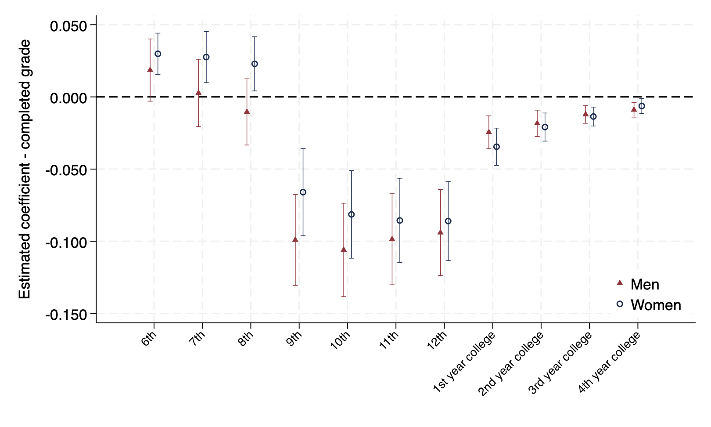
<figcaption><em>Notes:</em> Estimates are based on equation <a href="#eq:estimating" data-reference-type="eqref" data-reference="eq:estimating">[eq:estimating]</a> using the 1940 complete count census linked with the 1910 census using the Census Tree. The dependent variable is an indicator for completion of the schooling level on the <em>x</em>-axis. Coefficients for men (women) are marked with a triangle (circle). All regressions include parental and county controls and are restricted to those living on the farm. The 95% confidence intervals are shown based on standard errors clustered at the state-level.</figcaption>
</figure>

How do our estimates compare with those reported in the literature? Prior work by @black2005tight, in the context of the Appalachian Coal Boom, suggests that the elasticity of education with respect to the wage is 5-7 percent for a 10 percent increase in the wage. More recent work that focuses on the fracking boom or Texas oil boom suggest more muted effects, in the range of 1-3 percent [@kovalenko2023natural; @cascio2022needs]. Our coefficient estimate for white males is $-0.40$, which measures the effect of the index increasing from 1 to 2. At the average level of the index (1.2), the implied effect is $-0.40 \times (1.2 - 1) = -0.08$ years, or approximately 1 percent of mean schooling (8.2 years). At the peak of the boom, for cohorts born 1900 to 1905, we find a roughly 2 percent reduction in years of schooling. These estimates, in terms of years lost, are comparable to those found in the existing literature. Alternatively, if we use the 12^th^ grade completion estimate for white men from [5](#fig:grdcomp){reference-type="ref+label" reference="fig:grdcomp"}, a 10 percent increase in the exposure index leads to a 1 percent decrease in the probability of high school completion. Taken together, the results in this subsection provide strong evidence that the World War I agricultural boom raised the opportunity cost of schooling for teenagers on the farm, leading to permanent reductions in completed education, with larger effects for Black men and effects concentrated at the high school grades.

## Early Childhood Investment Channel

We now turn to our analysis of young children, ages 0-4. These younger cohorts suggest a slightly different empirical specification, outlined in [\[eq:estimating_young\]](#eq:estimating_young){reference-type="ref+label" reference="eq:estimating_young"}. Unlike older cohorts, young children whose households receive a positive resource shock may accumulate more human capital early in life, making them more productive as they enter their teen years. These increases in productivity interact with the structure of the local labor market. In locations with higher shares of child labor force participation, there are stronger incentives to exit school and enter the labor force. Therefore, we follow @bau2020human and include an interaction term between the childhood local labor demand shock and the intensity of child labor force participation in the local market. We measure child labor force participation, $CL_c$, at the county level in 1910 as the share of 10-14 year-olds that list an occupation in the Census. We also consider alternate definitions of child labor, such as being in the upper quartile of the child labor intensity distribution. $$\begin{align}
\label{eq:estimating_young}
    Y_{ihc} = \beta_1 E_{hc} + \beta_2 (CL_c \times E_{hc}) + \mathbf{X}'_{ihc}\boldsymbol{\delta} + \mathbf{Z}'_c\boldsymbol{\lambda}_h + \alpha_c + \phi_h + \varepsilon_{ihc}
\end{align}$$ Intuitively, in places where child labor is low or non-existent, the estimate of $\beta_{1}$ captures the net effect of increased household resources on human capital, reflecting both income effects and any dynamic complementarities in skill formation. The interaction term, $\beta_{2}$, captures the extent to which the opportunity cost of child labor offsets these gains: a negative $\beta_2$ indicates that early resource shocks reduce completed schooling more in high-child-labor areas. If $\beta_1$ is non-negative and $\beta_2$ is negative, the overall negative effect of early-life exposure (estimated without the interaction) is attributable to child labor intensity rather than to the resource shock itself.

In our estimation results, we highlight how the estimate of $\beta_{1}$ changes with and without the interaction term. In [3](#tab:young_kids){reference-type="ref+label" reference="tab:young_kids"}, we report the estimates from [\[eq:estimating_young\]](#eq:estimating_young){reference-type="ref+label" reference="eq:estimating_young"} for white and Black men and white and Black women separately. Column 1 in Panel A of [3](#tab:young_kids){reference-type="ref+label" reference="tab:young_kids"} reports the estimated relationship, excluding child labor controls for white men. Overall, these estimates indicate that on net, increases in household resources during early childhood lead to reductions in lifetime human capital accumulation. However, consistent with the theoretical model, column 2 shows that the effect is driven by returns to child labor in locations with high levels of child labor. Using the continuous child labor measure, the direct effect of the agricultural index on schooling is statistically indistinguishable from zero, and there is a negative and statistically significant coefficient on the interaction term. That is, the increased value of the children in the labor market drives the estimated negative coefficient reported in column 1. The top-quartile specification in column 3 tells a similar story, though the direct effect is larger in magnitude. In Panel B, we see a similar pattern for Black males using the continuous measure (column 2): the direct effect is close to zero once we account for the interaction. The Q4 specification in column 3 is less clear-cut, with a larger direct effect. We report estimates for white (Black) women in Panel A (B), columns 4 to 6. Using the continuous measure, the direct effect ($\beta_1$) is weakly positive once we account for child labor, while the interaction term ($\beta_2$) is negative but imprecisely estimated, consistent with lower opportunity costs for girls in agricultural labor markets. The Q4 results for Black women in column 6 do not follow this pattern, though the estimates are imprecise given the small sample size.

::: {#tab:young_kids}
+:---------------------------------------------------------------------------------------------------------------+:--------------------------------------------------------------------------------------------------------------:+:--------------------------------------------------------------------------------------------------------------:+:--------------------------------------------------------------------------------------------------------------:+:--------------------------------------------------------------------------------------------------------------:+:--------------------------------------------------------------------------------------------------------------:+:--------------------------------------------------------------------------------------------------------------:+
|                                                                                                                | Men                                                                                                                                                                                                                                                                                                                                              | Women                                                                                                                                                                                                                                                                                                                                            |
+----------------------------------------------------------------------------------------------------------------+----------------------------------------------------------------------------------------------------------------+----------------------------------------------------------------------------------------------------------------+----------------------------------------------------------------------------------------------------------------+----------------------------------------------------------------------------------------------------------------+----------------------------------------------------------------------------------------------------------------+----------------------------------------------------------------------------------------------------------------+
|                                                                                                                | \(1\)                                                                                                          | \(2\)                                                                                                          | \(3\)                                                                                                          | \(4\)                                                                                                          | \(5\)                                                                                                          | \(6\)                                                                                                          |
+----------------------------------------------------------------------------------------------------------------+----------------------------------------------------------------------------------------------------------------+----------------------------------------------------------------------------------------------------------------+----------------------------------------------------------------------------------------------------------------+----------------------------------------------------------------------------------------------------------------+----------------------------------------------------------------------------------------------------------------+----------------------------------------------------------------------------------------------------------------+
| *[Panel A: White]{.underline}*                                                                                 |                                                                                                                |                                                                                                                |                                                                                                                |                                                                                                                |                                                                                                                |                                                                                                                |
+----------------------------------------------------------------------------------------------------------------+----------------------------------------------------------------------------------------------------------------+----------------------------------------------------------------------------------------------------------------+----------------------------------------------------------------------------------------------------------------+----------------------------------------------------------------------------------------------------------------+----------------------------------------------------------------------------------------------------------------+----------------------------------------------------------------------------------------------------------------+
| Exposure Young                                                                                                 | -0.517                                                                                                         | -0.050                                                                                                         | -0.224                                                                                                         | 0.004                                                                                                          | 0.084                                                                                                          | 0.080                                                                                                          |
+----------------------------------------------------------------------------------------------------------------+----------------------------------------------------------------------------------------------------------------+----------------------------------------------------------------------------------------------------------------+----------------------------------------------------------------------------------------------------------------+----------------------------------------------------------------------------------------------------------------+----------------------------------------------------------------------------------------------------------------+----------------------------------------------------------------------------------------------------------------+
|                                                                                                                | (0.133)                                                                                                        | (0.135)                                                                                                        | (0.132)                                                                                                        | (0.114)                                                                                                        | (0.112)                                                                                                        | (0.103)                                                                                                        |
+----------------------------------------------------------------------------------------------------------------+----------------------------------------------------------------------------------------------------------------+----------------------------------------------------------------------------------------------------------------+----------------------------------------------------------------------------------------------------------------+----------------------------------------------------------------------------------------------------------------+----------------------------------------------------------------------------------------------------------------+----------------------------------------------------------------------------------------------------------------+
| Exp. $\times$ Fract. Child Work                                                                                |                                                                                                                | -0.701                                                                                                         |                                                                                                                |                                                                                                                | -0.120                                                                                                         |                                                                                                                |
+----------------------------------------------------------------------------------------------------------------+----------------------------------------------------------------------------------------------------------------+----------------------------------------------------------------------------------------------------------------+----------------------------------------------------------------------------------------------------------------+----------------------------------------------------------------------------------------------------------------+----------------------------------------------------------------------------------------------------------------+----------------------------------------------------------------------------------------------------------------+
|                                                                                                                |                                                                                                                | (0.171)                                                                                                        |                                                                                                                |                                                                                                                | (0.201)                                                                                                        |                                                                                                                |
+----------------------------------------------------------------------------------------------------------------+----------------------------------------------------------------------------------------------------------------+----------------------------------------------------------------------------------------------------------------+----------------------------------------------------------------------------------------------------------------+----------------------------------------------------------------------------------------------------------------+----------------------------------------------------------------------------------------------------------------+----------------------------------------------------------------------------------------------------------------+
| Exp. $\times$ Q4 Child Work                                                                                    |                                                                                                                |                                                                                                                | -0.244                                                                                                         |                                                                                                                |                                                                                                                | -0.063                                                                                                         |
+----------------------------------------------------------------------------------------------------------------+----------------------------------------------------------------------------------------------------------------+----------------------------------------------------------------------------------------------------------------+----------------------------------------------------------------------------------------------------------------+----------------------------------------------------------------------------------------------------------------+----------------------------------------------------------------------------------------------------------------+----------------------------------------------------------------------------------------------------------------+
|                                                                                                                |                                                                                                                |                                                                                                                | (0.071)                                                                                                        |                                                                                                                |                                                                                                                | (0.075)                                                                                                        |
+----------------------------------------------------------------------------------------------------------------+----------------------------------------------------------------------------------------------------------------+----------------------------------------------------------------------------------------------------------------+----------------------------------------------------------------------------------------------------------------+----------------------------------------------------------------------------------------------------------------+----------------------------------------------------------------------------------------------------------------+----------------------------------------------------------------------------------------------------------------+
| Observations                                                                                                   | 4,404,689                                                                                                      | 4,404,542                                                                                                      | 4,404,689                                                                                                      | 3,049,826                                                                                                      | 3,049,718                                                                                                      | 3,049,826                                                                                                      |
+----------------------------------------------------------------------------------------------------------------+----------------------------------------------------------------------------------------------------------------+----------------------------------------------------------------------------------------------------------------+----------------------------------------------------------------------------------------------------------------+----------------------------------------------------------------------------------------------------------------+----------------------------------------------------------------------------------------------------------------+----------------------------------------------------------------------------------------------------------------+
| *[Panel B: Black]{.underline}*                                                                                 |                                                                                                                |                                                                                                                |                                                                                                                |                                                                                                                |                                                                                                                |                                                                                                                |
+----------------------------------------------------------------------------------------------------------------+----------------------------------------------------------------------------------------------------------------+----------------------------------------------------------------------------------------------------------------+----------------------------------------------------------------------------------------------------------------+----------------------------------------------------------------------------------------------------------------+----------------------------------------------------------------------------------------------------------------+----------------------------------------------------------------------------------------------------------------+
| Exposure Young                                                                                                 | -0.547                                                                                                         | -0.079                                                                                                         | -0.301                                                                                                         | 0.012                                                                                                          | 0.242                                                                                                          | -0.170                                                                                                         |
+----------------------------------------------------------------------------------------------------------------+----------------------------------------------------------------------------------------------------------------+----------------------------------------------------------------------------------------------------------------+----------------------------------------------------------------------------------------------------------------+----------------------------------------------------------------------------------------------------------------+----------------------------------------------------------------------------------------------------------------+----------------------------------------------------------------------------------------------------------------+
|                                                                                                                | (0.157)                                                                                                        | (0.180)                                                                                                        | (0.203)                                                                                                        | (0.149)                                                                                                        | (0.232)                                                                                                        | (0.185)                                                                                                        |
+----------------------------------------------------------------------------------------------------------------+----------------------------------------------------------------------------------------------------------------+----------------------------------------------------------------------------------------------------------------+----------------------------------------------------------------------------------------------------------------+----------------------------------------------------------------------------------------------------------------+----------------------------------------------------------------------------------------------------------------+----------------------------------------------------------------------------------------------------------------+
| Exp. $\times$ Fract. Child Work                                                                                |                                                                                                                | -0.555                                                                                                         |                                                                                                                |                                                                                                                | -0.278                                                                                                         |                                                                                                                |
+----------------------------------------------------------------------------------------------------------------+----------------------------------------------------------------------------------------------------------------+----------------------------------------------------------------------------------------------------------------+----------------------------------------------------------------------------------------------------------------+----------------------------------------------------------------------------------------------------------------+----------------------------------------------------------------------------------------------------------------+----------------------------------------------------------------------------------------------------------------+
|                                                                                                                |                                                                                                                | (0.123)                                                                                                        |                                                                                                                |                                                                                                                | (0.195)                                                                                                        |                                                                                                                |
+----------------------------------------------------------------------------------------------------------------+----------------------------------------------------------------------------------------------------------------+----------------------------------------------------------------------------------------------------------------+----------------------------------------------------------------------------------------------------------------+----------------------------------------------------------------------------------------------------------------+----------------------------------------------------------------------------------------------------------------+----------------------------------------------------------------------------------------------------------------+
| Exp. $\times$ Q4 Child Work                                                                                    |                                                                                                                |                                                                                                                | -0.148                                                                                                         |                                                                                                                |                                                                                                                | 0.111                                                                                                          |
+----------------------------------------------------------------------------------------------------------------+----------------------------------------------------------------------------------------------------------------+----------------------------------------------------------------------------------------------------------------+----------------------------------------------------------------------------------------------------------------+----------------------------------------------------------------------------------------------------------------+----------------------------------------------------------------------------------------------------------------+----------------------------------------------------------------------------------------------------------------+
|                                                                                                                |                                                                                                                |                                                                                                                | (0.081)                                                                                                        |                                                                                                                |                                                                                                                | (0.096)                                                                                                        |
+----------------------------------------------------------------------------------------------------------------+----------------------------------------------------------------------------------------------------------------+----------------------------------------------------------------------------------------------------------------+----------------------------------------------------------------------------------------------------------------+----------------------------------------------------------------------------------------------------------------+----------------------------------------------------------------------------------------------------------------+----------------------------------------------------------------------------------------------------------------+
| Observations                                                                                                   | 470,282                                                                                                        | 470,282                                                                                                        | 470,282                                                                                                        | 152,550                                                                                                        | 152,550                                                                                                        | 152,550                                                                                                        |
+----------------------------------------------------------------------------------------------------------------+----------------------------------------------------------------------------------------------------------------+----------------------------------------------------------------------------------------------------------------+----------------------------------------------------------------------------------------------------------------+----------------------------------------------------------------------------------------------------------------+----------------------------------------------------------------------------------------------------------------+----------------------------------------------------------------------------------------------------------------+
| FEs and controls                                                                                               | $\checkmark$                                                                                                   | $\checkmark$                                                                                                   | $\checkmark$                                                                                                   | $\checkmark$                                                                                                   | $\checkmark$                                                                                                   | $\checkmark$                                                                                                   |
+----------------------------------------------------------------------------------------------------------------+----------------------------------------------------------------------------------------------------------------+----------------------------------------------------------------------------------------------------------------+----------------------------------------------------------------------------------------------------------------+----------------------------------------------------------------------------------------------------------------+----------------------------------------------------------------------------------------------------------------+----------------------------------------------------------------------------------------------------------------+
| *Notes:* Estimates are based on equation [\[eq:estimating_young\]](#eq:estimating_young){reference-type="eqref" reference="eq:estimating_young"} using the 1940 complete count census linked with the 1910 and 1920 census (via the Census Tree). The dependent variable is years of schooling in 1940. $E_{hc}$ is the exposure index cumulated over ages 0 to 4. $CL_c$ is the fraction of children aged 10 to 14 in the 1910 census working in a county. Q4 Child Work is an indicator for whether the county was in the top quartile of child labor intensity in the 1910 census. Each regression includes the complete set of controls from [1](#tab:main_results){reference-type="ref+label" reference="tab:main_results"}. Standard errors in parentheses are clustered at the state level.                   |
+----------------------------------------------------------------------------------------------------------------------------------------------------------------------------------------------------------------------------------------------------------------------------------------------------------------------------------------------------------------------------------------------------------------------------------------------------------------------------------------------------------------------------------------------------------------------------------------------------------------------------------------------------------------------------------------------------------------------------------------------------------------------------------------------------------------------+

: **The Effect of Exposure to World War I Agricultural Boom During Youth**
:::

[]{#tab:young_kids label="tab:young_kids"}

As with the older children, the aggregate sample may mask important heterogeneity. In [\[tab:robust_dyncomp_men\]](#tab:robust_dyncomp_men){reference-type="ref+label" reference="tab:robust_dyncomp_men"} we explore sub-samples of the data for men. In [\[tab:robust_dyncomp_women\]](#tab:robust_dyncomp_women){reference-type="ref+label" reference="tab:robust_dyncomp_women"}, we report the estimates for women. First focusing on the results for white men in [\[tab:robust_dyncomp_men\]](#tab:robust_dyncomp_men){reference-type="ref+label" reference="tab:robust_dyncomp_men"} Panel A, we restrict the sample to those living in their state of birth; the estimates are similar to the baseline. In columns 3 and 4, we explore differences between children whose parents owned versus rented their farm. Here we see a similar pattern to the baseline, although the children of renters accumulated less human capital than the children of farm owners. In column 5, we restrict the sample to the states where we can measure the 1918 Influenza; the estimates are similar to the baseline. In column 6, we use a more general measure of agricultural labor intensity that estimates the labor hours per acre based on the 1910 crop mixture and labor hours per crop as reported in @usda_labor_crop. Utilizing the alternative measure, we estimate a similar pattern although the coefficients are re-scaled. For male children living off the farm, we find no statistically significant effect of the agricultural index or its interaction with child labor intensity on years of schooling. For Black men, the estimates reported in Panel B follow a similar pattern to those of whites. The exception is Black men living off the farm, for whom $\beta_1$ is positive and statistically significant, suggesting that early resource gains raised completed schooling in areas with low child labor intensity. [\[tab:robust_dyncomp_clp\]](#tab:robust_dyncomp_clp){reference-type="ref+label" reference="tab:robust_dyncomp_clp"} displays similar estimates for men using links from the Census Linking Project.

Turning to [\[tab:robust_dyncomp_women\]](#tab:robust_dyncomp_women){reference-type="ref+label" reference="tab:robust_dyncomp_women"}, we report the estimates for women. Most of the results are consistent with the baseline findings. The coefficient on $\beta_{1}$ is generally weakly positive or at least non-negative and the coefficient for $\beta_{2}$ is generally negative and imprecisely estimated, suggesting that the opportunity cost of female labor was relatively low. For white women whose parents rent a farm, we see some statistical evidence of dynamic complementarities. Similarly, we see evidence of dynamic complementarities using our more general measure of agricultural labor intensity. In Panel B, we report estimates for Black women. While the sample sizes become small, the overall pattern is consistent with the baseline estimates.

It is useful to better understand whether the response to forego schooling in the context of the World War I agricultural boom was rational, given that shock was likely to be a transitory shock. To address this, in Appendix [8](#sec:Calibration){reference-type="ref" reference="sec:Calibration"}, we conduct a calibration exercise that compares the short run gain in farm revenue to the loss of lifetime income due to lower levels of education. Following the approach in @bau2020human, we find discount rates between 0.95 and 0.99. This is consistent with a model where parents and children are forward looking, and fall within the range of discount rates commonly found in the macroeconomics and public finance literature.

Taken together, the results in this subsection show that the negative effect of early-life exposure on completed schooling operates through child labor intensity. For boys, the direct effect of early resources ($\beta_1$) is indistinguishable from zero, and the negative overall effect is driven entirely by the interaction with child labor ($\beta_2$). For girls, the direct effect is weakly positive in some specifications, consistent with dynamic complementarities, but the interaction with child labor is smaller and less precisely estimated, consistent with lower opportunity costs in agricultural labor markets.

# Conclusion

The World War I agricultural boom generated large, temporary increases in crop revenues across the United States, with the largest gains concentrated in the cotton and tobacco South. We use this episode to study how changes in local economic conditions affected human capital accumulation during the early decades of the high school movement. Our analysis yields three main findings.

First, the boom reduced education for teenagers on the farm. Using newly constructed county-level data, we document a decrease in enrollment and average daily attendance at the peak of the boom. Second, linked census data confirm that these short-run disruptions translated into permanent reductions in completed schooling and that these effects are concentrated at the high school grades. Finally, the overall negative effects mask important heterogeneity. For children exposed during early childhood, the overall negative effect on completed schooling is driven by child labor intensity rather than the resource shock itself. Once we account for local child labor, the direct effect of early exposure is approximately zero for boys and weakly positive for girls. In counties with high child labor intensity, the interaction between early resources and child labor demand reduces completed schooling, consistent with @bau2020human. These results underscore the role of local labor markets in determining whether resource windfalls translate into lasting human capital gains and are consistent with dynamic complementarities whose effects on lifetime schooling are mediated by the opportunity cost of child labor [@cunha2007technology; @heckman2007economics].

The income channel through which the boom affected schooling operated primarily through crop composition: counties that grew cotton and tobacco experienced the largest revenue gains because these commodities saw the largest wartime price increases. These same counties had high rates of child labor, reflecting the labor intensity of cotton and tobacco cultivation. Crop composition, child labor intensity, and boom exposure are thus jointly determined by the same underlying agricultural structure. The high school movement was one of the defining features of American economic development in the early twentieth century [@goldin1998america; @goldin1999egalitarianism]. Our results show that even a temporary commodity boom can interrupt this type of transformation, with effects that persisted for decades and are experienced unevenly across demographic groups and regions.

::: onehalfspacing
:::

::: center
# Additional Figures and Tables 
:::

<figure id="fig:state_sample_ADA" data-latex-placement="H">
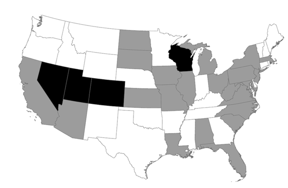
<figcaption>Notes: States shaded in gray or black indicate that we measure annual county-level enrollment 1910-1930, while those in gray indicate we measure average daily attendance 1910-1930.</figcaption>
</figure>

<figure id="fig:grdcomp_CLP" data-latex-placement="H">
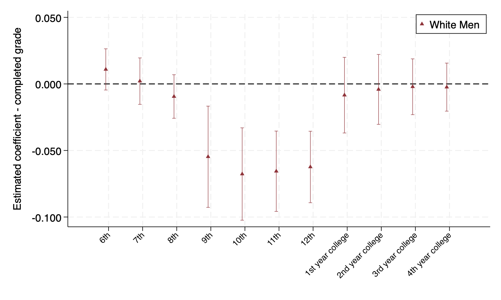
<figcaption><em>Notes:</em> Estimates are based on equation <a href="#eq:estimating" data-reference-type="eqref" data-reference="eq:estimating">[eq:estimating]</a> using the 1940 complete count census linked with the 1910 census using the Census Linking Project. The dependent variable is an indicator for completion of the schooling level on the <em>x</em>-axis. Coefficients are marked with a triangle. All regressions include parental and county characteristics. The 95% confidence intervals are shown based on standard errors clustered at the state-level.</figcaption>
</figure>

::: {#tab:birthOrder}
+:-------------------------------------------------------------------------------------------------------------------------------------------------------------------------------------------------+:------------------------------------------------------------------------------------------------------------------------------------------------------------------------------------------------:+:------------------------------------------------------------------------------------------------------------------------------------------------------------------------------------------------:+:------------------------------------------------------------------------------------------------------------------------------------------------------------------------------------------------:+
|                                                                                                                                                                                                  |                                                                                                                                                                                                  | Birth                                                                                                                                                                                            | Sibling                                                                                                                                                                                          |
+--------------------------------------------------------------------------------------------------------------------------------------------------------------------------------------------------+--------------------------------------------------------------------------------------------------------------------------------------------------------------------------------------------------+--------------------------------------------------------------------------------------------------------------------------------------------------------------------------------------------------+--------------------------------------------------------------------------------------------------------------------------------------------------------------------------------------------------+
|                                                                                                                                                                                                  | Baseline                                                                                                                                                                                         | Order                                                                                                                                                                                            | FE's                                                                                                                                                                                             |
+--------------------------------------------------------------------------------------------------------------------------------------------------------------------------------------------------+--------------------------------------------------------------------------------------------------------------------------------------------------------------------------------------------------+--------------------------------------------------------------------------------------------------------------------------------------------------------------------------------------------------+--------------------------------------------------------------------------------------------------------------------------------------------------------------------------------------------------+
|                                                                                                                                                                                                  | \(1\)                                                                                                                                                                                            | \(2\)                                                                                                                                                                                            | \(3\)                                                                                                                                                                                            |
+--------------------------------------------------------------------------------------------------------------------------------------------------------------------------------------------------+--------------------------------------------------------------------------------------------------------------------------------------------------------------------------------------------------+--------------------------------------------------------------------------------------------------------------------------------------------------------------------------------------------------+--------------------------------------------------------------------------------------------------------------------------------------------------------------------------------------------------+
| *[Panel A: White Men]{.underline}*                                                                                                                                                               |                                                                                                                                                                                                  |                                                                                                                                                                                                  |                                                                                                                                                                                                  |
+--------------------------------------------------------------------------------------------------------------------------------------------------------------------------------------------------+--------------------------------------------------------------------------------------------------------------------------------------------------------------------------------------------------+--------------------------------------------------------------------------------------------------------------------------------------------------------------------------------------------------+--------------------------------------------------------------------------------------------------------------------------------------------------------------------------------------------------+
| Exposure                                                                                                                                                                                         | -0.404                                                                                                                                                                                           | -0.018                                                                                                                                                                                           | -0.453                                                                                                                                                                                           |
+--------------------------------------------------------------------------------------------------------------------------------------------------------------------------------------------------+--------------------------------------------------------------------------------------------------------------------------------------------------------------------------------------------------+--------------------------------------------------------------------------------------------------------------------------------------------------------------------------------------------------+--------------------------------------------------------------------------------------------------------------------------------------------------------------------------------------------------+
|                                                                                                                                                                                                  | (0.089)                                                                                                                                                                                          | (0.093)                                                                                                                                                                                          | (0.095)                                                                                                                                                                                          |
+--------------------------------------------------------------------------------------------------------------------------------------------------------------------------------------------------+--------------------------------------------------------------------------------------------------------------------------------------------------------------------------------------------------+--------------------------------------------------------------------------------------------------------------------------------------------------------------------------------------------------+--------------------------------------------------------------------------------------------------------------------------------------------------------------------------------------------------+
| Exposure $\times$ 2nd Birth                                                                                                                                                                      |                                                                                                                                                                                                  | -0.270                                                                                                                                                                                           |                                                                                                                                                                                                  |
+--------------------------------------------------------------------------------------------------------------------------------------------------------------------------------------------------+--------------------------------------------------------------------------------------------------------------------------------------------------------------------------------------------------+--------------------------------------------------------------------------------------------------------------------------------------------------------------------------------------------------+--------------------------------------------------------------------------------------------------------------------------------------------------------------------------------------------------+
|                                                                                                                                                                                                  |                                                                                                                                                                                                  | (0.009)                                                                                                                                                                                          |                                                                                                                                                                                                  |
+--------------------------------------------------------------------------------------------------------------------------------------------------------------------------------------------------+--------------------------------------------------------------------------------------------------------------------------------------------------------------------------------------------------+--------------------------------------------------------------------------------------------------------------------------------------------------------------------------------------------------+--------------------------------------------------------------------------------------------------------------------------------------------------------------------------------------------------+
| Exposure $\times$ 3rd Birth                                                                                                                                                                      |                                                                                                                                                                                                  | -0.445                                                                                                                                                                                           |                                                                                                                                                                                                  |
+--------------------------------------------------------------------------------------------------------------------------------------------------------------------------------------------------+--------------------------------------------------------------------------------------------------------------------------------------------------------------------------------------------------+--------------------------------------------------------------------------------------------------------------------------------------------------------------------------------------------------+--------------------------------------------------------------------------------------------------------------------------------------------------------------------------------------------------+
|                                                                                                                                                                                                  |                                                                                                                                                                                                  | (0.013)                                                                                                                                                                                          |                                                                                                                                                                                                  |
+--------------------------------------------------------------------------------------------------------------------------------------------------------------------------------------------------+--------------------------------------------------------------------------------------------------------------------------------------------------------------------------------------------------+--------------------------------------------------------------------------------------------------------------------------------------------------------------------------------------------------+--------------------------------------------------------------------------------------------------------------------------------------------------------------------------------------------------+
| Exposure $\times$ 4th Birth                                                                                                                                                                      |                                                                                                                                                                                                  | -0.549                                                                                                                                                                                           |                                                                                                                                                                                                  |
+--------------------------------------------------------------------------------------------------------------------------------------------------------------------------------------------------+--------------------------------------------------------------------------------------------------------------------------------------------------------------------------------------------------+--------------------------------------------------------------------------------------------------------------------------------------------------------------------------------------------------+--------------------------------------------------------------------------------------------------------------------------------------------------------------------------------------------------+
|                                                                                                                                                                                                  |                                                                                                                                                                                                  | (0.019)                                                                                                                                                                                          |                                                                                                                                                                                                  |
+--------------------------------------------------------------------------------------------------------------------------------------------------------------------------------------------------+--------------------------------------------------------------------------------------------------------------------------------------------------------------------------------------------------+--------------------------------------------------------------------------------------------------------------------------------------------------------------------------------------------------+--------------------------------------------------------------------------------------------------------------------------------------------------------------------------------------------------+
| Exposure $\times$ 5th Birth                                                                                                                                                                      |                                                                                                                                                                                                  | -0.579                                                                                                                                                                                           |                                                                                                                                                                                                  |
+--------------------------------------------------------------------------------------------------------------------------------------------------------------------------------------------------+--------------------------------------------------------------------------------------------------------------------------------------------------------------------------------------------------+--------------------------------------------------------------------------------------------------------------------------------------------------------------------------------------------------+--------------------------------------------------------------------------------------------------------------------------------------------------------------------------------------------------+
|                                                                                                                                                                                                  |                                                                                                                                                                                                  | (0.017)                                                                                                                                                                                          |                                                                                                                                                                                                  |
+--------------------------------------------------------------------------------------------------------------------------------------------------------------------------------------------------+--------------------------------------------------------------------------------------------------------------------------------------------------------------------------------------------------+--------------------------------------------------------------------------------------------------------------------------------------------------------------------------------------------------+--------------------------------------------------------------------------------------------------------------------------------------------------------------------------------------------------+
| Exposure $\times$ \>5th Birth                                                                                                                                                                    |                                                                                                                                                                                                  | -0.702                                                                                                                                                                                           |                                                                                                                                                                                                  |
+--------------------------------------------------------------------------------------------------------------------------------------------------------------------------------------------------+--------------------------------------------------------------------------------------------------------------------------------------------------------------------------------------------------+--------------------------------------------------------------------------------------------------------------------------------------------------------------------------------------------------+--------------------------------------------------------------------------------------------------------------------------------------------------------------------------------------------------+
|                                                                                                                                                                                                  |                                                                                                                                                                                                  | (0.023)                                                                                                                                                                                          |                                                                                                                                                                                                  |
+--------------------------------------------------------------------------------------------------------------------------------------------------------------------------------------------------+--------------------------------------------------------------------------------------------------------------------------------------------------------------------------------------------------+--------------------------------------------------------------------------------------------------------------------------------------------------------------------------------------------------+--------------------------------------------------------------------------------------------------------------------------------------------------------------------------------------------------+
| Observations                                                                                                                                                                                     | 3,888,223                                                                                                                                                                                        | 3,888,223                                                                                                                                                                                        | 2,632,301                                                                                                                                                                                        |
+--------------------------------------------------------------------------------------------------------------------------------------------------------------------------------------------------+--------------------------------------------------------------------------------------------------------------------------------------------------------------------------------------------------+--------------------------------------------------------------------------------------------------------------------------------------------------------------------------------------------------+--------------------------------------------------------------------------------------------------------------------------------------------------------------------------------------------------+
| FEs and Controls                                                                                                                                                                                 | $\checkmark$                                                                                                                                                                                     | $\checkmark$                                                                                                                                                                                     | $\checkmark$                                                                                                                                                                                     |
+--------------------------------------------------------------------------------------------------------------------------------------------------------------------------------------------------+--------------------------------------------------------------------------------------------------------------------------------------------------------------------------------------------------+--------------------------------------------------------------------------------------------------------------------------------------------------------------------------------------------------+--------------------------------------------------------------------------------------------------------------------------------------------------------------------------------------------------+
| Sibling FEs                                                                                                                                                                                      |                                                                                                                                                                                                  |                                                                                                                                                                                                  | $\checkmark$                                                                                                                                                                                     |
+--------------------------------------------------------------------------------------------------------------------------------------------------------------------------------------------------+--------------------------------------------------------------------------------------------------------------------------------------------------------------------------------------------------+--------------------------------------------------------------------------------------------------------------------------------------------------------------------------------------------------+--------------------------------------------------------------------------------------------------------------------------------------------------------------------------------------------------+
| *Notes:* Estimates are based on equation [\[eq:estimating\]](#eq:estimating){reference-type="eqref" reference="eq:estimating"} using the 1940 complete count census linked with the 1910 census using the Census Tree. The dependent variable is years of schooling and the sample is restricted to those living on a farm. Column 1 reproduces the baseline results from [1](#tab:main_results){reference-type="ref+label" reference="tab:main_results"}, which include county and year fixed effects, parental controls, and additional controls. In column 2, we interact the birth order of the child with the agricultural index. In column 3, we restrict the comparisons to siblings within the same household. Standard errors in parentheses are clustered at the state-level.                   |
+-----------------------------------------------------------------------------------------------------------------------------------------------------------------------------------------------------------------------------------------------------------------------------------------------------------------------------------------------------------------------------------------------------------------------------------------------------------------------------------------------------------------------------------------------------------------------------------------------------------------------------------------------------------------------------------------------------------------------------------------------------------------------------------------------------------+

: Order Heterogeneity and Sibling Fixed Effects using the Census Tree
:::

[]{#tab:birthOrder label="tab:birthOrder"}

::: {#tab:clp_main_results}
+:----------------------------------------------------------------------------------------------------------------------------+:---------------------------------------------------------------------------------------------------------------------------:+:---------------------------------------------------------------------------------------------------------------------------:+:---------------------------------------------------------------------------------------------------------------------------:+:---------------------------------------------------------------------------------------------------------------------------:+:---------------------------------------------------------------------------------------------------------------------------:+:---------------------------------------------------------------------------------------------------------------------------:+
|                                                                                                                             | White Men                                                                                                                                                                                                                                                                                                                                                                               | Black Men                                                                                                                                                                                                                                                                                                                                                                               |
+-----------------------------------------------------------------------------------------------------------------------------+-----------------------------------------------------------------------------------------------------------------------------+-----------------------------------------------------------------------------------------------------------------------------+-----------------------------------------------------------------------------------------------------------------------------+-----------------------------------------------------------------------------------------------------------------------------+-----------------------------------------------------------------------------------------------------------------------------+-----------------------------------------------------------------------------------------------------------------------------+
|                                                                                                                             | \(1\)                                                                                                                       | \(2\)                                                                                                                       | \(3\)                                                                                                                       | \(4\)                                                                                                                       | \(5\)                                                                                                                       | \(6\)                                                                                                                       |
+-----------------------------------------------------------------------------------------------------------------------------+-----------------------------------------------------------------------------------------------------------------------------+-----------------------------------------------------------------------------------------------------------------------------+-----------------------------------------------------------------------------------------------------------------------------+-----------------------------------------------------------------------------------------------------------------------------+-----------------------------------------------------------------------------------------------------------------------------+-----------------------------------------------------------------------------------------------------------------------------+
| Exposure                                                                                                                    | -0.529                                                                                                                      | -0.475                                                                                                                      | -0.463                                                                                                                      | -0.505                                                                                                                      | -0.512                                                                                                                      | -0.435                                                                                                                      |
+-----------------------------------------------------------------------------------------------------------------------------+-----------------------------------------------------------------------------------------------------------------------------+-----------------------------------------------------------------------------------------------------------------------------+-----------------------------------------------------------------------------------------------------------------------------+-----------------------------------------------------------------------------------------------------------------------------+-----------------------------------------------------------------------------------------------------------------------------+-----------------------------------------------------------------------------------------------------------------------------+
|                                                                                                                             | (0.148)                                                                                                                     | (0.145)                                                                                                                     | (0.092)                                                                                                                     | (0.189)                                                                                                                     | (0.180)                                                                                                                     | (0.134)                                                                                                                     |
+-----------------------------------------------------------------------------------------------------------------------------+-----------------------------------------------------------------------------------------------------------------------------+-----------------------------------------------------------------------------------------------------------------------------+-----------------------------------------------------------------------------------------------------------------------------+-----------------------------------------------------------------------------------------------------------------------------+-----------------------------------------------------------------------------------------------------------------------------+-----------------------------------------------------------------------------------------------------------------------------+
| Observations                                                                                                                | 1,301,646                                                                                                                   | 1,203,503                                                                                                                   | 1,203,503                                                                                                                   | 82,156                                                                                                                      | 69,174                                                                                                                      | 69,174                                                                                                                      |
+-----------------------------------------------------------------------------------------------------------------------------+-----------------------------------------------------------------------------------------------------------------------------+-----------------------------------------------------------------------------------------------------------------------------+-----------------------------------------------------------------------------------------------------------------------------+-----------------------------------------------------------------------------------------------------------------------------+-----------------------------------------------------------------------------------------------------------------------------+-----------------------------------------------------------------------------------------------------------------------------+
| Cohort and county FE                                                                                                        | $\checkmark$                                                                                                                | $\checkmark$                                                                                                                | $\checkmark$                                                                                                                | $\checkmark$                                                                                                                | $\checkmark$                                                                                                                | $\checkmark$                                                                                                                |
+-----------------------------------------------------------------------------------------------------------------------------+-----------------------------------------------------------------------------------------------------------------------------+-----------------------------------------------------------------------------------------------------------------------------+-----------------------------------------------------------------------------------------------------------------------------+-----------------------------------------------------------------------------------------------------------------------------+-----------------------------------------------------------------------------------------------------------------------------+-----------------------------------------------------------------------------------------------------------------------------+
| Parental controls                                                                                                           |                                                                                                                             | $\checkmark$                                                                                                                | $\checkmark$                                                                                                                |                                                                                                                             | $\checkmark$                                                                                                                | $\checkmark$                                                                                                                |
+-----------------------------------------------------------------------------------------------------------------------------+-----------------------------------------------------------------------------------------------------------------------------+-----------------------------------------------------------------------------------------------------------------------------+-----------------------------------------------------------------------------------------------------------------------------+-----------------------------------------------------------------------------------------------------------------------------+-----------------------------------------------------------------------------------------------------------------------------+-----------------------------------------------------------------------------------------------------------------------------+
| Additional controls                                                                                                         |                                                                                                                             |                                                                                                                             | $\checkmark$                                                                                                                |                                                                                                                             |                                                                                                                             | $\checkmark$                                                                                                                |
+-----------------------------------------------------------------------------------------------------------------------------+-----------------------------------------------------------------------------------------------------------------------------+-----------------------------------------------------------------------------------------------------------------------------+-----------------------------------------------------------------------------------------------------------------------------+-----------------------------------------------------------------------------------------------------------------------------+-----------------------------------------------------------------------------------------------------------------------------+-----------------------------------------------------------------------------------------------------------------------------+
| *Notes:* Estimates from [\[eq:estimating\]](#eq:estimating){reference-type="ref+label" reference="eq:estimating"} using Census Linking Project estimates with 1940 Complete Count Census outcomes. Restricted to individuals on a farm. Parental controls are indicators or fixed effects measured in 1910 and include father's occupational score, father's birthplace, mother's birthplace, father illiteracy, mother illiteracy, maternal labor force participation, and home ownership. Additional controls are two-way interactions between birth cohort and WWI inductions, County Health Organization presence, hookworm infection, malaria death rate per 100,000, Rosenwald School presence, Boll Weevil infestation, and whether the birth county was dry (Prohibition). Standard errors shown in parentheses are clustered at the state-level.                                                       |
+-----------------------------------------------------------------------------------------------------------------------------------------------------------------------------------------------------------------------------------------------------------------------------------------------------------------------------------------------------------------------------------------------------------------------------------------------------------------------------------------------------------------------------------------------------------------------------------------------------------------------------------------------------------------------------------------------------------------------------------------------------------------------------------------------------------------------------------------------------------------------------------------------------------------+

: **Effects of Exposure to World War I Agricultural Boom using the Census Linking Project**
:::

[]{#tab:clp_main_results label="tab:clp_main_results"}

::: {#tab:robust_CLP}
+:-------------------------------------------------------------------------------------------------------------------------------------------------------------+:------------------------------------------------------------------------------------------------------------------------------------------------------------:+:------------------------------------------------------------------------------------------------------------------------------------------------------------:+:------------------------------------------------------------------------------------------------------------------------------------------------------------:+:------------------------------------------------------------------------------------------------------------------------------------------------------------:+:------------------------------------------------------------------------------------------------------------------------------------------------------------:+:------------------------------------------------------------------------------------------------------------------------------------------------------------:+
|                                                                                                                                                              |                                                                                                                                                              | Same                                                                                                                                                         | Owns                                                                                                                                                         | Rents                                                                                                                                                        | Spanish                                                                                                                                                      | Off                                                                                                                                                          |
+--------------------------------------------------------------------------------------------------------------------------------------------------------------+--------------------------------------------------------------------------------------------------------------------------------------------------------------+--------------------------------------------------------------------------------------------------------------------------------------------------------------+--------------------------------------------------------------------------------------------------------------------------------------------------------------+--------------------------------------------------------------------------------------------------------------------------------------------------------------+--------------------------------------------------------------------------------------------------------------------------------------------------------------+--------------------------------------------------------------------------------------------------------------------------------------------------------------+
|                                                                                                                                                              | Baseline                                                                                                                                                     | state                                                                                                                                                        | Farm                                                                                                                                                         | Farm                                                                                                                                                         | Flu                                                                                                                                                          | Farm                                                                                                                                                         |
+--------------------------------------------------------------------------------------------------------------------------------------------------------------+--------------------------------------------------------------------------------------------------------------------------------------------------------------+--------------------------------------------------------------------------------------------------------------------------------------------------------------+--------------------------------------------------------------------------------------------------------------------------------------------------------------+--------------------------------------------------------------------------------------------------------------------------------------------------------------+--------------------------------------------------------------------------------------------------------------------------------------------------------------+--------------------------------------------------------------------------------------------------------------------------------------------------------------+
|                                                                                                                                                              | \(1\)                                                                                                                                                        | \(2\)                                                                                                                                                        | \(3\)                                                                                                                                                        | \(4\)                                                                                                                                                        | \(5\)                                                                                                                                                        | \(6\)                                                                                                                                                        |
+--------------------------------------------------------------------------------------------------------------------------------------------------------------+--------------------------------------------------------------------------------------------------------------------------------------------------------------+--------------------------------------------------------------------------------------------------------------------------------------------------------------+--------------------------------------------------------------------------------------------------------------------------------------------------------------+--------------------------------------------------------------------------------------------------------------------------------------------------------------+--------------------------------------------------------------------------------------------------------------------------------------------------------------+--------------------------------------------------------------------------------------------------------------------------------------------------------------+
| *[White Men]{.underline}*                                                                                                                                    |                                                                                                                                                              |                                                                                                                                                              |                                                                                                                                                              |                                                                                                                                                              |                                                                                                                                                              |                                                                                                                                                              |
+--------------------------------------------------------------------------------------------------------------------------------------------------------------+--------------------------------------------------------------------------------------------------------------------------------------------------------------+--------------------------------------------------------------------------------------------------------------------------------------------------------------+--------------------------------------------------------------------------------------------------------------------------------------------------------------+--------------------------------------------------------------------------------------------------------------------------------------------------------------+--------------------------------------------------------------------------------------------------------------------------------------------------------------+--------------------------------------------------------------------------------------------------------------------------------------------------------------+
| Exposure                                                                                                                                                     | -0.463                                                                                                                                                       | -0.522                                                                                                                                                       | -0.442                                                                                                                                                       | -0.395                                                                                                                                                       | -0.437                                                                                                                                                       | -0.087                                                                                                                                                       |
+--------------------------------------------------------------------------------------------------------------------------------------------------------------+--------------------------------------------------------------------------------------------------------------------------------------------------------------+--------------------------------------------------------------------------------------------------------------------------------------------------------------+--------------------------------------------------------------------------------------------------------------------------------------------------------------+--------------------------------------------------------------------------------------------------------------------------------------------------------------+--------------------------------------------------------------------------------------------------------------------------------------------------------------+--------------------------------------------------------------------------------------------------------------------------------------------------------------+
|                                                                                                                                                              | (0.092)                                                                                                                                                      | (0.092)                                                                                                                                                      | (0.098)                                                                                                                                                      | (0.115)                                                                                                                                                      | (0.102)                                                                                                                                                      | (0.122)                                                                                                                                                      |
+--------------------------------------------------------------------------------------------------------------------------------------------------------------+--------------------------------------------------------------------------------------------------------------------------------------------------------------+--------------------------------------------------------------------------------------------------------------------------------------------------------------+--------------------------------------------------------------------------------------------------------------------------------------------------------------+--------------------------------------------------------------------------------------------------------------------------------------------------------------+--------------------------------------------------------------------------------------------------------------------------------------------------------------+--------------------------------------------------------------------------------------------------------------------------------------------------------------+
| Observations                                                                                                                                                 | 1,203,503                                                                                                                                                    | 907,605                                                                                                                                                      | 844,914                                                                                                                                                      | 358,538                                                                                                                                                      | 781,649                                                                                                                                                      | 1,802,895                                                                                                                                                    |
+--------------------------------------------------------------------------------------------------------------------------------------------------------------+--------------------------------------------------------------------------------------------------------------------------------------------------------------+--------------------------------------------------------------------------------------------------------------------------------------------------------------+--------------------------------------------------------------------------------------------------------------------------------------------------------------+--------------------------------------------------------------------------------------------------------------------------------------------------------------+--------------------------------------------------------------------------------------------------------------------------------------------------------------+--------------------------------------------------------------------------------------------------------------------------------------------------------------+
| *[Black Men]{.underline}*                                                                                                                                    |                                                                                                                                                              |                                                                                                                                                              |                                                                                                                                                              |                                                                                                                                                              |                                                                                                                                                              |                                                                                                                                                              |
+--------------------------------------------------------------------------------------------------------------------------------------------------------------+--------------------------------------------------------------------------------------------------------------------------------------------------------------+--------------------------------------------------------------------------------------------------------------------------------------------------------------+--------------------------------------------------------------------------------------------------------------------------------------------------------------+--------------------------------------------------------------------------------------------------------------------------------------------------------------+--------------------------------------------------------------------------------------------------------------------------------------------------------------+--------------------------------------------------------------------------------------------------------------------------------------------------------------+
| Exposure                                                                                                                                                     | -0.435                                                                                                                                                       | -0.519                                                                                                                                                       | -0.477                                                                                                                                                       | -0.412                                                                                                                                                       | -0.322                                                                                                                                                       | -0.168                                                                                                                                                       |
+--------------------------------------------------------------------------------------------------------------------------------------------------------------+--------------------------------------------------------------------------------------------------------------------------------------------------------------+--------------------------------------------------------------------------------------------------------------------------------------------------------------+--------------------------------------------------------------------------------------------------------------------------------------------------------------+--------------------------------------------------------------------------------------------------------------------------------------------------------------+--------------------------------------------------------------------------------------------------------------------------------------------------------------+--------------------------------------------------------------------------------------------------------------------------------------------------------------+
|                                                                                                                                                              | (0.134)                                                                                                                                                      | (0.177)                                                                                                                                                      | (0.367)                                                                                                                                                      | (0.290)                                                                                                                                                      | (0.169)                                                                                                                                                      | (0.205)                                                                                                                                                      |
+--------------------------------------------------------------------------------------------------------------------------------------------------------------+--------------------------------------------------------------------------------------------------------------------------------------------------------------+--------------------------------------------------------------------------------------------------------------------------------------------------------------+--------------------------------------------------------------------------------------------------------------------------------------------------------------+--------------------------------------------------------------------------------------------------------------------------------------------------------------+--------------------------------------------------------------------------------------------------------------------------------------------------------------+--------------------------------------------------------------------------------------------------------------------------------------------------------------+
| Observations                                                                                                                                                 | 69,174                                                                                                                                                       | 46,094                                                                                                                                                       | 21,794                                                                                                                                                       | 47,133                                                                                                                                                       | 38,715                                                                                                                                                       | 54,082                                                                                                                                                       |
+--------------------------------------------------------------------------------------------------------------------------------------------------------------+--------------------------------------------------------------------------------------------------------------------------------------------------------------+--------------------------------------------------------------------------------------------------------------------------------------------------------------+--------------------------------------------------------------------------------------------------------------------------------------------------------------+--------------------------------------------------------------------------------------------------------------------------------------------------------------+--------------------------------------------------------------------------------------------------------------------------------------------------------------+--------------------------------------------------------------------------------------------------------------------------------------------------------------+
| FEs and Controls                                                                                                                                             | $\checkmark$                                                                                                                                                 | $\checkmark$                                                                                                                                                 | $\checkmark$                                                                                                                                                 | $\checkmark$                                                                                                                                                 | $\checkmark$                                                                                                                                                 | $\checkmark$                                                                                                                                                 |
+--------------------------------------------------------------------------------------------------------------------------------------------------------------+--------------------------------------------------------------------------------------------------------------------------------------------------------------+--------------------------------------------------------------------------------------------------------------------------------------------------------------+--------------------------------------------------------------------------------------------------------------------------------------------------------------+--------------------------------------------------------------------------------------------------------------------------------------------------------------+--------------------------------------------------------------------------------------------------------------------------------------------------------------+--------------------------------------------------------------------------------------------------------------------------------------------------------------+
| *Notes:* Estimates are based on equation [\[eq:estimating\]](#eq:estimating){reference-type="eqref" reference="eq:estimating"} using the 1940 complete count census linked with the 1910 census using the Census Linking Project. The dependent variable is years of schooling. Column 1 reproduces the baseline specification from [5](#tab:clp_main_results){reference-type="ref+label" reference="tab:clp_main_results"}, which includes county and year fixed effects, parental controls, and additional controls. Each column includes this complete set of controls. Column 2 restricts the sample to individuals who are still living in their birth state. Column 3 is restricted to individuals whose family owned the farm while column 4 focuses on individuals whose family rented their farm properties. Column 5 includes an interaction between birth year fixed effects and excess mortality related to the 1918 Influenza Epidemic (i.e., "Spanish Flu"). Column 6 restricts the sample to those who do not live on farms. Standard errors in parentheses are clustered at the state-level.                                           |
+--------------------------------------------------------------------------------------------------------------------------------------------------------------------------------------------------------------------------------------------------------------------------------------------------------------------------------------------------------------------------------------------------------------------------------------------------------------------------------------------------------------------------------------------------------------------------------------------------------------------------------------------------------------------------------------------------------------------------------------------------------------------------------------------------------------------------------------------------------------------------------------------------------------------------------------------------------------------------------------------------------------------------------------------------------------------------------------------------------------------------------------------------------+

: **Robustness Checks - Years of Schooling (Census Linking Project)**
:::

[]{#tab:robust_CLP label="tab:robust_CLP"}

::: {#tab:iv_results}
+:-----------------------------------------------------------------------------------------------------------------------------------------------------------------------+:----------------------------------------------------------------------------------------------------------------------------------------------------------------------:+:----------------------------------------------------------------------------------------------------------------------------------------------------------------------:+:----------------------------------------------------------------------------------------------------------------------------------------------------------------------:+:----------------------------------------------------------------------------------------------------------------------------------------------------------------------:+:----------------------------------------------------------------------------------------------------------------------------------------------------------------------:+:----------------------------------------------------------------------------------------------------------------------------------------------------------------------:+
|                                                                                                                                                                        | Men                                                                                                                                                                                                                                                                                                                                                                                                                                                                                                                      | Women                                                                                                                                                                                                                                                                                                                                                                                                                                                                                                                    |
+------------------------------------------------------------------------------------------------------------------------------------------------------------------------+------------------------------------------------------------------------------------------------------------------------------------------------------------------------+------------------------------------------------------------------------------------------------------------------------------------------------------------------------+------------------------------------------------------------------------------------------------------------------------------------------------------------------------+------------------------------------------------------------------------------------------------------------------------------------------------------------------------+------------------------------------------------------------------------------------------------------------------------------------------------------------------------+------------------------------------------------------------------------------------------------------------------------------------------------------------------------+
|                                                                                                                                                                        | \(1\)                                                                                                                                                                  | \(2\)                                                                                                                                                                  | \(3\)                                                                                                                                                                  | \(4\)                                                                                                                                                                  | \(5\)                                                                                                                                                                  | \(6\)                                                                                                                                                                  |
+------------------------------------------------------------------------------------------------------------------------------------------------------------------------+------------------------------------------------------------------------------------------------------------------------------------------------------------------------+------------------------------------------------------------------------------------------------------------------------------------------------------------------------+------------------------------------------------------------------------------------------------------------------------------------------------------------------------+------------------------------------------------------------------------------------------------------------------------------------------------------------------------+------------------------------------------------------------------------------------------------------------------------------------------------------------------------+------------------------------------------------------------------------------------------------------------------------------------------------------------------------+
| *[Panel A: White]{.underline}*                                                                                                                                         |                                                                                                                                                                        |                                                                                                                                                                        |                                                                                                                                                                        |                                                                                                                                                                        |                                                                                                                                                                        |                                                                                                                                                                        |
+------------------------------------------------------------------------------------------------------------------------------------------------------------------------+------------------------------------------------------------------------------------------------------------------------------------------------------------------------+------------------------------------------------------------------------------------------------------------------------------------------------------------------------+------------------------------------------------------------------------------------------------------------------------------------------------------------------------+------------------------------------------------------------------------------------------------------------------------------------------------------------------------+------------------------------------------------------------------------------------------------------------------------------------------------------------------------+------------------------------------------------------------------------------------------------------------------------------------------------------------------------+
| Exposure                                                                                                                                                               | -0.487                                                                                                                                                                 | -0.482                                                                                                                                                                 | -0.518                                                                                                                                                                 | -0.068                                                                                                                                                                 | -0.186                                                                                                                                                                 | -0.003                                                                                                                                                                 |
+------------------------------------------------------------------------------------------------------------------------------------------------------------------------+------------------------------------------------------------------------------------------------------------------------------------------------------------------------+------------------------------------------------------------------------------------------------------------------------------------------------------------------------+------------------------------------------------------------------------------------------------------------------------------------------------------------------------+------------------------------------------------------------------------------------------------------------------------------------------------------------------------+------------------------------------------------------------------------------------------------------------------------------------------------------------------------+------------------------------------------------------------------------------------------------------------------------------------------------------------------------+
|                                                                                                                                                                        | (0.149)                                                                                                                                                                | (0.147)                                                                                                                                                                | (0.283)                                                                                                                                                                | (0.180)                                                                                                                                                                | (0.168)                                                                                                                                                                | (0.342)                                                                                                                                                                |
+------------------------------------------------------------------------------------------------------------------------------------------------------------------------+------------------------------------------------------------------------------------------------------------------------------------------------------------------------+------------------------------------------------------------------------------------------------------------------------------------------------------------------------+------------------------------------------------------------------------------------------------------------------------------------------------------------------------+------------------------------------------------------------------------------------------------------------------------------------------------------------------------+------------------------------------------------------------------------------------------------------------------------------------------------------------------------+------------------------------------------------------------------------------------------------------------------------------------------------------------------------+
| First Stage F-Stat                                                                                                                                                     | 58.01                                                                                                                                                                  | 52.05                                                                                                                                                                  | 8.96                                                                                                                                                                   | 57.82                                                                                                                                                                  | 51.68                                                                                                                                                                  | 8.87                                                                                                                                                                   |
+------------------------------------------------------------------------------------------------------------------------------------------------------------------------+------------------------------------------------------------------------------------------------------------------------------------------------------------------------+------------------------------------------------------------------------------------------------------------------------------------------------------------------------+------------------------------------------------------------------------------------------------------------------------------------------------------------------------+------------------------------------------------------------------------------------------------------------------------------------------------------------------------+------------------------------------------------------------------------------------------------------------------------------------------------------------------------+------------------------------------------------------------------------------------------------------------------------------------------------------------------------+
| Observations                                                                                                                                                           | 4,222,413                                                                                                                                                              | 3,882,618                                                                                                                                                              | 3,882,618                                                                                                                                                              | 3,029,297                                                                                                                                                              | 2,757,384                                                                                                                                                              | 2,757,384                                                                                                                                                              |
+------------------------------------------------------------------------------------------------------------------------------------------------------------------------+------------------------------------------------------------------------------------------------------------------------------------------------------------------------+------------------------------------------------------------------------------------------------------------------------------------------------------------------------+------------------------------------------------------------------------------------------------------------------------------------------------------------------------+------------------------------------------------------------------------------------------------------------------------------------------------------------------------+------------------------------------------------------------------------------------------------------------------------------------------------------------------------+------------------------------------------------------------------------------------------------------------------------------------------------------------------------+
| *[Panel B: Black]{.underline}*                                                                                                                                         |                                                                                                                                                                        |                                                                                                                                                                        |                                                                                                                                                                        |                                                                                                                                                                        |                                                                                                                                                                        |                                                                                                                                                                        |
+------------------------------------------------------------------------------------------------------------------------------------------------------------------------+------------------------------------------------------------------------------------------------------------------------------------------------------------------------+------------------------------------------------------------------------------------------------------------------------------------------------------------------------+------------------------------------------------------------------------------------------------------------------------------------------------------------------------+------------------------------------------------------------------------------------------------------------------------------------------------------------------------+------------------------------------------------------------------------------------------------------------------------------------------------------------------------+------------------------------------------------------------------------------------------------------------------------------------------------------------------------+
| Exposure                                                                                                                                                               | -0.774                                                                                                                                                                 | -0.735                                                                                                                                                                 | -0.707                                                                                                                                                                 | 0.191                                                                                                                                                                  | 0.180                                                                                                                                                                  | 0.468                                                                                                                                                                  |
+------------------------------------------------------------------------------------------------------------------------------------------------------------------------+------------------------------------------------------------------------------------------------------------------------------------------------------------------------+------------------------------------------------------------------------------------------------------------------------------------------------------------------------+------------------------------------------------------------------------------------------------------------------------------------------------------------------------+------------------------------------------------------------------------------------------------------------------------------------------------------------------------+------------------------------------------------------------------------------------------------------------------------------------------------------------------------+------------------------------------------------------------------------------------------------------------------------------------------------------------------------+
|                                                                                                                                                                        | (0.258)                                                                                                                                                                | (0.322)                                                                                                                                                                | (0.552)                                                                                                                                                                | (0.368)                                                                                                                                                                | (0.347)                                                                                                                                                                | (0.617)                                                                                                                                                                |
+------------------------------------------------------------------------------------------------------------------------------------------------------------------------+------------------------------------------------------------------------------------------------------------------------------------------------------------------------+------------------------------------------------------------------------------------------------------------------------------------------------------------------------+------------------------------------------------------------------------------------------------------------------------------------------------------------------------+------------------------------------------------------------------------------------------------------------------------------------------------------------------------+------------------------------------------------------------------------------------------------------------------------------------------------------------------------+------------------------------------------------------------------------------------------------------------------------------------------------------------------------+
| First Stage F-Stat                                                                                                                                                     | 10.27                                                                                                                                                                  | 9.88                                                                                                                                                                   | 4.19                                                                                                                                                                   | 10.91                                                                                                                                                                  | 10.03                                                                                                                                                                  | 3.77                                                                                                                                                                   |
+------------------------------------------------------------------------------------------------------------------------------------------------------------------------+------------------------------------------------------------------------------------------------------------------------------------------------------------------------+------------------------------------------------------------------------------------------------------------------------------------------------------------------------+------------------------------------------------------------------------------------------------------------------------------------------------------------------------+------------------------------------------------------------------------------------------------------------------------------------------------------------------------+------------------------------------------------------------------------------------------------------------------------------------------------------------------------+------------------------------------------------------------------------------------------------------------------------------------------------------------------------+
| Observations                                                                                                                                                           | 428,936                                                                                                                                                                | 353,979                                                                                                                                                                | 353,979                                                                                                                                                                | 108,497                                                                                                                                                                | 80,223                                                                                                                                                                 | 80,223                                                                                                                                                                 |
+------------------------------------------------------------------------------------------------------------------------------------------------------------------------+------------------------------------------------------------------------------------------------------------------------------------------------------------------------+------------------------------------------------------------------------------------------------------------------------------------------------------------------------+------------------------------------------------------------------------------------------------------------------------------------------------------------------------+------------------------------------------------------------------------------------------------------------------------------------------------------------------------+------------------------------------------------------------------------------------------------------------------------------------------------------------------------+------------------------------------------------------------------------------------------------------------------------------------------------------------------------+
| Cohort and county FE                                                                                                                                                   | $\checkmark$                                                                                                                                                           | $\checkmark$                                                                                                                                                           | $\checkmark$                                                                                                                                                           | $\checkmark$                                                                                                                                                           | $\checkmark$                                                                                                                                                           | $\checkmark$                                                                                                                                                           |
+------------------------------------------------------------------------------------------------------------------------------------------------------------------------+------------------------------------------------------------------------------------------------------------------------------------------------------------------------+------------------------------------------------------------------------------------------------------------------------------------------------------------------------+------------------------------------------------------------------------------------------------------------------------------------------------------------------------+------------------------------------------------------------------------------------------------------------------------------------------------------------------------+------------------------------------------------------------------------------------------------------------------------------------------------------------------------+------------------------------------------------------------------------------------------------------------------------------------------------------------------------+
| Parental controls                                                                                                                                                      |                                                                                                                                                                        | $\checkmark$                                                                                                                                                           | $\checkmark$                                                                                                                                                           |                                                                                                                                                                        | $\checkmark$                                                                                                                                                           | $\checkmark$                                                                                                                                                           |
+------------------------------------------------------------------------------------------------------------------------------------------------------------------------+------------------------------------------------------------------------------------------------------------------------------------------------------------------------+------------------------------------------------------------------------------------------------------------------------------------------------------------------------+------------------------------------------------------------------------------------------------------------------------------------------------------------------------+------------------------------------------------------------------------------------------------------------------------------------------------------------------------+------------------------------------------------------------------------------------------------------------------------------------------------------------------------+------------------------------------------------------------------------------------------------------------------------------------------------------------------------+
| Additional controls                                                                                                                                                    |                                                                                                                                                                        |                                                                                                                                                                        | $\checkmark$                                                                                                                                                           |                                                                                                                                                                        |                                                                                                                                                                        | $\checkmark$                                                                                                                                                           |
+------------------------------------------------------------------------------------------------------------------------------------------------------------------------+------------------------------------------------------------------------------------------------------------------------------------------------------------------------+------------------------------------------------------------------------------------------------------------------------------------------------------------------------+------------------------------------------------------------------------------------------------------------------------------------------------------------------------+------------------------------------------------------------------------------------------------------------------------------------------------------------------------+------------------------------------------------------------------------------------------------------------------------------------------------------------------------+------------------------------------------------------------------------------------------------------------------------------------------------------------------------+
| *Notes:* Estimates are based on an IV specification, where the first stage is composed of estimated crop shares using only crop suitability, similar to [@kitchens2023impact] In the second stage, we use the 1940 complete count census linked with the 1910 census using the Census Tree. The dependent variable is years of schooling. Panels A and B include whites and Blacks, respectively, with men in columns 1 through 3 and women in columns 4 through 6. Restricted to individuals living on a farm. Columns 1 and 4 include cohort and county fixed effects. Columns 2 and 5 add parental controls measured in 1910 and include father's occupational score, father's birthplace, mother's birthplace, father illiteracy, mother illiteracy, maternal labor force participation, and home ownership. Columns 3 and 6 add two-way interactions between birth cohort and World War I inductions, County Health Organization presence, hookworm infection, malaria death rate per 100,000, Rosenwald School presence, Boll Weevil infestation, and whether the birth county was dry (Prohibition). Standard errors in parentheses are clustered at the state-level.                                                 |
+------------------------------------------------------------------------------------------------------------------------------------------------------------------------------------------------------------------------------------------------------------------------------------------------------------------------------------------------------------------------------------------------------------------------------------------------------------------------------------------------------------------------------------------------------------------------------------------------------------------------------------------------------------------------------------------------------------------------------------------------------------------------------------------------------------------------------------------------------------------------------------------------------------------------------------------------------------------------------------------------------------------------------------------------------------------------------------------------------------------------------------------------------------------------------------------------------------------------------+

: **Effects of Exposure to World War I Agricultural Boom - IV Estimates**
:::

[]{#tab:iv_results label="tab:iv_results"}

::: sidewaystable
+:-------------------------------------------------------------------------------------------------------------------------------------------------------+:------------------------------------------------------------------------------------------------------------------------------------------------------:+:------------------------------------------------------------------------------------------------------------------------------------------------------:+:------------------------------------------------------------------------------------------------------------------------------------------------------:+:------------------------------------------------------------------------------------------------------------------------------------------------------:+:------------------------------------------------------------------------------------------------------------------------------------------------------:+:------------------------------------------------------------------------------------------------------------------------------------------------------:+:------------------------------------------------------------------------------------------------------------------------------------------------------:+
|                                                                                                                                                        |                                                                                                                                                        | Same                                                                                                                                                   | Owns                                                                                                                                                   | Rents                                                                                                                                                  | Spanish                                                                                                                                                | Alt. Labor                                                                                                                                             | Off                                                                                                                                                    |
+--------------------------------------------------------------------------------------------------------------------------------------------------------+--------------------------------------------------------------------------------------------------------------------------------------------------------+--------------------------------------------------------------------------------------------------------------------------------------------------------+--------------------------------------------------------------------------------------------------------------------------------------------------------+--------------------------------------------------------------------------------------------------------------------------------------------------------+--------------------------------------------------------------------------------------------------------------------------------------------------------+--------------------------------------------------------------------------------------------------------------------------------------------------------+--------------------------------------------------------------------------------------------------------------------------------------------------------+
|                                                                                                                                                        | Baseline                                                                                                                                               | state                                                                                                                                                  | Farm                                                                                                                                                   | Farm                                                                                                                                                   | Flu                                                                                                                                                    | Measure                                                                                                                                                | Farm                                                                                                                                                   |
+--------------------------------------------------------------------------------------------------------------------------------------------------------+--------------------------------------------------------------------------------------------------------------------------------------------------------+--------------------------------------------------------------------------------------------------------------------------------------------------------+--------------------------------------------------------------------------------------------------------------------------------------------------------+--------------------------------------------------------------------------------------------------------------------------------------------------------+--------------------------------------------------------------------------------------------------------------------------------------------------------+--------------------------------------------------------------------------------------------------------------------------------------------------------+--------------------------------------------------------------------------------------------------------------------------------------------------------+
|                                                                                                                                                        | \(1\)                                                                                                                                                  | \(2\)                                                                                                                                                  | \(3\)                                                                                                                                                  | \(4\)                                                                                                                                                  | \(5\)                                                                                                                                                  | \(6\)                                                                                                                                                  | \(7\)                                                                                                                                                  |
+--------------------------------------------------------------------------------------------------------------------------------------------------------+--------------------------------------------------------------------------------------------------------------------------------------------------------+--------------------------------------------------------------------------------------------------------------------------------------------------------+--------------------------------------------------------------------------------------------------------------------------------------------------------+--------------------------------------------------------------------------------------------------------------------------------------------------------+--------------------------------------------------------------------------------------------------------------------------------------------------------+--------------------------------------------------------------------------------------------------------------------------------------------------------+--------------------------------------------------------------------------------------------------------------------------------------------------------+
| *[Panel A: White Men]{.underline}*                                                                                                                     |                                                                                                                                                        |                                                                                                                                                        |                                                                                                                                                        |                                                                                                                                                        |                                                                                                                                                        |                                                                                                                                                        |                                                                                                                                                        |
+--------------------------------------------------------------------------------------------------------------------------------------------------------+--------------------------------------------------------------------------------------------------------------------------------------------------------+--------------------------------------------------------------------------------------------------------------------------------------------------------+--------------------------------------------------------------------------------------------------------------------------------------------------------+--------------------------------------------------------------------------------------------------------------------------------------------------------+--------------------------------------------------------------------------------------------------------------------------------------------------------+--------------------------------------------------------------------------------------------------------------------------------------------------------+--------------------------------------------------------------------------------------------------------------------------------------------------------+
| Exposure Young                                                                                                                                         | -0.050                                                                                                                                                 | 0.022                                                                                                                                                  | -0.163                                                                                                                                                 | 0.053                                                                                                                                                  | -0.056                                                                                                                                                 | -0.094                                                                                                                                                 | 0.206                                                                                                                                                  |
+--------------------------------------------------------------------------------------------------------------------------------------------------------+--------------------------------------------------------------------------------------------------------------------------------------------------------+--------------------------------------------------------------------------------------------------------------------------------------------------------+--------------------------------------------------------------------------------------------------------------------------------------------------------+--------------------------------------------------------------------------------------------------------------------------------------------------------+--------------------------------------------------------------------------------------------------------------------------------------------------------+--------------------------------------------------------------------------------------------------------------------------------------------------------+--------------------------------------------------------------------------------------------------------------------------------------------------------+
|                                                                                                                                                        | (0.135)                                                                                                                                                | (0.150)                                                                                                                                                | (0.165)                                                                                                                                                | (0.154)                                                                                                                                                | (0.194)                                                                                                                                                | (0.169)                                                                                                                                                | (0.258)                                                                                                                                                |
+--------------------------------------------------------------------------------------------------------------------------------------------------------+--------------------------------------------------------------------------------------------------------------------------------------------------------+--------------------------------------------------------------------------------------------------------------------------------------------------------+--------------------------------------------------------------------------------------------------------------------------------------------------------+--------------------------------------------------------------------------------------------------------------------------------------------------------+--------------------------------------------------------------------------------------------------------------------------------------------------------+--------------------------------------------------------------------------------------------------------------------------------------------------------+--------------------------------------------------------------------------------------------------------------------------------------------------------+
| Exposure $\times$ Fraction Child Work                                                                                                                  | -0.701                                                                                                                                                 | -0.778                                                                                                                                                 | -0.435                                                                                                                                                 | -0.804                                                                                                                                                 | -0.575                                                                                                                                                 |                                                                                                                                                        | -0.347                                                                                                                                                 |
+--------------------------------------------------------------------------------------------------------------------------------------------------------+--------------------------------------------------------------------------------------------------------------------------------------------------------+--------------------------------------------------------------------------------------------------------------------------------------------------------+--------------------------------------------------------------------------------------------------------------------------------------------------------+--------------------------------------------------------------------------------------------------------------------------------------------------------+--------------------------------------------------------------------------------------------------------------------------------------------------------+--------------------------------------------------------------------------------------------------------------------------------------------------------+--------------------------------------------------------------------------------------------------------------------------------------------------------+
|                                                                                                                                                        | (0.171)                                                                                                                                                | (0.175)                                                                                                                                                | (0.190)                                                                                                                                                | (0.173)                                                                                                                                                | (0.271)                                                                                                                                                |                                                                                                                                                        | (0.231)                                                                                                                                                |
+--------------------------------------------------------------------------------------------------------------------------------------------------------+--------------------------------------------------------------------------------------------------------------------------------------------------------+--------------------------------------------------------------------------------------------------------------------------------------------------------+--------------------------------------------------------------------------------------------------------------------------------------------------------+--------------------------------------------------------------------------------------------------------------------------------------------------------+--------------------------------------------------------------------------------------------------------------------------------------------------------+--------------------------------------------------------------------------------------------------------------------------------------------------------+--------------------------------------------------------------------------------------------------------------------------------------------------------+
| Exposure $\times$ Labor per Acre                                                                                                                       |                                                                                                                                                        |                                                                                                                                                        |                                                                                                                                                        |                                                                                                                                                        |                                                                                                                                                        | -0.005                                                                                                                                                 |                                                                                                                                                        |
+--------------------------------------------------------------------------------------------------------------------------------------------------------+--------------------------------------------------------------------------------------------------------------------------------------------------------+--------------------------------------------------------------------------------------------------------------------------------------------------------+--------------------------------------------------------------------------------------------------------------------------------------------------------+--------------------------------------------------------------------------------------------------------------------------------------------------------+--------------------------------------------------------------------------------------------------------------------------------------------------------+--------------------------------------------------------------------------------------------------------------------------------------------------------+--------------------------------------------------------------------------------------------------------------------------------------------------------+
|                                                                                                                                                        |                                                                                                                                                        |                                                                                                                                                        |                                                                                                                                                        |                                                                                                                                                        |                                                                                                                                                        | (0.002)                                                                                                                                                |                                                                                                                                                        |
+--------------------------------------------------------------------------------------------------------------------------------------------------------+--------------------------------------------------------------------------------------------------------------------------------------------------------+--------------------------------------------------------------------------------------------------------------------------------------------------------+--------------------------------------------------------------------------------------------------------------------------------------------------------+--------------------------------------------------------------------------------------------------------------------------------------------------------+--------------------------------------------------------------------------------------------------------------------------------------------------------+--------------------------------------------------------------------------------------------------------------------------------------------------------+--------------------------------------------------------------------------------------------------------------------------------------------------------+
| Observations                                                                                                                                           | 4,404,542                                                                                                                                              | 3,460,790                                                                                                                                              | 2,674,454                                                                                                                                              | 1,730,067                                                                                                                                              | 2,736,100                                                                                                                                              | 4,404,685                                                                                                                                              | 7,878,019                                                                                                                                              |
+--------------------------------------------------------------------------------------------------------------------------------------------------------+--------------------------------------------------------------------------------------------------------------------------------------------------------+--------------------------------------------------------------------------------------------------------------------------------------------------------+--------------------------------------------------------------------------------------------------------------------------------------------------------+--------------------------------------------------------------------------------------------------------------------------------------------------------+--------------------------------------------------------------------------------------------------------------------------------------------------------+--------------------------------------------------------------------------------------------------------------------------------------------------------+--------------------------------------------------------------------------------------------------------------------------------------------------------+
| *[Panel B: Black Men]{.underline}*                                                                                                                     |                                                                                                                                                        |                                                                                                                                                        |                                                                                                                                                        |                                                                                                                                                        |                                                                                                                                                        |                                                                                                                                                        |                                                                                                                                                        |
+--------------------------------------------------------------------------------------------------------------------------------------------------------+--------------------------------------------------------------------------------------------------------------------------------------------------------+--------------------------------------------------------------------------------------------------------------------------------------------------------+--------------------------------------------------------------------------------------------------------------------------------------------------------+--------------------------------------------------------------------------------------------------------------------------------------------------------+--------------------------------------------------------------------------------------------------------------------------------------------------------+--------------------------------------------------------------------------------------------------------------------------------------------------------+--------------------------------------------------------------------------------------------------------------------------------------------------------+
| Exposure Young                                                                                                                                         | -0.079                                                                                                                                                 | -0.288                                                                                                                                                 | 0.231                                                                                                                                                  | -0.135                                                                                                                                                 | -0.273                                                                                                                                                 | -0.350                                                                                                                                                 | 0.356                                                                                                                                                  |
+--------------------------------------------------------------------------------------------------------------------------------------------------------+--------------------------------------------------------------------------------------------------------------------------------------------------------+--------------------------------------------------------------------------------------------------------------------------------------------------------+--------------------------------------------------------------------------------------------------------------------------------------------------------+--------------------------------------------------------------------------------------------------------------------------------------------------------+--------------------------------------------------------------------------------------------------------------------------------------------------------+--------------------------------------------------------------------------------------------------------------------------------------------------------+--------------------------------------------------------------------------------------------------------------------------------------------------------+
|                                                                                                                                                        | (0.180)                                                                                                                                                | (0.192)                                                                                                                                                | (0.207)                                                                                                                                                | (0.206)                                                                                                                                                | (0.217)                                                                                                                                                | (0.198)                                                                                                                                                | (0.149)                                                                                                                                                |
+--------------------------------------------------------------------------------------------------------------------------------------------------------+--------------------------------------------------------------------------------------------------------------------------------------------------------+--------------------------------------------------------------------------------------------------------------------------------------------------------+--------------------------------------------------------------------------------------------------------------------------------------------------------+--------------------------------------------------------------------------------------------------------------------------------------------------------+--------------------------------------------------------------------------------------------------------------------------------------------------------+--------------------------------------------------------------------------------------------------------------------------------------------------------+--------------------------------------------------------------------------------------------------------------------------------------------------------+
| Exposure $\times$ Fraction Child Work                                                                                                                  | -0.555                                                                                                                                                 | -0.557                                                                                                                                                 | -0.562                                                                                                                                                 | -0.366                                                                                                                                                 | -0.541                                                                                                                                                 |                                                                                                                                                        | -0.682                                                                                                                                                 |
+--------------------------------------------------------------------------------------------------------------------------------------------------------+--------------------------------------------------------------------------------------------------------------------------------------------------------+--------------------------------------------------------------------------------------------------------------------------------------------------------+--------------------------------------------------------------------------------------------------------------------------------------------------------+--------------------------------------------------------------------------------------------------------------------------------------------------------+--------------------------------------------------------------------------------------------------------------------------------------------------------+--------------------------------------------------------------------------------------------------------------------------------------------------------+--------------------------------------------------------------------------------------------------------------------------------------------------------+
|                                                                                                                                                        | (0.123)                                                                                                                                                | (0.130)                                                                                                                                                | (0.155)                                                                                                                                                | (0.122)                                                                                                                                                | (0.162)                                                                                                                                                |                                                                                                                                                        | (0.254)                                                                                                                                                |
+--------------------------------------------------------------------------------------------------------------------------------------------------------+--------------------------------------------------------------------------------------------------------------------------------------------------------+--------------------------------------------------------------------------------------------------------------------------------------------------------+--------------------------------------------------------------------------------------------------------------------------------------------------------+--------------------------------------------------------------------------------------------------------------------------------------------------------+--------------------------------------------------------------------------------------------------------------------------------------------------------+--------------------------------------------------------------------------------------------------------------------------------------------------------+--------------------------------------------------------------------------------------------------------------------------------------------------------+
| Exposure $\times$ Labor per Acre                                                                                                                       |                                                                                                                                                        |                                                                                                                                                        |                                                                                                                                                        |                                                                                                                                                        |                                                                                                                                                        | -0.002                                                                                                                                                 |                                                                                                                                                        |
+--------------------------------------------------------------------------------------------------------------------------------------------------------+--------------------------------------------------------------------------------------------------------------------------------------------------------+--------------------------------------------------------------------------------------------------------------------------------------------------------+--------------------------------------------------------------------------------------------------------------------------------------------------------+--------------------------------------------------------------------------------------------------------------------------------------------------------+--------------------------------------------------------------------------------------------------------------------------------------------------------+--------------------------------------------------------------------------------------------------------------------------------------------------------+--------------------------------------------------------------------------------------------------------------------------------------------------------+
|                                                                                                                                                        |                                                                                                                                                        |                                                                                                                                                        |                                                                                                                                                        |                                                                                                                                                        |                                                                                                                                                        | (0.001)                                                                                                                                                |                                                                                                                                                        |
+--------------------------------------------------------------------------------------------------------------------------------------------------------+--------------------------------------------------------------------------------------------------------------------------------------------------------+--------------------------------------------------------------------------------------------------------------------------------------------------------+--------------------------------------------------------------------------------------------------------------------------------------------------------+--------------------------------------------------------------------------------------------------------------------------------------------------------+--------------------------------------------------------------------------------------------------------------------------------------------------------+--------------------------------------------------------------------------------------------------------------------------------------------------------+--------------------------------------------------------------------------------------------------------------------------------------------------------+
| Observations                                                                                                                                           | 470,282                                                                                                                                                | 352,213                                                                                                                                                | 113,670                                                                                                                                                | 356,432                                                                                                                                                | 266,326                                                                                                                                                | 470,282                                                                                                                                                | 334,050                                                                                                                                                |
+--------------------------------------------------------------------------------------------------------------------------------------------------------+--------------------------------------------------------------------------------------------------------------------------------------------------------+--------------------------------------------------------------------------------------------------------------------------------------------------------+--------------------------------------------------------------------------------------------------------------------------------------------------------+--------------------------------------------------------------------------------------------------------------------------------------------------------+--------------------------------------------------------------------------------------------------------------------------------------------------------+--------------------------------------------------------------------------------------------------------------------------------------------------------+--------------------------------------------------------------------------------------------------------------------------------------------------------+
| FEs and Controls                                                                                                                                       | $\checkmark$                                                                                                                                           | $\checkmark$                                                                                                                                           | $\checkmark$                                                                                                                                           | $\checkmark$                                                                                                                                           | $\checkmark$                                                                                                                                           | $\checkmark$                                                                                                                                           | $\checkmark$                                                                                                                                           |
+--------------------------------------------------------------------------------------------------------------------------------------------------------+--------------------------------------------------------------------------------------------------------------------------------------------------------+--------------------------------------------------------------------------------------------------------------------------------------------------------+--------------------------------------------------------------------------------------------------------------------------------------------------------+--------------------------------------------------------------------------------------------------------------------------------------------------------+--------------------------------------------------------------------------------------------------------------------------------------------------------+--------------------------------------------------------------------------------------------------------------------------------------------------------+--------------------------------------------------------------------------------------------------------------------------------------------------------+
| *Notes:* Estimates are based on equation [\[eq:estimating_young\]](#eq:estimating_young){reference-type="eqref" reference="eq:estimating_young"} using the 1940 complete count census linked with the 1910 census and 1920 census using the Census Tree. The dependent variable is years of schooling. Panel A includes white men and Panel B includes black men. Column 1 reproduces the baseline results from [3](#tab:young_kids){reference-type="ref+label" reference="tab:young_kids"}, which include county and year fixed effects, parental controls, and additional controls. Each column includes this complete set of controls. Column 2 restricts the sample to individuals who are still living in their birth state. Column 3 is restricted to individuals whose family owned the farm while column 4 focuses on individuals whose family rented their farm properties. Column 5 includes an interaction between birth year fixed effects and excess mortality related to the 1918 Influenza. Column 6 uses an alternative measure of agricultural labor intensity based on labor hours per acre. Column 7 restricts the sample to those who do not live on farms. Standard errors in parentheses are clustered at the state-level.                      |
+-----------------------------------------------------------------------------------------------------------------------------------------------------------------------------------------------------------------------------------------------------------------------------------------------------------------------------------------------------------------------------------------------------------------------------------------------------------------------------------------------------------------------------------------------------------------------------------------------------------------------------------------------------------------------------------------------------------------------------------------------------------------------------------------------------------------------------------------------------------------------------------------------------------------------------------------------------------------------------------------------------------------------------------------------------------------------------------------------------------------------------------------------------------------------------------------------------------------------------------------------------------------------+

[]{#tab:robust_dyncomp_men label="tab:robust_dyncomp_men"}
:::

::: sidewaystable
+:-----------------------------------------------------------------------------------------------------------------------------------------------------------+:----------------------------------------------------------------------------------------------------------------------------------------------------------:+:----------------------------------------------------------------------------------------------------------------------------------------------------------:+:----------------------------------------------------------------------------------------------------------------------------------------------------------:+:----------------------------------------------------------------------------------------------------------------------------------------------------------:+:----------------------------------------------------------------------------------------------------------------------------------------------------------:+:----------------------------------------------------------------------------------------------------------------------------------------------------------:+:----------------------------------------------------------------------------------------------------------------------------------------------------------:+
|                                                                                                                                                            |                                                                                                                                                            | Same                                                                                                                                                       | Owns                                                                                                                                                       | Rents                                                                                                                                                      | Spanish                                                                                                                                                    | Alt. Labor                                                                                                                                                 | Off                                                                                                                                                        |
+------------------------------------------------------------------------------------------------------------------------------------------------------------+------------------------------------------------------------------------------------------------------------------------------------------------------------+------------------------------------------------------------------------------------------------------------------------------------------------------------+------------------------------------------------------------------------------------------------------------------------------------------------------------+------------------------------------------------------------------------------------------------------------------------------------------------------------+------------------------------------------------------------------------------------------------------------------------------------------------------------+------------------------------------------------------------------------------------------------------------------------------------------------------------+------------------------------------------------------------------------------------------------------------------------------------------------------------+
|                                                                                                                                                            | Baseline                                                                                                                                                   | state                                                                                                                                                      | Farm                                                                                                                                                       | Farm                                                                                                                                                       | Flu                                                                                                                                                        | Measure                                                                                                                                                    | Farm                                                                                                                                                       |
+------------------------------------------------------------------------------------------------------------------------------------------------------------+------------------------------------------------------------------------------------------------------------------------------------------------------------+------------------------------------------------------------------------------------------------------------------------------------------------------------+------------------------------------------------------------------------------------------------------------------------------------------------------------+------------------------------------------------------------------------------------------------------------------------------------------------------------+------------------------------------------------------------------------------------------------------------------------------------------------------------+------------------------------------------------------------------------------------------------------------------------------------------------------------+------------------------------------------------------------------------------------------------------------------------------------------------------------+
|                                                                                                                                                            | \(1\)                                                                                                                                                      | \(2\)                                                                                                                                                      | \(3\)                                                                                                                                                      | \(4\)                                                                                                                                                      | \(5\)                                                                                                                                                      | \(6\)                                                                                                                                                      | \(7\)                                                                                                                                                      |
+------------------------------------------------------------------------------------------------------------------------------------------------------------+------------------------------------------------------------------------------------------------------------------------------------------------------------+------------------------------------------------------------------------------------------------------------------------------------------------------------+------------------------------------------------------------------------------------------------------------------------------------------------------------+------------------------------------------------------------------------------------------------------------------------------------------------------------+------------------------------------------------------------------------------------------------------------------------------------------------------------+------------------------------------------------------------------------------------------------------------------------------------------------------------+------------------------------------------------------------------------------------------------------------------------------------------------------------+
| *[Panel A: White Women]{.underline}*                                                                                                                       |                                                                                                                                                            |                                                                                                                                                            |                                                                                                                                                            |                                                                                                                                                            |                                                                                                                                                            |                                                                                                                                                            |                                                                                                                                                            |
+------------------------------------------------------------------------------------------------------------------------------------------------------------+------------------------------------------------------------------------------------------------------------------------------------------------------------+------------------------------------------------------------------------------------------------------------------------------------------------------------+------------------------------------------------------------------------------------------------------------------------------------------------------------+------------------------------------------------------------------------------------------------------------------------------------------------------------+------------------------------------------------------------------------------------------------------------------------------------------------------------+------------------------------------------------------------------------------------------------------------------------------------------------------------+------------------------------------------------------------------------------------------------------------------------------------------------------------+
| Exposure Young                                                                                                                                             | 0.084                                                                                                                                                      | 0.134                                                                                                                                                      | -0.091                                                                                                                                                     | 0.308                                                                                                                                                      | 0.095                                                                                                                                                      | 0.476                                                                                                                                                      | 0.149                                                                                                                                                      |
+------------------------------------------------------------------------------------------------------------------------------------------------------------+------------------------------------------------------------------------------------------------------------------------------------------------------------+------------------------------------------------------------------------------------------------------------------------------------------------------------+------------------------------------------------------------------------------------------------------------------------------------------------------------+------------------------------------------------------------------------------------------------------------------------------------------------------------+------------------------------------------------------------------------------------------------------------------------------------------------------------+------------------------------------------------------------------------------------------------------------------------------------------------------------+------------------------------------------------------------------------------------------------------------------------------------------------------------+
|                                                                                                                                                            | (0.112)                                                                                                                                                    | (0.118)                                                                                                                                                    | (0.151)                                                                                                                                                    | (0.121)                                                                                                                                                    | (0.172)                                                                                                                                                    | (0.143)                                                                                                                                                    | (0.242)                                                                                                                                                    |
+------------------------------------------------------------------------------------------------------------------------------------------------------------+------------------------------------------------------------------------------------------------------------------------------------------------------------+------------------------------------------------------------------------------------------------------------------------------------------------------------+------------------------------------------------------------------------------------------------------------------------------------------------------------+------------------------------------------------------------------------------------------------------------------------------------------------------------+------------------------------------------------------------------------------------------------------------------------------------------------------------+------------------------------------------------------------------------------------------------------------------------------------------------------------+------------------------------------------------------------------------------------------------------------------------------------------------------------+
| Exposure $\times$ Fraction Child Work                                                                                                                      | -0.120                                                                                                                                                     | -0.180                                                                                                                                                     | 0.218                                                                                                                                                      | -0.331                                                                                                                                                     | -0.025                                                                                                                                                     |                                                                                                                                                            | 0.246                                                                                                                                                      |
+------------------------------------------------------------------------------------------------------------------------------------------------------------+------------------------------------------------------------------------------------------------------------------------------------------------------------+------------------------------------------------------------------------------------------------------------------------------------------------------------+------------------------------------------------------------------------------------------------------------------------------------------------------------+------------------------------------------------------------------------------------------------------------------------------------------------------------+------------------------------------------------------------------------------------------------------------------------------------------------------------+------------------------------------------------------------------------------------------------------------------------------------------------------------+------------------------------------------------------------------------------------------------------------------------------------------------------------+
|                                                                                                                                                            | (0.201)                                                                                                                                                    | (0.205)                                                                                                                                                    | (0.203)                                                                                                                                                    | (0.215)                                                                                                                                                    | (0.303)                                                                                                                                                    |                                                                                                                                                            | (0.222)                                                                                                                                                    |
+------------------------------------------------------------------------------------------------------------------------------------------------------------+------------------------------------------------------------------------------------------------------------------------------------------------------------+------------------------------------------------------------------------------------------------------------------------------------------------------------+------------------------------------------------------------------------------------------------------------------------------------------------------------+------------------------------------------------------------------------------------------------------------------------------------------------------------+------------------------------------------------------------------------------------------------------------------------------------------------------------+------------------------------------------------------------------------------------------------------------------------------------------------------------+------------------------------------------------------------------------------------------------------------------------------------------------------------+
| Exposure $\times$ Labor per Acre                                                                                                                           |                                                                                                                                                            |                                                                                                                                                            |                                                                                                                                                            |                                                                                                                                                            |                                                                                                                                                            | -0.006                                                                                                                                                     |                                                                                                                                                            |
+------------------------------------------------------------------------------------------------------------------------------------------------------------+------------------------------------------------------------------------------------------------------------------------------------------------------------+------------------------------------------------------------------------------------------------------------------------------------------------------------+------------------------------------------------------------------------------------------------------------------------------------------------------------+------------------------------------------------------------------------------------------------------------------------------------------------------------+------------------------------------------------------------------------------------------------------------------------------------------------------------+------------------------------------------------------------------------------------------------------------------------------------------------------------+------------------------------------------------------------------------------------------------------------------------------------------------------------+
|                                                                                                                                                            |                                                                                                                                                            |                                                                                                                                                            |                                                                                                                                                            |                                                                                                                                                            |                                                                                                                                                            | (0.001)                                                                                                                                                    |                                                                                                                                                            |
+------------------------------------------------------------------------------------------------------------------------------------------------------------+------------------------------------------------------------------------------------------------------------------------------------------------------------+------------------------------------------------------------------------------------------------------------------------------------------------------------+------------------------------------------------------------------------------------------------------------------------------------------------------------+------------------------------------------------------------------------------------------------------------------------------------------------------------+------------------------------------------------------------------------------------------------------------------------------------------------------------+------------------------------------------------------------------------------------------------------------------------------------------------------------+------------------------------------------------------------------------------------------------------------------------------------------------------------+
| Observations                                                                                                                                               | 3,049,718                                                                                                                                                  | 2,440,714                                                                                                                                                  | 1,881,884                                                                                                                                                  | 1,167,791                                                                                                                                                  | 1,919,194                                                                                                                                                  | 3,049,823                                                                                                                                                  | 4,980,015                                                                                                                                                  |
+------------------------------------------------------------------------------------------------------------------------------------------------------------+------------------------------------------------------------------------------------------------------------------------------------------------------------+------------------------------------------------------------------------------------------------------------------------------------------------------------+------------------------------------------------------------------------------------------------------------------------------------------------------------+------------------------------------------------------------------------------------------------------------------------------------------------------------+------------------------------------------------------------------------------------------------------------------------------------------------------------+------------------------------------------------------------------------------------------------------------------------------------------------------------+------------------------------------------------------------------------------------------------------------------------------------------------------------+
| *[Panel B: Black Women]{.underline}*                                                                                                                       |                                                                                                                                                            |                                                                                                                                                            |                                                                                                                                                            |                                                                                                                                                            |                                                                                                                                                            |                                                                                                                                                            |                                                                                                                                                            |
+------------------------------------------------------------------------------------------------------------------------------------------------------------+------------------------------------------------------------------------------------------------------------------------------------------------------------+------------------------------------------------------------------------------------------------------------------------------------------------------------+------------------------------------------------------------------------------------------------------------------------------------------------------------+------------------------------------------------------------------------------------------------------------------------------------------------------------+------------------------------------------------------------------------------------------------------------------------------------------------------------+------------------------------------------------------------------------------------------------------------------------------------------------------------+------------------------------------------------------------------------------------------------------------------------------------------------------------+
| Exposure Young                                                                                                                                             | 0.242                                                                                                                                                      | 0.138                                                                                                                                                      | 0.286                                                                                                                                                      | 0.235                                                                                                                                                      | 0.466                                                                                                                                                      | -0.148                                                                                                                                                     | 0.134                                                                                                                                                      |
+------------------------------------------------------------------------------------------------------------------------------------------------------------+------------------------------------------------------------------------------------------------------------------------------------------------------------+------------------------------------------------------------------------------------------------------------------------------------------------------------+------------------------------------------------------------------------------------------------------------------------------------------------------------+------------------------------------------------------------------------------------------------------------------------------------------------------------+------------------------------------------------------------------------------------------------------------------------------------------------------------+------------------------------------------------------------------------------------------------------------------------------------------------------------+------------------------------------------------------------------------------------------------------------------------------------------------------------+
|                                                                                                                                                            | (0.232)                                                                                                                                                    | (0.279)                                                                                                                                                    | (0.358)                                                                                                                                                    | (0.259)                                                                                                                                                    | (0.178)                                                                                                                                                    | (0.257)                                                                                                                                                    | (0.302)                                                                                                                                                    |
+------------------------------------------------------------------------------------------------------------------------------------------------------------+------------------------------------------------------------------------------------------------------------------------------------------------------------+------------------------------------------------------------------------------------------------------------------------------------------------------------+------------------------------------------------------------------------------------------------------------------------------------------------------------+------------------------------------------------------------------------------------------------------------------------------------------------------------+------------------------------------------------------------------------------------------------------------------------------------------------------------+------------------------------------------------------------------------------------------------------------------------------------------------------------+------------------------------------------------------------------------------------------------------------------------------------------------------------+
| Exposure $\times$ Fraction Child Work                                                                                                                      | -0.278                                                                                                                                                     | -0.378                                                                                                                                                     | -0.157                                                                                                                                                     | -0.162                                                                                                                                                     | -0.475                                                                                                                                                     |                                                                                                                                                            | 0.007                                                                                                                                                      |
+------------------------------------------------------------------------------------------------------------------------------------------------------------+------------------------------------------------------------------------------------------------------------------------------------------------------------+------------------------------------------------------------------------------------------------------------------------------------------------------------+------------------------------------------------------------------------------------------------------------------------------------------------------------+------------------------------------------------------------------------------------------------------------------------------------------------------------+------------------------------------------------------------------------------------------------------------------------------------------------------------+------------------------------------------------------------------------------------------------------------------------------------------------------------+------------------------------------------------------------------------------------------------------------------------------------------------------------+
|                                                                                                                                                            | (0.195)                                                                                                                                                    | (0.230)                                                                                                                                                    | (0.343)                                                                                                                                                    | (0.209)                                                                                                                                                    | (0.143)                                                                                                                                                    |                                                                                                                                                            | (0.421)                                                                                                                                                    |
+------------------------------------------------------------------------------------------------------------------------------------------------------------+------------------------------------------------------------------------------------------------------------------------------------------------------------+------------------------------------------------------------------------------------------------------------------------------------------------------------+------------------------------------------------------------------------------------------------------------------------------------------------------------+------------------------------------------------------------------------------------------------------------------------------------------------------------+------------------------------------------------------------------------------------------------------------------------------------------------------------+------------------------------------------------------------------------------------------------------------------------------------------------------------+------------------------------------------------------------------------------------------------------------------------------------------------------------+
| Exposure $\times$ Labor per Acre                                                                                                                           |                                                                                                                                                            |                                                                                                                                                            |                                                                                                                                                            |                                                                                                                                                            |                                                                                                                                                            | 0.001                                                                                                                                                      |                                                                                                                                                            |
+------------------------------------------------------------------------------------------------------------------------------------------------------------+------------------------------------------------------------------------------------------------------------------------------------------------------------+------------------------------------------------------------------------------------------------------------------------------------------------------------+------------------------------------------------------------------------------------------------------------------------------------------------------------+------------------------------------------------------------------------------------------------------------------------------------------------------------+------------------------------------------------------------------------------------------------------------------------------------------------------------+------------------------------------------------------------------------------------------------------------------------------------------------------------+------------------------------------------------------------------------------------------------------------------------------------------------------------+
|                                                                                                                                                            |                                                                                                                                                            |                                                                                                                                                            |                                                                                                                                                            |                                                                                                                                                            |                                                                                                                                                            | (0.002)                                                                                                                                                    |                                                                                                                                                            |
+------------------------------------------------------------------------------------------------------------------------------------------------------------+------------------------------------------------------------------------------------------------------------------------------------------------------------+------------------------------------------------------------------------------------------------------------------------------------------------------------+------------------------------------------------------------------------------------------------------------------------------------------------------------+------------------------------------------------------------------------------------------------------------------------------------------------------------+------------------------------------------------------------------------------------------------------------------------------------------------------------+------------------------------------------------------------------------------------------------------------------------------------------------------------+------------------------------------------------------------------------------------------------------------------------------------------------------------+
| Observations                                                                                                                                               | 152,550                                                                                                                                                    | 125,426                                                                                                                                                    | 40,551                                                                                                                                                     | 111,796                                                                                                                                                    | 91,675                                                                                                                                                     | 152,550                                                                                                                                                    | 128,570                                                                                                                                                    |
+------------------------------------------------------------------------------------------------------------------------------------------------------------+------------------------------------------------------------------------------------------------------------------------------------------------------------+------------------------------------------------------------------------------------------------------------------------------------------------------------+------------------------------------------------------------------------------------------------------------------------------------------------------------+------------------------------------------------------------------------------------------------------------------------------------------------------------+------------------------------------------------------------------------------------------------------------------------------------------------------------+------------------------------------------------------------------------------------------------------------------------------------------------------------+------------------------------------------------------------------------------------------------------------------------------------------------------------+
| FEs and Controls                                                                                                                                           | $\checkmark$                                                                                                                                               | $\checkmark$                                                                                                                                               | $\checkmark$                                                                                                                                               | $\checkmark$                                                                                                                                               | $\checkmark$                                                                                                                                               | $\checkmark$                                                                                                                                               | $\checkmark$                                                                                                                                               |
+------------------------------------------------------------------------------------------------------------------------------------------------------------+------------------------------------------------------------------------------------------------------------------------------------------------------------+------------------------------------------------------------------------------------------------------------------------------------------------------------+------------------------------------------------------------------------------------------------------------------------------------------------------------+------------------------------------------------------------------------------------------------------------------------------------------------------------+------------------------------------------------------------------------------------------------------------------------------------------------------------+------------------------------------------------------------------------------------------------------------------------------------------------------------+------------------------------------------------------------------------------------------------------------------------------------------------------------+
| *Notes:* Estimates are based on equation [\[eq:estimating_young\]](#eq:estimating_young){reference-type="eqref" reference="eq:estimating_young"} using the 1940 complete count census linked with the 1910 census and 1920 census using the Census Tree. The dependent variable is years of schooling. Panel A includes white women and Panel B includes black women. Column 1 reproduces the baseline results from [3](#tab:young_kids){reference-type="ref+label" reference="tab:young_kids"}, which include county and year fixed effects, parental controls, and additional controls. Each column includes this complete set of controls. Column 2 restricts the sample to individuals who are still living in their birth state. Column 3 is restricted to individuals whose family owned the farm while column 4 focuses on individuals whose family rented their farm properties. Column 5 includes an interaction between birth year fixed effects and excess mortality related to the 1918 Influenza. Column 6 uses an alternative measure of agricultural labor intensity based on labor hours per acre. Column 7 restricts the sample to those who do not live on farms. Standard errors in parentheses are clustered at the state-level.                                                  |
+-------------------------------------------------------------------------------------------------------------------------------------------------------------------------------------------------------------------------------------------------------------------------------------------------------------------------------------------------------------------------------------------------------------------------------------------------------------------------------------------------------------------------------------------------------------------------------------------------------------------------------------------------------------------------------------------------------------------------------------------------------------------------------------------------------------------------------------------------------------------------------------------------------------------------------------------------------------------------------------------------------------------------------------------------------------------------------------------------------------------------------------------------------------------------------------------------------------------------------------------------------------------------------------------------------+

[]{#tab:robust_dyncomp_women label="tab:robust_dyncomp_women"}
:::

::: sidewaystable
+:-----------------------------------------------------------------------------------------------------------------------------------------------------------+:----------------------------------------------------------------------------------------------------------------------------------------------------------:+:----------------------------------------------------------------------------------------------------------------------------------------------------------:+:----------------------------------------------------------------------------------------------------------------------------------------------------------:+:----------------------------------------------------------------------------------------------------------------------------------------------------------:+:----------------------------------------------------------------------------------------------------------------------------------------------------------:+:----------------------------------------------------------------------------------------------------------------------------------------------------------:+:----------------------------------------------------------------------------------------------------------------------------------------------------------:+
|                                                                                                                                                            |                                                                                                                                                            | Same                                                                                                                                                       | Owns                                                                                                                                                       | Rents                                                                                                                                                      | Spanish                                                                                                                                                    | Alt. Labor                                                                                                                                                 | Off                                                                                                                                                        |
+------------------------------------------------------------------------------------------------------------------------------------------------------------+------------------------------------------------------------------------------------------------------------------------------------------------------------+------------------------------------------------------------------------------------------------------------------------------------------------------------+------------------------------------------------------------------------------------------------------------------------------------------------------------+------------------------------------------------------------------------------------------------------------------------------------------------------------+------------------------------------------------------------------------------------------------------------------------------------------------------------+------------------------------------------------------------------------------------------------------------------------------------------------------------+------------------------------------------------------------------------------------------------------------------------------------------------------------+
|                                                                                                                                                            | Baseline                                                                                                                                                   | state                                                                                                                                                      | Farm                                                                                                                                                       | Farm                                                                                                                                                       | Flu                                                                                                                                                        | Measure                                                                                                                                                    | Farm                                                                                                                                                       |
+------------------------------------------------------------------------------------------------------------------------------------------------------------+------------------------------------------------------------------------------------------------------------------------------------------------------------+------------------------------------------------------------------------------------------------------------------------------------------------------------+------------------------------------------------------------------------------------------------------------------------------------------------------------+------------------------------------------------------------------------------------------------------------------------------------------------------------+------------------------------------------------------------------------------------------------------------------------------------------------------------+------------------------------------------------------------------------------------------------------------------------------------------------------------+------------------------------------------------------------------------------------------------------------------------------------------------------------+
|                                                                                                                                                            | \(1\)                                                                                                                                                      | \(2\)                                                                                                                                                      | \(3\)                                                                                                                                                      | \(4\)                                                                                                                                                      | \(5\)                                                                                                                                                      | \(6\)                                                                                                                                                      | \(7\)                                                                                                                                                      |
+------------------------------------------------------------------------------------------------------------------------------------------------------------+------------------------------------------------------------------------------------------------------------------------------------------------------------+------------------------------------------------------------------------------------------------------------------------------------------------------------+------------------------------------------------------------------------------------------------------------------------------------------------------------+------------------------------------------------------------------------------------------------------------------------------------------------------------+------------------------------------------------------------------------------------------------------------------------------------------------------------+------------------------------------------------------------------------------------------------------------------------------------------------------------+------------------------------------------------------------------------------------------------------------------------------------------------------------+
| *[Panel A: White Men]{.underline}*                                                                                                                         |                                                                                                                                                            |                                                                                                                                                            |                                                                                                                                                            |                                                                                                                                                            |                                                                                                                                                            |                                                                                                                                                            |                                                                                                                                                            |
+------------------------------------------------------------------------------------------------------------------------------------------------------------+------------------------------------------------------------------------------------------------------------------------------------------------------------+------------------------------------------------------------------------------------------------------------------------------------------------------------+------------------------------------------------------------------------------------------------------------------------------------------------------------+------------------------------------------------------------------------------------------------------------------------------------------------------------+------------------------------------------------------------------------------------------------------------------------------------------------------------+------------------------------------------------------------------------------------------------------------------------------------------------------------+------------------------------------------------------------------------------------------------------------------------------------------------------------+
| Exposure Young                                                                                                                                             | -0.011                                                                                                                                                     | 0.086                                                                                                                                                      | -0.241                                                                                                                                                     | 0.170                                                                                                                                                      | -0.040                                                                                                                                                     | -0.005                                                                                                                                                     | 0.171                                                                                                                                                      |
+------------------------------------------------------------------------------------------------------------------------------------------------------------+------------------------------------------------------------------------------------------------------------------------------------------------------------+------------------------------------------------------------------------------------------------------------------------------------------------------------+------------------------------------------------------------------------------------------------------------------------------------------------------------+------------------------------------------------------------------------------------------------------------------------------------------------------------+------------------------------------------------------------------------------------------------------------------------------------------------------------+------------------------------------------------------------------------------------------------------------------------------------------------------------+------------------------------------------------------------------------------------------------------------------------------------------------------------+
|                                                                                                                                                            | (0.157)                                                                                                                                                    | (0.179)                                                                                                                                                    | (0.174)                                                                                                                                                    | (0.206)                                                                                                                                                    | (0.212)                                                                                                                                                    | (0.168)                                                                                                                                                    | (0.259)                                                                                                                                                    |
+------------------------------------------------------------------------------------------------------------------------------------------------------------+------------------------------------------------------------------------------------------------------------------------------------------------------------+------------------------------------------------------------------------------------------------------------------------------------------------------------+------------------------------------------------------------------------------------------------------------------------------------------------------------+------------------------------------------------------------------------------------------------------------------------------------------------------------+------------------------------------------------------------------------------------------------------------------------------------------------------------+------------------------------------------------------------------------------------------------------------------------------------------------------------+------------------------------------------------------------------------------------------------------------------------------------------------------------+
| Exposure $\times$ Fraction Child Work                                                                                                                      | -0.629                                                                                                                                                     | -0.716                                                                                                                                                     | -0.325                                                                                                                                                     | -0.788                                                                                                                                                     | -0.465                                                                                                                                                     |                                                                                                                                                            | -0.294                                                                                                                                                     |
+------------------------------------------------------------------------------------------------------------------------------------------------------------+------------------------------------------------------------------------------------------------------------------------------------------------------------+------------------------------------------------------------------------------------------------------------------------------------------------------------+------------------------------------------------------------------------------------------------------------------------------------------------------------+------------------------------------------------------------------------------------------------------------------------------------------------------------+------------------------------------------------------------------------------------------------------------------------------------------------------------+------------------------------------------------------------------------------------------------------------------------------------------------------------+------------------------------------------------------------------------------------------------------------------------------------------------------------+
|                                                                                                                                                            | (0.175)                                                                                                                                                    | (0.190)                                                                                                                                                    | (0.166)                                                                                                                                                    | (0.228)                                                                                                                                                    | (0.235)                                                                                                                                                    |                                                                                                                                                            | (0.230)                                                                                                                                                    |
+------------------------------------------------------------------------------------------------------------------------------------------------------------+------------------------------------------------------------------------------------------------------------------------------------------------------------+------------------------------------------------------------------------------------------------------------------------------------------------------------+------------------------------------------------------------------------------------------------------------------------------------------------------------+------------------------------------------------------------------------------------------------------------------------------------------------------------+------------------------------------------------------------------------------------------------------------------------------------------------------------+------------------------------------------------------------------------------------------------------------------------------------------------------------+------------------------------------------------------------------------------------------------------------------------------------------------------------+
| Exposure $\times$ Labor per Acre                                                                                                                           |                                                                                                                                                            |                                                                                                                                                            |                                                                                                                                                            |                                                                                                                                                            |                                                                                                                                                            | -0.005                                                                                                                                                     |                                                                                                                                                            |
+------------------------------------------------------------------------------------------------------------------------------------------------------------+------------------------------------------------------------------------------------------------------------------------------------------------------------+------------------------------------------------------------------------------------------------------------------------------------------------------------+------------------------------------------------------------------------------------------------------------------------------------------------------------+------------------------------------------------------------------------------------------------------------------------------------------------------------+------------------------------------------------------------------------------------------------------------------------------------------------------------+------------------------------------------------------------------------------------------------------------------------------------------------------------+------------------------------------------------------------------------------------------------------------------------------------------------------------+
|                                                                                                                                                            |                                                                                                                                                            |                                                                                                                                                            |                                                                                                                                                            |                                                                                                                                                            |                                                                                                                                                            | (0.001)                                                                                                                                                    |                                                                                                                                                            |
+------------------------------------------------------------------------------------------------------------------------------------------------------------+------------------------------------------------------------------------------------------------------------------------------------------------------------+------------------------------------------------------------------------------------------------------------------------------------------------------------+------------------------------------------------------------------------------------------------------------------------------------------------------------+------------------------------------------------------------------------------------------------------------------------------------------------------------+------------------------------------------------------------------------------------------------------------------------------------------------------------+------------------------------------------------------------------------------------------------------------------------------------------------------------+------------------------------------------------------------------------------------------------------------------------------------------------------------+
| Observations                                                                                                                                               | 1,432,210                                                                                                                                                  | 1,117,723                                                                                                                                                  | 894,537                                                                                                                                                    | 537,642                                                                                                                                                    | 909,337                                                                                                                                                    | 1,432,271                                                                                                                                                  | 2,476,935                                                                                                                                                  |
+------------------------------------------------------------------------------------------------------------------------------------------------------------+------------------------------------------------------------------------------------------------------------------------------------------------------------+------------------------------------------------------------------------------------------------------------------------------------------------------------+------------------------------------------------------------------------------------------------------------------------------------------------------------+------------------------------------------------------------------------------------------------------------------------------------------------------------+------------------------------------------------------------------------------------------------------------------------------------------------------------+------------------------------------------------------------------------------------------------------------------------------------------------------------+------------------------------------------------------------------------------------------------------------------------------------------------------------+
| *[Panel B: Black Men]{.underline}*                                                                                                                         |                                                                                                                                                            |                                                                                                                                                            |                                                                                                                                                            |                                                                                                                                                            |                                                                                                                                                            |                                                                                                                                                            |                                                                                                                                                            |
+------------------------------------------------------------------------------------------------------------------------------------------------------------+------------------------------------------------------------------------------------------------------------------------------------------------------------+------------------------------------------------------------------------------------------------------------------------------------------------------------+------------------------------------------------------------------------------------------------------------------------------------------------------------+------------------------------------------------------------------------------------------------------------------------------------------------------------+------------------------------------------------------------------------------------------------------------------------------------------------------------+------------------------------------------------------------------------------------------------------------------------------------------------------------+------------------------------------------------------------------------------------------------------------------------------------------------------------+
| Exposure Young                                                                                                                                             | -0.087                                                                                                                                                     | -0.338                                                                                                                                                     | -0.277                                                                                                                                                     | 0.044                                                                                                                                                      | -0.149                                                                                                                                                     | -0.225                                                                                                                                                     | 0.057                                                                                                                                                      |
+------------------------------------------------------------------------------------------------------------------------------------------------------------+------------------------------------------------------------------------------------------------------------------------------------------------------------+------------------------------------------------------------------------------------------------------------------------------------------------------------+------------------------------------------------------------------------------------------------------------------------------------------------------------+------------------------------------------------------------------------------------------------------------------------------------------------------------+------------------------------------------------------------------------------------------------------------------------------------------------------------+------------------------------------------------------------------------------------------------------------------------------------------------------------+------------------------------------------------------------------------------------------------------------------------------------------------------------+
|                                                                                                                                                            | (0.358)                                                                                                                                                    | (0.370)                                                                                                                                                    | (0.594)                                                                                                                                                    | (0.353)                                                                                                                                                    | (0.601)                                                                                                                                                    | (0.412)                                                                                                                                                    | (0.274)                                                                                                                                                    |
+------------------------------------------------------------------------------------------------------------------------------------------------------------+------------------------------------------------------------------------------------------------------------------------------------------------------------+------------------------------------------------------------------------------------------------------------------------------------------------------------+------------------------------------------------------------------------------------------------------------------------------------------------------------+------------------------------------------------------------------------------------------------------------------------------------------------------------+------------------------------------------------------------------------------------------------------------------------------------------------------------+------------------------------------------------------------------------------------------------------------------------------------------------------------+------------------------------------------------------------------------------------------------------------------------------------------------------------+
| Exposure $\times$ Fraction Child Work                                                                                                                      | -0.458                                                                                                                                                     | -0.495                                                                                                                                                     | -0.593                                                                                                                                                     | -0.205                                                                                                                                                     | -0.575                                                                                                                                                     |                                                                                                                                                            | -0.375                                                                                                                                                     |
+------------------------------------------------------------------------------------------------------------------------------------------------------------+------------------------------------------------------------------------------------------------------------------------------------------------------------+------------------------------------------------------------------------------------------------------------------------------------------------------------+------------------------------------------------------------------------------------------------------------------------------------------------------------+------------------------------------------------------------------------------------------------------------------------------------------------------------+------------------------------------------------------------------------------------------------------------------------------------------------------------+------------------------------------------------------------------------------------------------------------------------------------------------------------+------------------------------------------------------------------------------------------------------------------------------------------------------------+
|                                                                                                                                                            | (0.202)                                                                                                                                                    | (0.194)                                                                                                                                                    | (0.295)                                                                                                                                                    | (0.218)                                                                                                                                                    | (0.285)                                                                                                                                                    |                                                                                                                                                            | (0.421)                                                                                                                                                    |
+------------------------------------------------------------------------------------------------------------------------------------------------------------+------------------------------------------------------------------------------------------------------------------------------------------------------------+------------------------------------------------------------------------------------------------------------------------------------------------------------+------------------------------------------------------------------------------------------------------------------------------------------------------------+------------------------------------------------------------------------------------------------------------------------------------------------------------+------------------------------------------------------------------------------------------------------------------------------------------------------------+------------------------------------------------------------------------------------------------------------------------------------------------------------+------------------------------------------------------------------------------------------------------------------------------------------------------------+
| Exposure $\times$ Labor per Acre                                                                                                                           |                                                                                                                                                            |                                                                                                                                                            |                                                                                                                                                            |                                                                                                                                                            |                                                                                                                                                            | -0.002                                                                                                                                                     |                                                                                                                                                            |
+------------------------------------------------------------------------------------------------------------------------------------------------------------+------------------------------------------------------------------------------------------------------------------------------------------------------------+------------------------------------------------------------------------------------------------------------------------------------------------------------+------------------------------------------------------------------------------------------------------------------------------------------------------------+------------------------------------------------------------------------------------------------------------------------------------------------------------+------------------------------------------------------------------------------------------------------------------------------------------------------------+------------------------------------------------------------------------------------------------------------------------------------------------------------+------------------------------------------------------------------------------------------------------------------------------------------------------------+
|                                                                                                                                                            |                                                                                                                                                            |                                                                                                                                                            |                                                                                                                                                            |                                                                                                                                                            |                                                                                                                                                            | (0.002)                                                                                                                                                    |                                                                                                                                                            |
+------------------------------------------------------------------------------------------------------------------------------------------------------------+------------------------------------------------------------------------------------------------------------------------------------------------------------+------------------------------------------------------------------------------------------------------------------------------------------------------------+------------------------------------------------------------------------------------------------------------------------------------------------------------+------------------------------------------------------------------------------------------------------------------------------------------------------------+------------------------------------------------------------------------------------------------------------------------------------------------------------+------------------------------------------------------------------------------------------------------------------------------------------------------------+------------------------------------------------------------------------------------------------------------------------------------------------------------+
| Observations                                                                                                                                               | 95,647                                                                                                                                                     | 70,360                                                                                                                                                     | 24,968                                                                                                                                                     | 70,425                                                                                                                                                     | 53,451                                                                                                                                                     | 95,647                                                                                                                                                     | 74,462                                                                                                                                                     |
+------------------------------------------------------------------------------------------------------------------------------------------------------------+------------------------------------------------------------------------------------------------------------------------------------------------------------+------------------------------------------------------------------------------------------------------------------------------------------------------------+------------------------------------------------------------------------------------------------------------------------------------------------------------+------------------------------------------------------------------------------------------------------------------------------------------------------------+------------------------------------------------------------------------------------------------------------------------------------------------------------+------------------------------------------------------------------------------------------------------------------------------------------------------------+------------------------------------------------------------------------------------------------------------------------------------------------------------+
| FEs and Controls                                                                                                                                           | $\checkmark$                                                                                                                                               | $\checkmark$                                                                                                                                               | $\checkmark$                                                                                                                                               | $\checkmark$                                                                                                                                               | $\checkmark$                                                                                                                                               | $\checkmark$                                                                                                                                               | $\checkmark$                                                                                                                                               |
+------------------------------------------------------------------------------------------------------------------------------------------------------------+------------------------------------------------------------------------------------------------------------------------------------------------------------+------------------------------------------------------------------------------------------------------------------------------------------------------------+------------------------------------------------------------------------------------------------------------------------------------------------------------+------------------------------------------------------------------------------------------------------------------------------------------------------------+------------------------------------------------------------------------------------------------------------------------------------------------------------+------------------------------------------------------------------------------------------------------------------------------------------------------------+------------------------------------------------------------------------------------------------------------------------------------------------------------+
| *Notes:* Estimates are based on equation [\[eq:estimating_young\]](#eq:estimating_young){reference-type="eqref" reference="eq:estimating_young"} using the 1940 complete count census linked with the 1910 census and 1920 census using the Census Linking Project. The dependent variable is years of schooling. Panel A includes white men and Panel B includes black men. Column 1 reproduces the baseline specification from [3](#tab:young_kids){reference-type="ref+label" reference="tab:young_kids"} using the Census Linking Project sample. All columns include county and year fixed effects, parental controls, and additional controls. Column 2 restricts the sample to individuals who are still living in their birth state. Column 3 is restricted to individuals whose family owned the farm while column 4 focuses on individuals whose family rented their farm properties. Column 5 includes an interaction between birth year fixed effects and excess mortality related to the 1918 Influenza. Column 6 uses an alternative measure of agricultural labor intensity based on labor hours per acre. Column 7 restricts the sample to those who do not live on farms. Standard errors in parentheses are clustered at the state-level.                                           |
+-------------------------------------------------------------------------------------------------------------------------------------------------------------------------------------------------------------------------------------------------------------------------------------------------------------------------------------------------------------------------------------------------------------------------------------------------------------------------------------------------------------------------------------------------------------------------------------------------------------------------------------------------------------------------------------------------------------------------------------------------------------------------------------------------------------------------------------------------------------------------------------------------------------------------------------------------------------------------------------------------------------------------------------------------------------------------------------------------------------------------------------------------------------------------------------------------------------------------------------------------------------------------------------------------------+

[]{#tab:robust_dyncomp_clp label="tab:robust_dyncomp_clp"}
:::

::: center
# Calibrating the Discount Factor {#sec:Calibration}
:::

We follow @bau2020human and calibrate the maximum discount factor consistent with the observed reduction in schooling. The exercise asks: how patient must households be for the short-run income gain from the boom to outweigh the long-run cost of forgone schooling? If the implied discount factor falls within standard estimates, the schooling response can be rationalized as the outcome of forward-looking optimization.

The household receives a proportional income gain $\Delta c^h$ per year during the boom and suffers a proportional earnings loss $\Delta c^l$ per year over the working life due to reduced schooling. With a constant growth rate $g$ and discount factor $\rho$, the present value of the short-run gain must exceed the present value of the long-run cost: $$\begin{align}
\sum_{t=0}^{T_h - 1} (g\rho)^t \, \Delta c^h \;\geq\; \sum_{t=T_h + G}^{T_h + G + W - 1} (g\rho)^t \, \Delta c^l \label{eq:brss}
\end{align}$$ where $T_h$ is the duration of the boom (4 years, 1916 to 1919), $G$ is the gap between the end of the boom and entry into the labor force, and $W = 47$ is the length of the working life (ages 18 to 65). We solve for the maximum $\rho$ at which the short-run gain weakly exceeds the long-run cost.

We estimate the proportional income gain $\Delta c^h$ from a difference-in-differences regression of log per-farm crop revenue on the crop revenue index interacted with an indicator for the boom period. The coefficient is 0.321, which measures the proportional revenue increase from a one-unit change in the index. For the opportunity cost channel, this coefficient directly captures the income gain available to households in high-exposure counties, so we set $\Delta c^h = 0.321$ per year. For the early childhood investment channel, the relevant income effect operates through the interaction with child labor intensity, so we scale by the contrast between the top and bottom quartiles (0.469 $-$ 0.048 $=$ 0.421), yielding $\Delta c^h = 0.135$ per year. As a robustness check, we adjust for farm expenses using the 1920 Census of Agriculture profit margin of 0.909, giving net gains of $\Delta c^h = 0.292$ and $0.123$ per year, respectively.[^13]

The annual earnings loss from reduced schooling is $\Delta c^l = r \times \Delta s$, where $r = 0.08$ is the Mincerian return to a year of schooling [@clay2021laws] and $\Delta s$ is the estimated reduction in years of completed schooling from our main results. We set $g = 1.02$, consistent with average per capita income growth in the early twentieth-century United States.

We calibrate the discount factor separately for each channel, since they imply different timing. Children born around 1902 to 1905 were teenagers during the boom and could substitute away from school toward farm labor. The boom lasts $T_h = 4$ years (1916 to 1919). A child born in 1905 was 11 at the start of the boom and 14 at the end, implying a gap of $G = 4$ years before labor force entry at age 18. A child born in 1902 was already 17 at the end of the boom, with a gap of only $G = 1$ year. We set $G = 4$ as an upper bound; columns 4 and 5 report results with $G = 0$, which represents the most conservative case. The working life is $W = 47$ years (ages 18 to 65). The $\Delta s$ estimates come from our main results: 0.404 years for white men, 0.466 for Black men, 0.274 for white women, and 0.316 for Black women. This is the *opportunity cost* channel.

Children born around 1915 to 1919 were too young to work during the boom, but the increase in household resources during early childhood affected their later schooling decisions through child labor intensity. The boom duration is the same ($T_h = 4$), but the gap is longer ($G = 14$ years, from age 4 to labor force entry at age 18), followed by $W = 47$ years of work. The $\Delta s$ estimates come from the young children results: 0.244 years for white men (top quartile child labor interaction) and 0.148 for Black men. We also report results using the continuous child labor measure scaled by the quartile contrast: 0.295 for white men and 0.234 for Black men. This is the *early childhood investment* channel.

::::: threeparttable
::: {#tab:calibration}
+----------------+------------+-----------------+-----------------+
|                |            | With Gap        | No Gap          |
+:===============+:===========+:======:+:======:+:======:+:======:+
| 3-4 (lr)5-6    | $\Delta s$ | Gross  | Net    | Gross  | Net    |
+----------------+------------+--------+--------+--------+--------+
|                | \(1\)      | \(2\)  | \(3\)  | \(4\)  | \(5\)  |
+----------------+------------+--------+--------+--------+--------+
| *A. Opportunity Cost*                                           |
+----------------+------------+--------+--------+--------+--------+
| White women    | 0.274      | 0.987  | 0.984  | 0.988  | 0.985  |
+----------------+------------+--------+--------+--------+--------+
| Black women    | 0.316      | 0.982  | 0.979  | 0.983  | 0.979  |
+----------------+------------+--------+--------+--------+--------+
| White men      | 0.404      | 0.974  | 0.971  | 0.973  | 0.969  |
+----------------+------------+--------+--------+--------+--------+
| Black men      | 0.466      | 0.969  | 0.966  | 0.967  | 0.963  |
+----------------+------------+--------+--------+--------+--------+
| *B. Early Childhood Investment*                                 |
+----------------+------------+--------+--------+--------+--------+
| Black men (Q4) | 0.148      | 0.979  | 0.977  | 0.979  | 0.975  |
+----------------+------------+--------+--------+--------+--------+
| Black men (CL) | 0.234      | 0.968  | 0.965  | 0.960  | 0.956  |
+----------------+------------+--------+--------+--------+--------+
| White men (Q4) | 0.244      | 0.966  | 0.964  | 0.958  | 0.954  |
+----------------+------------+--------+--------+--------+--------+
| White men (CL) | 0.295      | 0.961  | 0.959  | 0.949  | 0.945  |
+----------------+------------+--------+--------+--------+--------+

: **Implied Discount Factor**
:::

::: tablenotes
*Notes:* Each cell reports the maximum $\rho$ satisfying equation [\[eq:brss\]](#eq:brss){reference-type="eqref" reference="eq:brss"}. Column 1 reports the estimated reduction in years of completed schooling ($\Delta s$) from our main results. Columns 2 and 3 set $G = 4$ (opportunity cost channel) or $G = 14$ (early childhood investment channel). Columns 4 and 5 set $G = 0$. Q4 denotes the top-quartile child labor interaction; CL denotes the continuous child labor measure scaled by the Q4$-$Q1 contrast. "Gross" (in columns 2 and 4) uses crop revenue directly and "Net" (in columns 3 and 5) adjusts for farm expenses using a profit margin of 0.909. For the opportunity cost channel, $\Delta c^h = 0.321$ (gross) and $0.292$ (net); for the early childhood investment channel, $\Delta c^h = 0.135$ (gross) and $0.123$ (net). The values of the parameters are set as follows: $g = 1.02$, $r = 0.08$, and $W = 47$.
:::
:::::

[8](#tab:calibration){reference-type="ref+label" reference="tab:calibration"} reports the maximum discount factor $\rho$ consistent with [\[eq:brss\]](#eq:brss){reference-type="eqref" reference="eq:brss"}. The estimated implied discount factors are between 0.945 and 0.988. Several features of the results are worth noting. First, all estimates lie within or above the standard range of 0.93 to 0.97 used in the macroeconomics and public finance literatures, and are above the 0.88 reported by @bau2020human for India. The observed schooling reductions are therefore consistent with forward-looking household optimization at conventional discount rates. Second, the implied $\rho$ is lower for subgroups with larger $\Delta s$. Third, the results are not sensitive to the choice of income measure: adjusting for farm expenses lowers $\rho$ by 2 to 4 points across all specifications. Eliminating the gap has a modest effect in Panel A (at most 3 points) and a larger effect in Panel B (up to 14 points). Even under the most conservative specification, the lowest implied discount factor is 0.945. Fourth, the estimates of $\rho$ in Panel A are higher than the estimates in Panel B. The opportunity cost channel uses a larger income gain ($\Delta c^h = 0.321$), reflecting the full revenue effect of the boom, which more than offsets the larger $\Delta s$ estimates and shorter gap for the older cohort. Panel B uses the scaled income gain ($\Delta c^h = 0.135$), but the smaller $\Delta s$ estimates and longer gap partially compensate, keeping the implied discount factors within conventional ranges.

[^1]: It has also been well documented that recessions can increase schooling and that graduation during a recession can have a scarring effect. See, for example, @barr2015stemming, @goodman2025labor, and @rothstein2023when.

[^2]: Using our estimates, we recover discount rates required to rationalize our findings with forward-looking decisions regarding the tradeoff between foregone earnings and completed schooling. The range of discount rates we find is consistent with estimates reported in the macroeconomics and public finance literature [@arrow2014should]. Our estimates also closely correspond to contemporary interest rates and bond yields [@fred_m13026].

[^3]: The model abstracts away from the endogenous decisions of how many children to have, how to allocate investments across children, and spousal matching choices.

[^4]: [@shah2017drought] place additional assumptions on the second-order derivatives to ensure a globally concave objective function with a unique maximum.

[^5]: The index in @kitchens2023impact is similar to one utilized by @rajan2015anatomy and [@jaremski2020banking], however, it adds additional crops to represent forage crops as inputs to livestock output. The inclusion of forage crops is important for livestock producing areas where it is difficult to measure the stocks and flow of livestock.

[^6]: The index is constructed in the spirit of a shift-share instrument. A recent concern regarding these types of measures is that the weights (in our case, the initial cropping patterns) may be endogenous [@goldsmith2020bartik]. However, given that our shares depend on agro-climatic factors such as rainfall, soil type, and temperature, we have no reason to suspect that our shares are endogenous. As a robustness check, we develop an alternate instrumental variables strategy that utilizes potential crop yields rather than observed crop shares.

[^7]: In our regression analysis, we will also estimate the effects for those living off of farms in 1910.

[^8]: Parental characteristics measured in 1910 include father's occupational score, father's birthplace, mother's birthplace, father illiteracy, mother illiteracy, maternal labor force participation, and home ownership.

[^9]: While the estimates for Black men are larger, it is difficult to directly compare the estimates for whites and Blacks given large differences in school resources [@carruthers2017separate]. The lower perceived returns to schooling for Black children are reflected in contemporary accounts. The *Dallas Express* reported in 1922 that the school board "took this step as an alternative to enforcing the state's compulsory school attendance law. Members of the board believe the Negroes are needed badly in the cotton fields, and can accomplish as much for the economic condition of this section by dragging a bag between the rows as by enforced attendance at school, and consequently causing a labor shortage" [@dallasexpress1922].

[^10]: Women entered agriculture to help with the harvest, as epitomized by the Women's Land Army, organized by the USDA.

[^11]: The exception is Black women, for whom the owner and renter estimates diverge, though both are imprecisely estimated given the small sample size.

[^12]: [7](#fig:grdcomp_CLP){reference-type="ref+label" reference="fig:grdcomp_CLP"} displays this pattern for men based on Census Linking Project links.

[^13]: Our calibration uses per-farm crop revenue as a proxy for household consumption. This differs from @bau2020human, who estimate $\Delta c^h$ directly from consumption survey data. Three considerations mitigate this concern. First, because the crop revenue index holds quantities fixed at 1910 levels, the revenue increase reflects price changes rather than costly expansions of acreage. Variable costs, including wages, did rise during the boom, which is why we report both gross and net calibrations; the difference between the two is small. Second, @kitchens2023impact show that the crop revenue index tracks county-level retail sales, supporting the link between crop revenue and local consumption. Third, our calibration results are not sensitive to the profit margin assumption.
