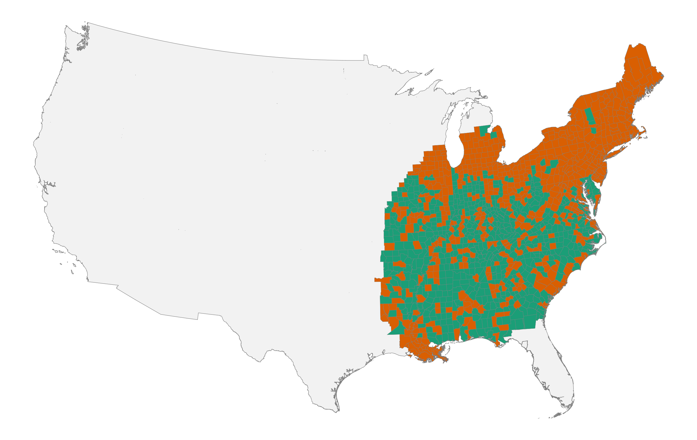
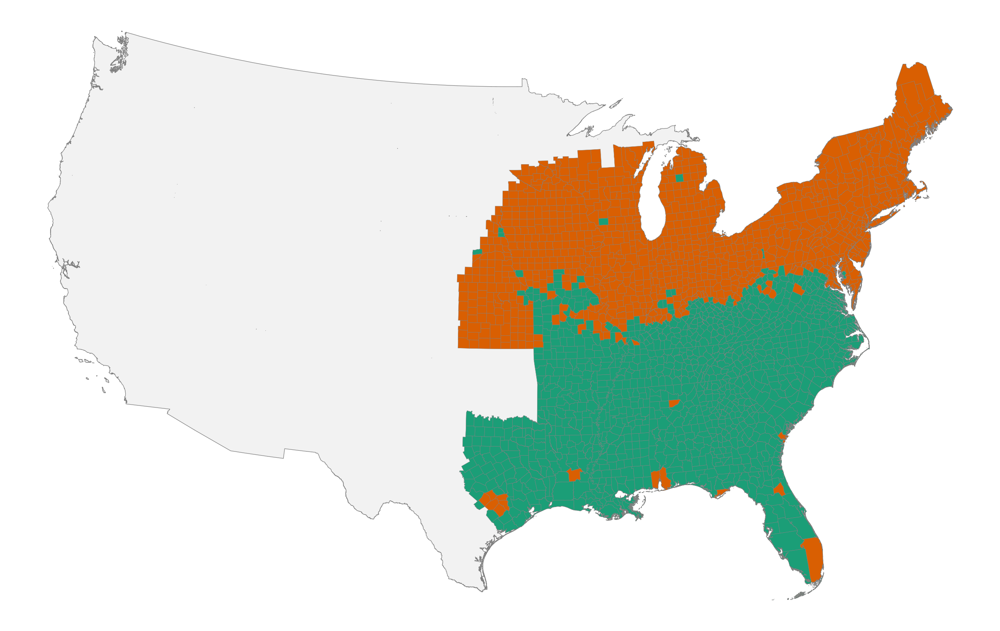
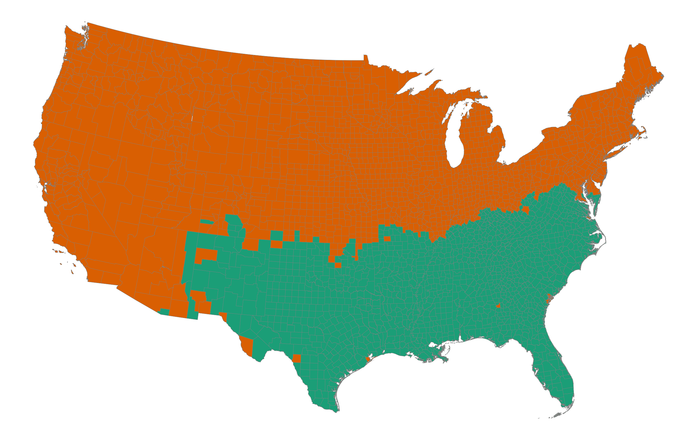
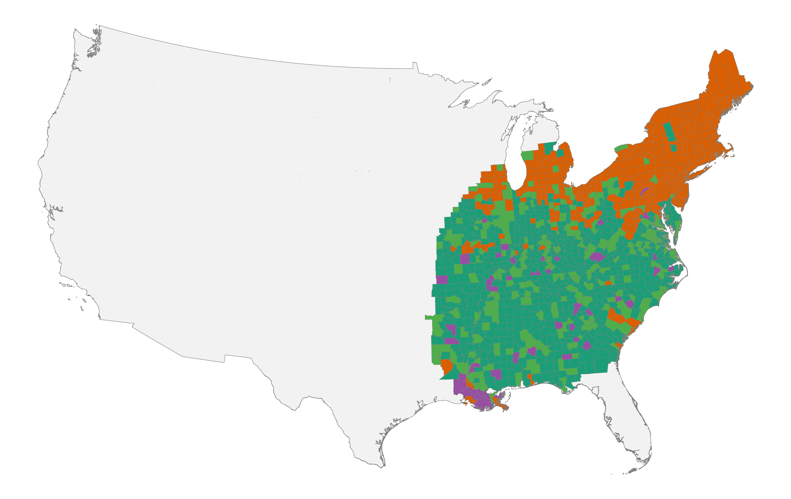
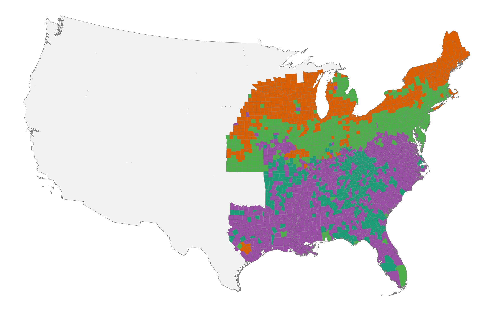
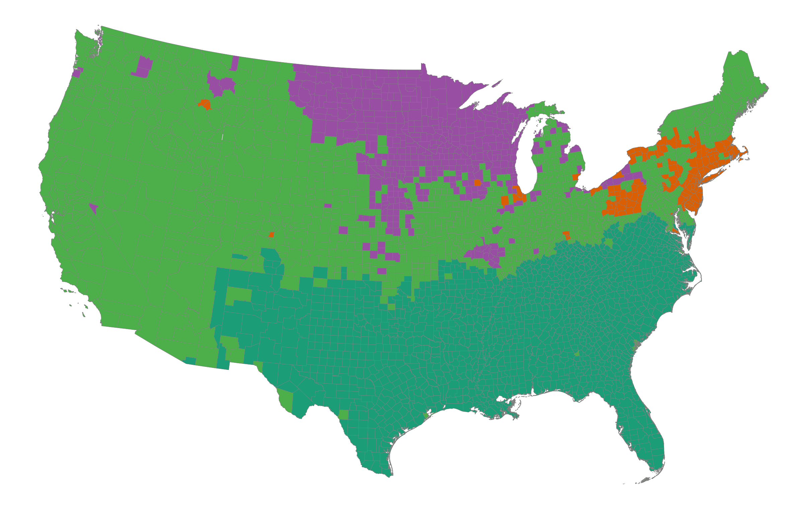
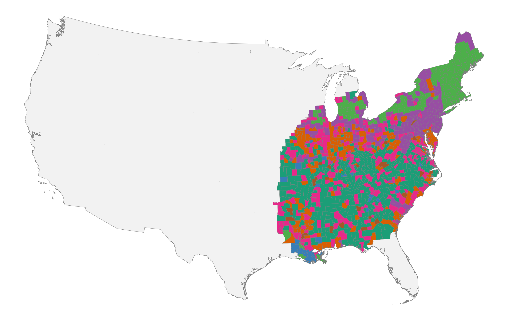
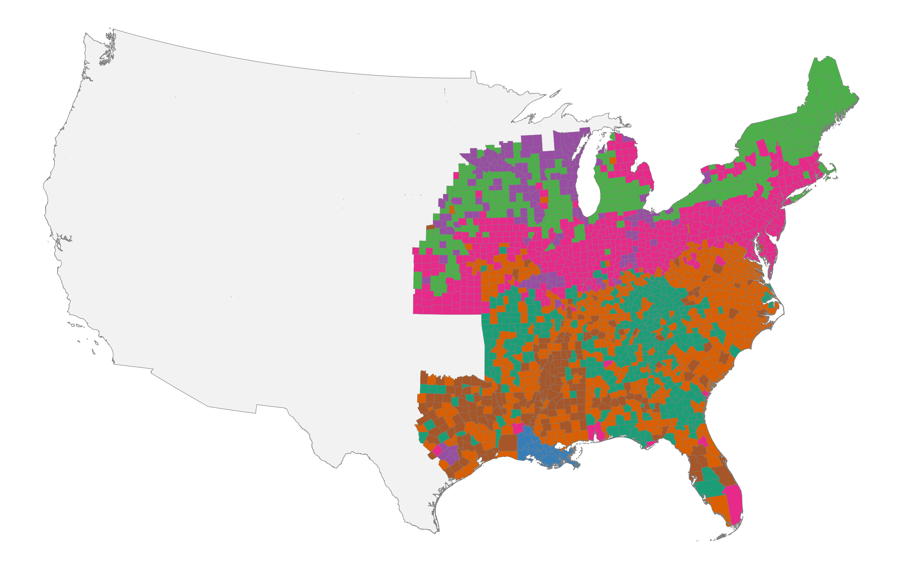
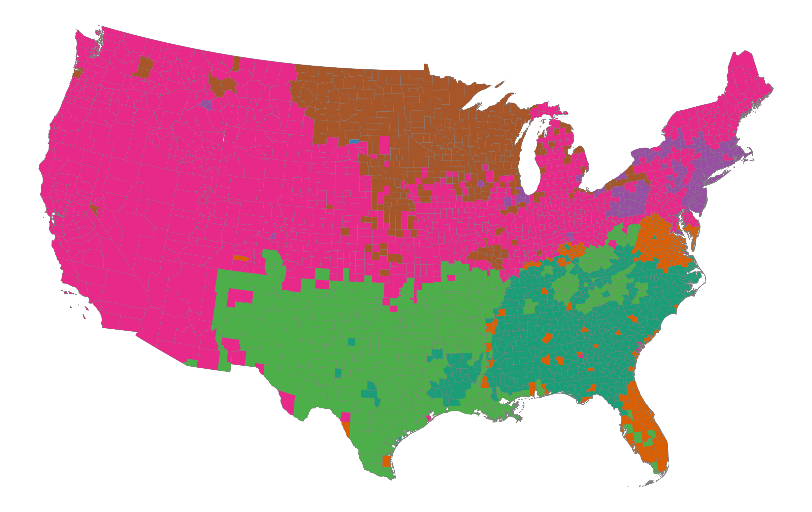

# Introduction

Economic development in the United States has unfolded within distinctive cultural contexts that played a central role in shaping regional trajectories of growth, institutional development, and social organization. Rather than being byproducts of material forces, culture, norms, and shared beliefs influence how markets function, which forms of commerce thrive, and what kinds of cooperation are sustainable [@guiso2006culture; @bisin2011culture; @nunn2012culture; @tabellini2010culture; @alesina2015culture; @greif2006institutions]. This perspective challenges explanations that reduce economic change to technology, geography, or factor endowments alone. Instead, culture both constrains and enables economic transformation, providing durable social foundations that persist even as material conditions evolve.

A distinctive feature of American development is the breadth of social life organized through voluntary association. Churches, civic organizations, political parties, reform movements, mutual aid societies, and commercial partnerships have long operated through consent rather than coercion. Tocqueville ([-@tocqueville2004] \[1835/1840\]) famously described this propensity as a defining characteristic of American democracy.[^4] Subsequent scholarship has linked associational life to social capital, trust, and institutional performance [@putnam1993; @putnam2000]. The United States became a society of organizations: political mobilization, moral reform, mutual aid, and community governance were frequently pursued through membership-based associations rather than centralized administration. In the nineteenth century, this encompassed both elite-oriented societies and mass-membership organizations, from national reform networks to local lodges and benevolent associations that provided insurance, identity, and channels for collective action in rapidly changing communities [@skocpol2003].

At the same time, American economic and institutional change has been regional. Patterns of industrialization and urbanization differed sharply between New England mill towns, Midwestern market centers, and the plantation South; religious adherence and revival traditions exhibited persistent geographic structure; and common-school reforms diffused unevenly across states and localities. Political competition likewise varied in organization and intensity across regions, even when operating under shared constitutional rules. If voluntary association is central to American development, then identifying the regional cultures that shape association is essential for understanding both persistence and change. In this paper, "regional culture" refers to locally shared practices that are reproduced through socialization and reinforced by community institutions. These cultures need not be immutable to matter; they can evolve while remaining regionally recognizable.

The origins of this voluntary society remain contested. One view emphasizes the transplantation of distinct colonial folkways that had to coexist in order to form a nation [@fischer1989; @woodard2011]. A related tradition identifies coherent cultural regions that persist into the present, organized around shared economic orientations, social attitudes, and political identities [@garreau1981; @zelinsky1992]. Another highlights frontier conditions and abundant land as the source of American individualism and associational forms [@turner1893significance; @bazzi2020frontier]. Institutional accounts stress constitutional design, federalism, and the diffusion of impersonal organizational forms [@north1990; @lamoreaux2021]. A further perspective attributes associational expansion to structural transformation and market integration during the nineteenth century [@sellers1991; @howe2007; @larson2009]. Each account implies a distinct geography and timeline of convergence. If markets and standardized institutions dominate, regional cultural differences should attenuate over time. If early-settler folkways establish durable baselines that are reproduced through churches, schools, and local governance, regional distinctions should remain legible well into the modern era.

These different perspectives have distinctive empirical implications. If modernization operated primarily through mobility, standardization, and national networks, the cultural map should flatten: counties should increasingly resemble one another in everyday social practices. If early cultural endowments mattered, the spatial imprint of those baselines should persist, perhaps adapting at the margins but remaining organized into coherent regions. In this sense, the question of regional cultural persistence is not merely descriptive; it bears directly on debates about path dependence, institutional complementarity, and the long-run effects of historical shocks [@arthur1989competing; @acemoglu2001colonial]. For our purposes, path dependence means that early settlement and institutional conditions may have resulted in novel "cultural equilibria" [see also @acemoglu2019narrow]. Institutional convergence can coexist with cultural persistence if shared legal forms are adopted and interpreted through locally durable norms.

This paper tests these competing claims. We define a "voluntary society" as the domain of social life organized through choice rather than coercion, including economic exchange, civic associations such as churches and reform societies, mutual aid and fraternal orders, and political participation through parties and elections. A voluntary society is not free of hierarchy, but it relies on consent, negotiation, and association rather than inherited status or centralized command. In what follows, we use naming-based cultural clusters as a measure of regional culture and ask whether coherent, durable cultural regions can be recovered from the historical record. The hypothesis we test is that cultural geography is empirically salient: that it can be detected in an everyday behavior, that it exhibits spatial coherence and temporal persistence, and that it survives the convergence forces of the nineteenth and early twentieth centuries. Establishing this foundation is a prerequisite for subsequent investigation of whether cultural regions organize variation in the institutions and associations that constitute a voluntary society.

To operationalize culture, we follow @zelinsky1970 and focus on naming practices between 1850 and 1930. Names have several advantages as cultural indicators. They are parent-chosen, stable over the life cycle, and often reflect religious, ethnic, and familial traditions. They are also consistently recorded in census sources at fine geographic levels. Naming has been shown to encode both cultural continuity and assimilation pressures [@smith1985; @watkins1994personal; @smith1994; @main1996; @lieberson2000matter; @abramitzky2020]. We treat each county's distribution of first names as a cultural "fingerprint" and use unsupervised clustering to group counties that are similar. The intuition is straightforward: counties sharing similar cultural environments should have more similar first-name distributions than counties anchored in different repertoires.

This approach serves three purposes. First, it provides a transparent and scalable measure of cultural similarity across U.S. counties using a consistently recorded behavior. Second, it allows us to test whether cultural regions were already present by 1850 and whether they persisted through 1930. This period spans the pre-Civil War decades when sectional identities and internal migration were already salient, the postbellum era of emancipation and rapid industrial expansion, and the peak decades of mass immigration and deepening national integration in the early twentieth century. Third, it establishes a framework that can be connected to independent markers of civic and institutional organization central to a voluntary society. If naming-based clusters recover meaningful cultural regions, those regions may also help organize variation in associational density, religious and civic institutions, and political participation, a question we return to in the conclusion.

The next two sections outline the major transformations (structural change, market integration, and the diffusion of impersonal institutions) that could have produced cultural convergence, and the competing thesis that early-settler folkways established durable baselines despite these forces.

# Forces of Convergence

Over the nineteenth and early twentieth centuries, three sets of forces worked to reshape the social foundations of American society: structural change in the economy, the market revolution, and the diffusion of impersonal institutions. Together, they increased geographic mobility, widened interregional exchange, and exposed individuals to common organizational frameworks. At the same time, these forces operated unevenly across a society divided by slavery. The plantation system organized economic and social life in the South along fundamentally different lines, and its abolition restructured but did not erase the regional cultural patterns it had sustained. If convergence forces dominated, inherited regional cultures should have attenuated. This is an empirical question.

The scale of structural change was vast. In 1800, more than 70 percent of the labor force worked in agriculture; by 1900 this share had fallen below 40 percent, and by 1950 it was less than 15 percent [@goldin1982; @hsus]. In the Early Republic, economic life was organized around households, kin networks, and congregations. Farm households coordinated labor internally and relied on extended family ties and neighborhood reciprocity to smooth risk [@henretta1978families]. Exchange was embedded in personal relationships, where reputation and communal oversight substituted for formal enforcement [@clark1990social]. The postal network, which expanded rapidly in this period, provided an early infrastructure for long-distance communication that connected even remote communities to wider circuits of news and commerce [@blevins2021paper]. Voluntary association took localized forms rooted in face-to-face interaction and shared norms.

Industrialization and urbanization altered this arrangement. As wage labor expanded and populations concentrated in cities, new organizational forms supplanted traditional kin-based networks: labor unions, mutual aid societies, fraternal organizations, and reform societies proliferated [@skocpol2003; @beito2000mutual]. These membership-based organizations provided insurance, structured social identity, and linked individuals to broader civic movements [@beito2000mutual; @clemens1997peoples]. Many operated under standardized constitutions, dues systems, and governance rules replicated across regions. The common-school movement diffused graded classrooms and standardized curricula [@kaestle1983; @tyack1974onebest], the high school movement linked educational expansion to the rising demand for skilled labor [@goldin1998highschool], and professional societies codified credentials and licensing requirements [@abbott1988system]. Through these developments, Americans were increasingly socialized into similar institutional forms even when residing in different regions.

These structural shifts coincided with a market revolution, which reoriented the economy between roughly 1815 and the Civil War from local exchange toward impersonal, long-distance markets [@sellers1991; @howe2007; @larson2009]. Technological innovations dramatically reduced transportation and communication costs. Canals linked interior regions to Atlantic ports; railroads created a national commercial network; and the telegraph enabled rapid communication across space [@fogel1964; @fishlow1965; @atack2013gis; @donaldson2016railroads; @rhode2021]. The postal network transmitted political news, religious tracts, and commercial information across vast distances [@john1995]. Participation in national markets exposed individuals to common price signals, contractual norms, and commercial practices, potentially encouraging convergence in expectations and everyday behavior.

Market integration interacted with migration regimes that reshaped population geography. Falling transport costs facilitated large-scale internal migration from New England and the Mid-Atlantic into the Old Northwest and, later, the Great Plains and Pacific Coast. Yankee migrants carried town-based institutions, schooling traditions, and religious forms that were often replicated in new settlements. Upland migrants from the Appalachian South moved into the Ohio Valley and lower Midwest, transmitting distinctive evangelical traditions and kin-based social structures across state lines. Westward expansion thus frequently involved the transplantation of established regional cultures rather than their dissolution.

Between 1850 and 1930, millions of European immigrants introduced new folkways into local contexts. In some settings, immigrant communities maintained distinct practices for generations; in others, assimilation into prevailing regional norms proceeded rapidly. New cultural layers were added to existing structures rather than uniformly replacing them. Moreover, the same communication networks that facilitated national reform movements (temperance, abolition, and religious revival) also accelerated sectional conflict over slavery. Market integration expanded the spatial reach of voluntary association while providing new arenas in which regional identities could be articulated. Structural change therefore does not mechanically imply homogenization; its cultural consequences depend on how mobility, market participation, and assimilation interact with inherited norms.

Institutional development reinforced these tendencies. The Constitution established a national framework of predictable rules: federalism constrained arbitrary authority, protections for property and contract facilitated exchange, and the Bill of Rights guaranteed freedoms of speech, press, religion, and assembly, providing legal foundations for civic association [@north1990; @wood2009empire]. Over the nineteenth century, institutional change moved broadly toward impersonal access and standardized rules. One of the most consequential transformations was the spread of general incorporation laws, which replaced particularistic legislative charters with open access to the corporate form [@lamoreaux2021; @hilt2008]. By lowering the costs of collective action and standardizing governance structures, general incorporation expanded both the scale and durability of voluntary associations. Churches incorporated trustees to hold property; mutual aid societies adopted constitutions modeled on statutory templates. The corporate form provided a common organizational technology that functioned similarly across states.

Financial and political institutions evolved along comparable lines. Early banks were chartered by state legislatures and embedded in personal networks [@lamoreaux1994]. Free banking laws in the antebellum period expanded entry, and the National Banking System promoted more uniform regulatory oversight across states [@sylla1969]. As credit markets deepened and capital became more mobile, economic actors operated within financial frameworks that extended beyond purely local trust networks. The emergence of durable mass political parties linked local communities into national coalitions [@aldrich1995whyparties; @wilentz2005rise].

Through newspapers, conventions, and committee structures, counties were connected to state and national leadership, and by the late nineteenth century party organization was deeply embedded in civic life [@white2017republic]. Even when conflict followed regional lines, party structures operated under common constitutional rules. Denominational networks linked congregations across regions, creating hierarchical organizational structures that transcended local boundaries while preserving theological variation. Together, these developments supplied organizational templates that extended across the country.

However, institutional convergence did not imply uniform experience. Participation in voluntary society was constrained by race, gender, and legal status. Enslaved people were denied basic freedoms of association; indigenous nations were excluded from constitutional protections; and women's political rights were limited well into the nineteenth century. Even where formal rules converged, local enforcement and informal norms varied substantially. The same incorporation statute could underpin different patterns of church governance; the same party structure could operate within distinct regional political cultures. Shared institutions provided common frameworks, but those frameworks were embedded in, and interpreted through, existing regional cultures.

The cumulative force of these transformations was enormous. Mobility, standardized economic incentives, impersonal exchange institutions, national media, professionalized organizational forms, and common legal structures all worked in the direction of convergence. If modernization operated primarily through these channels, regional cultural differences should have attenuated during the nineteenth and early twentieth centuries. The empirical question is whether structural change, market integration, and institutional diffusion produced convergence in everyday social practice, or whether regional cultures remained visible despite these forces.

# The Fischer Thesis

A prominent explanation for persistent regional differences in the United States is the cultural thesis advanced by @fischer1989. In broad outline, the argument holds that migrants from different regions of the British Isles transplanted coherent packages of norms and practices (religious observance, family structure, attitudes toward hierarchy, education, work, and law) to North America during the seventeenth and eighteenth centuries. These "folkways" structured everyday life and institutional development, establishing durable regional cultures that long outlived the original settlers. In this account, regional culture is not an epiphenomenon of later economic specialization; it is a foundational layer that shapes how subsequent institutions are adopted, interpreted, and reproduced.

Fischer identifies four groups. Puritans from East Anglia settled New England, emphasizing congregational self-government, literacy, covenant theology, and communal moral discipline. Royalist migrants from southern and western England dominated the Chesapeake, transplanting hierarchical social relations, Anglican religious forms, and gentry-led political culture. Quakers from the English Midlands shaped the Delaware Valley, privileging toleration, pluralism, pacifism, and commercial pragmatism. Borderers from the Anglo-Scottish frontier spread through the Appalachian backcountry, valorizing independence, local autonomy, evangelical religion, and codes of personal honor [@fischer1989]. Across domains ranging from church governance and inheritance practices to naming conventions, patterns of violence, and political organization, each group generated distinctive and internally coherent cultural profiles. The claim is not that these cultures were static, but that they supplied durable folkways that influenced subsequent development.

This perspective provides a mechanism for cultural persistence. Early settlers embedded norms within durable institutional arrangements: town meetings and congregational churches in New England; plantation hierarchies and Anglican parishes in the Chesapeake; pluralistic assemblies and commercial networks in the Delaware Valley; decentralized county structures and kin-based settlement in the backcountry. These institutions shaped patterns of landholding, schooling, dispute resolution, and elite formation. Cultural traits could persist not because they were immutable, but because they were reinforced by institutional complementarities. Norms supportive of literacy were complemented by school systems; hierarchical social expectations were reinforced by plantation economies; traditions of local autonomy were embedded in decentralized political structures. Through intergenerational transmission, selective migration, marriage patterns, and institutional reproduction, regional cultures could remain stable even as economic circumstances changed.

In this framework, persistence operates through feedback between norms and institutions. Once a region is organized around particular church polities, schooling systems, inheritance rules, and elite recruitment patterns, these institutions reward behaviors consistent with prevailing norms and discourage deviations. Such complementarities can generate what @arthur1989competing describes as path-dependent equilibria: early institutional-cultural configurations channel subsequent development along distinct trajectories. Regional divergence is therefore not merely an artifact of initial conditions but the outcome of self-reinforcing dynamics.

The thesis has testable implications. Communities founded by different settlement groups should display recognizable continuities in measurable behaviors generations later. If attitudes toward authority, trust, education, honor, and association are embedded in regional folkways, variation in civic organization, political mobilization, religious participation, violence, and everyday social practice should reflect these deep cultural baselines. Even if economic structures converge, cultural regions should remain legible in domains of family behavior, naming, and associational life.

There are complementary accounts in the literature. @garreau1981 argues that North America divides into nine coherent "nations" defined by shared economic interests, cultural attitudes, and political orientations, from the resource-extractive "Empty Quarter" of the interior West to the industrial "Foundry" of the Great Lakes and the agrarian-traditionalist "Dixie" of the Southeast. Although Garreau's regions are drawn from contemporary observation rather than historical settlement, their boundaries often align with Fischer's folkway zones, suggesting that the cultural imprints of early settlement remained visible in late-twentieth-century social and economic life.

@woodard2011 extends this tradition, arguing that North America comprises a wider mosaic of enduring cultural regions extending beyond the four British folkways, incorporating French, Dutch, Spanish, and later settlement layers. @zelinsky1970 and @zelinsky1992 document persistent spatial patterns in naming, dialects, and religious adherence well into the twentieth century, suggesting that cultural geography can be empirically recovered from everyday behavior. Together, this literature implies that first-settler cultures may cast long shadows even amid migration, industrialization, and market integration. Cultural layers accumulate rather than disappear, producing nested regional identities.

At the same time, important critiques caution against cultural determinism [@appleby1992liberalism]. Settlement was not random; migrants selected destinations compatible with their economic interests, religious commitments, and institutional preferences. Cultural traits may therefore reflect endogenous sorting as much as transplantation. A more fundamental objection is that observed regional differences may reflect geography and economics rather than culture per se.

The South is distinguished by climate, soil, and the plantation complex; the North by temperate agriculture and early industrialization. If naming patterns correlate with agricultural systems, urbanization, or labor market structure, clustering might recover economic regions rather than cultural ones. This concern cannot be fully resolved with naming data alone, but two features of our results bear on it: cluster boundaries do not align with state lines or the free-slave border (counties in free states cluster with the South when their settlement history warrants it), and the hierarchical structure of the clusters (New England distinct from the Mid-Atlantic, Appalachia from the Deep South) crosscuts simple economic geography. Moreover, culture co-evolved with material conditions. Plantation slavery in the South was not simply an inherited British folkway but a system that reshaped social hierarchy, law, and everyday norms over generations. Indigenous displacement, frontier violence, and federal land policy altered the institutional environment in which regional cultures developed. Later waves of immigration, from Ireland and Germany in the mid-nineteenth century to southern and eastern Europe in the late nineteenth and early twentieth centuries, introduced new religious traditions, naming practices, and associational forms that interacted with existing regional baselines. Regional development was therefore the product of cultural and institutional interactions rather than a simple transplantation of British origins.

These considerations suggest two competing but not mutually exclusive possibilities. One is that early-settler folkways established durable macro-regional baselines that structured subsequent adaptation, even as new groups and institutions layered onto them. Another is that structural transformation, emancipation, mass migration, and institutional convergence reshaped local norms sufficiently to attenuate colonial-era distinctions. The empirical question is not whether culture changes, but whether the spatial organization of cultural groups persists in ways that are consistent with early settlement.

Naming practices provide a tractable domain in which to test these claims. @zelinsky1970 documents systematic regional variation in first names in the eastern United States, and subsequent research shows that naming responds to cultural continuity and assimilation pressures [@main1996; @smith1985; @smith1994; @abramitzky2020]. Names are parent-chosen signals that encode religious affiliation, ethnic background, and familial traditions; they are consistently recorded in census data; and they can be aggregated at fine geographic scales. Because naming decisions occur within families yet reflect broader social influences, they provide a window into locally shared identities. If counties share common cultural baselines transmitted across generations, their naming distributions should align. Alternatively, if regional distinctions dissolved under the pressures of migration and modernization, naming patterns should converge.

Our empirical strategy builds on this insight. Using complete-count census data from 1850, 1880, and 1930 [@ruggles2024ipums], we construct county-level first-name distributions and cluster counties according to the similarity of their name shares. The Fischer thesis implies that recovered clusters should correspond, at least in broad outline, to historical settlement patterns and remain recognizable over time, even as their geographic footprint expands or contracts [@fischer1989; @garreau1981; @zelinsky1970; @zelinsky1992]. If modernization instead produced convergence, regional clustering in naming practices should weaken across decades, and spatial boundaries should blur.

The clustering analysis therefore provides a test of cultural persistence. By examining whether spatially coherent naming regions emerge and remain stable despite structural transformation, emancipation, institutional convergence, and mass migration, we provide a window into whether the cultural groups defined by early settlement continued to shape the United States across subsequent generations.

# Clustering Regional Cultures

To assess whether regional cultures are visible in naming practices, we employ a clustering approach that allows groupings to emerge from the data without imposing *ex ante* regional boundaries. Our objective is to recover county groups with similar first-name distributions and evaluate whether the resulting clusters correspond to historically meaningful cultural regions. If regional cultures structured everyday social life and voluntary association, they should leave detectable traces in the spatial distribution of names. At the same time, clustering does not presuppose which regions should exist; any spatial coherence that emerges is a property of the data rather than an artifact of predefined categories.

The data are drawn from complete-count census records [@ruggles2024ipums]. After excluding counties where settlement was still frontier in character at the time of each census [@bazzi2020frontier], the sample includes 1,344 counties in 1850, 2,054 in 1880, and 3,100 in 1930, reflecting the westward expansion of settled territory. For each county, we observe the full distribution of white first names recorded in the census. The resulting name vectors are high-dimensional: 26,438 distinct forenames appear in 1850, 34,216 in 1880, and 41,594 in 1930. No minimum frequency threshold is imposed so that all recorded names enter the analysis.

To start, we construct $s_{ij}$, the share of first name $i$ in county $j$. Using shares rather than counts normalizes for population differences and ensures that comparisons reflect compositional rather than scale differences. Each county is represented by a vector of name shares, $\mathbf{s}_j = (s_{1j}, s_{2j}, \dots, s_{nj})$, where $n$ denotes the number of distinct forenames observed in that census year. Cultural similarity is proxied by similarity in these distributions. Naming is not treated as a comprehensive measure of culture, but as an observable and consistently recorded domain in which locally shared identities are likely to manifest.

Following @hoberg2016, we measure similarity using cosine similarity. After normalizing each vector to unit length, the cosine similarity between counties $j$ and $j’$ is $$\begin{equation}
\cos \theta_{jj’} =
\frac{\sum_{i=1}^n s_{ij} s_{ij’}}
{\sqrt{\sum_{i=1}^n s_{ij}^2} \sqrt{\sum_{i=1}^n s_{ij’}^2}}.
\end{equation}$$ Cosine similarity emphasizes proportional resemblance rather than absolute magnitudes. Because it is a monotonic transformation of Euclidean distance for normalized vectors, clustering on cosine similarity is equivalent to clustering on Euclidean distance after normalization. This approach is well suited to high-dimensional compositional data in which relative frequencies carry the relevant information and in which differences in overall population size are not substantively meaningful.

We partition counties using agglomerative hierarchical clustering with Ward's minimum variance criterion [@ward1963]. The algorithm begins with each county as its own cluster and iteratively merges the pair that generates the smallest increase in within-cluster sum of squares. The resulting dendrogram provides a nested representation of similarity across counties. Intuitively, the procedure measures how alike two counties' naming patterns are, then groups the most similar counties together, building up from pairs to larger groupings. Because the algorithm receives no information about geography, any spatial coherence in the resulting clusters reflects underlying cultural similarity rather than mechanical smoothing. If clusters align along contiguous geographic lines, that alignment is evidence that naming practices were regionally distinctive. We discuss results for two, four, and seven clusters.[^5]

Our sample is restricted to white individuals. In 1850, we begin with counties in the settled core of the United States and expand westward in later decades as settlement spreads.[^6] Restricting attention to established counties reduces distortions from frontier demographic imbalance, while focusing on whites mitigates the large compositional break introduced by emancipation and the post-Civil War enumeration of formerly enslaved individuals. This restriction allows clearer intertemporal comparison of naming patterns within a relatively stable population, though it necessarily abstracts from the profound cultural contributions of Black and Indigenous communities. Clustering is performed separately for each census year, allowing us to trace the evolution of regional cultural structure through slavery, emancipation, industrialization, westward expansion, and the age of mass migration.

This approach provides a direct test of competing hypotheses. If early settlement patterns established durable cultural baselines, geographically coherent clusters should be present by the middle of the nineteenth century and remain recognizable despite economic transformation and institutional convergence. If market integration, emancipation, internal migration, and mass immigration homogenized everyday practice, regional distinctions should weaken over time, cluster boundaries should blur, and spatial coherence should diminish. The clustering results can be evaluated against these predictions using formal tests of spatial coherence, temporal persistence, and cluster stability.

Clustering counties into two groups in 1850 reveals a striking and spatially contiguous division. As shown in Figure [\[fig:twoclusters\]](#fig:twoclusters){reference-type="ref" reference="fig:twoclusters"}, a broad cultural boundary separates New England and much of the northern tier from the South and parts of the lower Midwest. This spatial coherence is not an artifact of visual impression.[^7] Beyond local adjacency, the clusters form large contiguous blocks: for two clusters in 1930, over 98 percent of each cluster's counties belong to a single connected component. Even in 1850, when county coverage is more limited, observed clusters contain fewer spatially disconnected fragments than would arise under random labeling. The geographic structure of naming patterns is not merely statistically detectable; it organizes the landscape into coherent cultural regions.

Importantly, the 1850 boundary does not coincide mechanically with the free-slave political line. Counties in southern Ohio, Indiana, Illinois, and western Pennsylvania cluster with the South, despite being located in free states. These counties were heavily influenced by upland migration from the Appalachian backcountry, carrying evangelical religious traditions and kin-based social structures across formal state boundaries. Naming practices therefore appear to track settlement corridors and cultural transmission more closely than contemporaneous legal status.

The presence of a coherent regional division prior to the Civil War is noteworthy. It indicates that cultural structure was already spatially organized before the institutional rupture of emancipation and before the peak of industrialization and national market integration. In other words, the baseline cultural geography predates many of the forces typically associated with convergence. The North-South cleavage visible in naming distributions aligns broadly with historically recognized macro-regions, suggesting that first-settler patterns left measurable imprints on everyday social practice.

Extending the analysis to 1880 and 1930 reveals both persistence and asymmetry. The North-South cleavage sharpens and remains spatially coherent[^8] despite emancipation, Reconstruction, rapid industrial growth, and substantial declines in transportation and communication costs. By 1880, counties across the Midwest and western frontier increasingly align with the northern cluster, while the Southeast and lower Mississippi Valley retain a coherent southern grouping. By 1930, most counties outside the South fall within a single northern bloc, whereas the South continues to exhibit a distinct naming regime. We measure this persistence formally by matching counties across census years and computing the fraction that retain the same cluster assignment, using optimal label alignment to account for arbitrary labeling differences across independently clustered years.[^9]

The persistence of a cluster in the South after emancipation is striking. The end of slavery transformed the legal and economic foundations of southern society. Yet the cultural boundary identified in 1850 remains visible decades later. Because our baseline sample focuses on whites, this persistence reflects continuity within the white population despite sweeping institutional change. Cultural characteristics embedded in churches, schools, and local networks appear to have adjusted more slowly than formal legal rules. Institutional convergence, in other words, did not immediately dissolve inherited regional baselines [see also @ager2021intergenerational].

The consolidation is asymmetric. Northern counties increasingly converge toward a relatively homogeneous naming regime by 1930, while the South retains visible internal differentiation, particularly across Appalachia, the Upper South, and the Deep South plantation belt. Upland counties shaped by Scots-Irish migration remain distinguishable from lowland plantation regions associated with Tidewater settlement patterns [@fischer1989]. Appalachia, characterized historically by decentralized settlement and evangelical religious forms, appears distinct from the plantation-dominated Deep South, where hierarchical social structures were reinforced by slavery. The internal structure of the South thus remains legible in naming practices even as northern counties exhibit convergence.

This asymmetry aligns with differing historical trajectories. The North experienced rapid industrialization, dense urbanization, mass public schooling, and large inflows of European immigrants between 1880 and 1920. Northern cities drew migrants from multiple origins into shared labor markets, neighborhoods, and public institutions. Common schools socialized children of diverse backgrounds into uniform curricula; intermarriage across ethnic lines accelerated after the first generation; and nationally circulating media, standardized credentials, and intercity labor markets plausibly promoted cultural mixing, encouraging convergence across formerly distinct subregions.

By 1930, the naming distributions of counties in New England, the Mid-Atlantic, and the Upper Midwest had converged sufficiently to fall within a single broad cluster, despite the substantial ethnic heterogeneity of these areas. By contrast, the South's postbellum development remained more regionally segmented. Racial hierarchy structured social interaction across counties. Agriculture persisted as the dominant sector longer than in the North, maintaining the local kin-based networks that may have sustained distinctive naming traditions. Foreign immigration to the South was comparatively low, reducing the assimilative pressures that might have disrupted inherited naming patterns. The result was a region in which Appalachian, Upper South, and Deep South subcultures remained distinguishable from one another in ways that the northern subregions did not. Modernization did not operate symmetrically across regions.

The age of mass migration provides a particularly stringent test of cultural persistence. Between 1880 and 1920, millions of immigrants from southern and eastern Europe settled in northern cities. If immigration had fundamentally restructured local cultural baselines, one would expect fragmentation or reconfiguration of northern naming clusters by 1930. Instead, northern counties consolidate into a broadly coherent regional regime. This pattern is consistent with rapid assimilation into prevailing regional cultural groups or with the interpretation that clustering captures deeper structural similarities that persist even as ethnic composition changes. Cultural regions appear capable of absorbing new layers without losing their overall structure.

Counties in the trans-Mississippi West progressively align with the northern cluster. Although western counties appear more fragmented in 1850, reflecting frontier turnover and demographic imbalance, by 1880 and especially 1930 they largely integrate into the northern naming regime. Settlement corridors, railroad expansion, and federal land policy facilitated the transplantation of institutional forms and social networks from the Northeast and Midwest into the Great Plains and Pacific Coast. Migration from New England and the Mid-Atlantic into the Upper Midwest transmitted established naming practices westward [@turner1893significance]. Westward expansion thus appears to extend existing cultural regions geographically rather than generate an entirely new western regime. Cultural geography spreads through migration rather than dissolving at the frontier.

Allowing the number of clusters to increase reveals that the North-South divide constitutes the primary axis of variation in naming distributions. As the number of clusters rises, the initial partition remains intact and serves as the backbone for finer subregional distinctions. In Figure [\[fig:fourclusters\]](#fig:fourclusters){reference-type="ref" reference="fig:fourclusters"}, for four clusters, the North subdivides into broadly recognizable eastern and western components while the South separates along Upper South and Deep South lines.[^10][^11] From Figure [\[fig:sevenclusters\]](#fig:sevenclusters){reference-type="ref" reference="fig:sevenclusters"}, for seven clusters, New England, the Mid-Atlantic, and Appalachia emerge as distinct groupings nested within the earlier macro-regions. This hierarchical nesting, in which large regions subdivide along intuitive historical lines rather than fragmenting arbitrarily, is consistent with a model of cultural development in which broad settlement patterns establish macro-regional baselines that later differentiate into coherent subcultures [@arthur1989competing].

At higher levels of disaggregation, the algorithm identifies persistent subregions whose boundaries are spatially contiguous and historically plausible [@fischer1989; @garreau1981]. New England separates from the broader North in ways consistent with its early emphasis on congregational governance and literacy; the Mid-Atlantic reflects its pluralistic and commercial heritage; Appalachia exhibits patterns consistent with backcountry settlement and evangelical traditions; and the Deep South retains distinctive profiles associated with plantation society.[^12]

Matching cluster centroids across census years shows that the cultural signatures of major regions remain recognizable between 1850 and 1930, even as their geographic footprint evolves. For two clusters, 428 of 1,344 matched counties (32 percent) shift cluster membership between 1850 and 1880, but only 114 of 2,052 matched counties (6 percent) shift between 1880 and 1930. The declining rate of boundary movement is consistent with a cultural geography that consolidated over time rather than dissolving. Counties that do shift membership are disproportionately located along historically recognized borderlands: the Ohio Valley, Kentucky, Missouri, and parts of Maryland and West Virginia, where mixed settlement from both northern and southern migration streams made cultural boundaries fluid. These borderland counties exhibit lower silhouette scores than interior counties, indicating weaker attachment to either cluster, which is precisely what one would expect in zones of overlapping cultural influence. Borderlands function as areas of interaction, where competing groups coexist and adaptation is more likely. Cultural boundaries thus appear durable but permeable: they channel development without rendering change impossible.

These results indicate that regional cultures were legible in mid-nineteenth-century naming practices and remained detectable nearly a century later. Strong geographic structure is evident in 1850, prior to the Civil War and large-scale industrialization, and persists through emancipation, Reconstruction, mass immigration, and national market integration. Our formal tests confirm that the recovered clusters are spatially coherent, temporally persistent, and robust to resampling, while the hierarchical organization of the dendrogram yields historically interpretable subregions at multiple resolutions. The stability, spatial coherence, and hierarchical organization of the recovered clusters are consistent with a framework in which early settlement patterns established durable cultural baselines that continued to shape social identity and voluntary association across generations.

The results also provide a bridge to the broader question motivating this paper. If naming-based cultural regions are not only statistically recoverable but historically interpretable, they raise the question of whether cultural geography organizes variation in civic and institutional outcomes. Do counties embedded in distinct cultural regions differ systematically in associational density, political organization, or educational development? The clustering framework developed here provides the foundation for investigating these questions: having established that coherent, stable, and hierarchically organized cultural regions can be recovered from naming data, subsequent work can link these regions to measures of voluntary association and institutional life.

# Conclusion

This paper provides evidence that regional cultures in the United States were both apparent in everyday social practice and persisted across generations. Using detailed data on first-name distributions and a clustering algorithm, we recover spatially coherent cultural regions as early as 1850. These regions align closely with historically recognized settlement patterns, remain prominent through 1930, and display a hierarchical internal structure consistent with layered cultural development. The temporal stability of their underlying name-share profiles indicates that cultural groups can endure even as economic and political institutions evolve.

The persistence of these cultural regions is not uniform. Northern counties converge into a relatively homogeneous cluster by the early twentieth century, likely reflecting industrialization, urbanization, mass schooling, and national media. The South, by contrast, retains internal differentiation rooted in distinct settlement histories and social organization. Counties in the trans-Mississippi West increasingly align with preexisting northern cultural groups, suggesting that migration replicated established naming conventions rather than generating entirely new regional identities. Modernization reshapes regional cultures but does not erase their spatial organization.

These findings speak to a broader debate in economic history and development about the durability of cultural traits. Markets, standardized institutions, and national communication networks are powerful forces for convergence. Yet the evidence here indicates that such forces did not fully homogenize everyday social practice. Instead, institutional convergence coexisted with persistent regional structure. The recovered clusters align broadly with cultural regions identified through independent methods, from @fischer1989's ([-@fischer1989]) colonial folkways to @garreau1981's ([-@garreau1981]) late-twentieth-century "nine nations" and @woodard2011's ([-@woodard2011]) eleven rival regional cultures, suggesting that naming-based clusters capture real and durable features of American cultural geography. The results are consistent with models of path dependence in which early settlement and institutional configurations shape long-run trajectories of social organization, voluntary association, and institutional adaptation.

These findings have implications for understanding changes in the twenty-first century. A defining feature of liberal and democratic societies is the coexistence of shared formal institutions with diverse local practices, what Tocqueville recognized as the interplay between national law and local association. The cultural regions we recover illustrate this coexistence concretely. Between 1850 and 1930, Americans adopted common constitutional rules, participated in national markets, and organized through standardized corporate and political forms. Yet underneath this institutional convergence, regionally distinctive patterns of everyday social practice persisted. The same legal framework supported different forms of community organization, religious observance, and civic life in New England and the Deep South. Shared rules did not produce shared culture. This finding is relevant to contemporary debates about whether liberal institutions require cultural homogeneity to function, or whether they can sustain, and even depend upon, cultural pluralism. The American experience suggests the latter: a voluntary society operated across deep cultural divisions, precisely because its institutional architecture accommodated regional variation.

At the same time, the asymmetry we document, northern convergence alongside persistent southern distinctiveness, raises questions about the conditions under which cultural pluralism becomes politically destabilizing. If regional cultures are durable enough to survive industrialization, mass migration, and institutional reform, they are also durable enough to sustain divergent political identities. The sectional tensions visible in antebellum naming patterns did not dissolve after the Civil War; they reorganized. The persistence of regional cultural structure may therefore illuminate not only the resilience of free societies but also their vulnerabilities, insofar as durable cultural divisions can be mobilized for political conflict as readily as for local self-governance.

The findings also suggest that cultural geography is a meaningful dimension of economic analysis. Regional differences in norms, identity, and social networks persist alongside formal institutional convergence, potentially influencing patterns of human capital accumulation, political behavior, and economic exchange. By demonstrating that cultural regions are empirically recoverable from naming practices, we provide one approach to integrating cultural persistence into the study of long-run development.

Our analysis leaves an opening for future work. Our focus on whites facilitates intertemporal comparison but necessarily abstracts from the central role of Black, Indigenous, and immigrant communities in shaping American cultural life. The exclusion is particularly consequential for a study framed around voluntary society: the most fundamental violation of voluntary association in American history was the enslavement of millions of Black Americans, and the cultural geography of the South cannot be fully understood without accounting for the interactions between white and Black naming traditions, religious practices, and community institutions. Black naming practices were themselves regionally structured, shaped by the conditions of enslavement, the influence of slaveholders' naming conventions, and the distinctive religious and kinship networks that developed within enslaved communities.

After emancipation, the naming choices of former slaves and their descendants often diverged sharply from white patterns, as families adopted surnames and given names that asserted autonomy and memorialized kin ties severed by slavery [@gutman1976black]. Including Black populations in the clustering analysis would likely alter the recovered cultural geography of the South, potentially revealing a more complex pattern in which white and Black cultural regions overlap geographically but differ in internal structure. Whether inclusion would reinforce the North-South divide (because Black naming traditions in the South differed from both white northern and white southern patterns) or crosscut it (because Black naming practices shared features across the South regardless of subregional white variation) remains an open question.

Naming is, moreover, an observable proxy for cultural groups, not a complete measure of values or beliefs. County boundaries and demographic composition also evolve over time. Future work can build on this approach by incorporating additional populations, alternative cultural indicators, and finer measures of institutional outcomes. A particularly important avenue is to better understand the factors that link cultural clusters across time: because each year is clustered independently, identifying which forces cause a region's cultural profile to persist, converge, or diverge across decades remains an open empirical question. Linking cultural clustering more directly to educational attainment, associational density, political participation, and intergenerational mobility would further clarify the mechanisms through which early settlement patterns continue to shape economic and social outcomes.

Taken together, the evidence suggests that culture is neither epiphenomenal nor static. It evolves, adapts, and absorbs new influences, yet retains spatial structure that reflects historical origins. Understanding how such durable cultural geographies interact with markets, institutions, and the practice of self-governance remains central to explaining not only long-run patterns of American development but also the conditions under which free societies cohere.

<figure data-latex-placement="t">
<figure>

<figcaption>1850</figcaption>
</figure>
<figure>

<figcaption>1880</figcaption>
</figure>
<figure>

<figcaption>1930</figcaption>
</figure>

<em>Notes:</em> Counties are clustered into two groups in each census year using hierarchical agglomerative clustering with Ward’s minimum-variance method applied to cosine-normalized first-name share vectors. Clustering is performed separately for each year. The sample includes white individuals. Colors indicate cluster membership and do not impose any geographic structure. Spatial contiguity reflects similarity in naming distributions rather than administrative boundaries. See text for sample definition by year.

<figcaption>1930</figcaption>
</figure>

<figure data-latex-placement="t">
<figure>

<figcaption>1850</figcaption>
</figure>
<figure>

<figcaption>1880</figcaption>
</figure>
<figure>

<figcaption>1930</figcaption>
</figure>

<em>Notes:</em> Counties are clustered into four groups in each census year using hierarchical agglomerative clustering with Ward’s minimum-variance method applied to cosine-normalized first-name share vectors. Clustering is conducted separately by year. The sample includes white individuals. Colors indicate cluster membership and do not impose any geographic structure. Spatial contiguity reflects similarity in naming distributions rather than administrative boundaries. See text for sample definition by year.

<figcaption>1930</figcaption>
</figure>

<figure data-latex-placement="t">
<figure>

<figcaption>1850</figcaption>
</figure>
<figure>

<figcaption>1880</figcaption>
</figure>
<figure>

<figcaption>1930</figcaption>
</figure>

<em>Notes:</em> Counties are clustered into seven groups in each census year using hierarchical agglomerative clustering with Ward’s minimum-variance method applied to cosine-normalized first-name share vectors. Clustering is conducted separately by year. The sample includes white individuals. Colors indicate cluster membership; the seven clusters reflect a higher level of disaggregation. Spatial coherence emerges from similarity in naming distributions rather than imposed geographic boundaries. See text for sample definition by year.

<figcaption>1930</figcaption>
</figure>

[^1]: Department of Economics, University of Colorado, Boulder. `tjaworski@gmail.com`

[^2]: Smith Institute for Political Economy and Philosophy, Chapman University. `ekimbrough@gmail.com`

[^3]: The authors thank the Kay Family Foundation for funding. We thank Allison Ma, Pranit Nanda, Manav Chakravarthy, Emma Kochenderfer, and Anna Pasnau for excellent research assistance. We have benefited from feedback from Derek Amlicke, Jonathan Hersh, Christopher Kitchens, Michael Makowsky, Steve Pittz, Mikhail Poyker, Tzachi Raz, Nicole Saito, Constantine Vassiliou, and participants at the 2018 meetings of the Association for the Study of Religion, Economics and Culture and the 2025 conference on Free Societies in Crisis at the University of Texas at Austin's School of Civic Leadership.

[^4]: The contrast to the voluntary characteristics emphasized by Tocqueville is slavery and the freedoms of association, mobility, and contract denied to millions of people. Tocqueville himself recognized this tension, observing that slavery undermined the habits of industry, enterprise, and self-governance that characterized free society, and that the institution produced distinct social and economic patterns across the South that set it apart from the North. Recent work by @bleakley2023 examines Tocqueville's observations more formally, using population movements to reveal how slavery shaped institutional preferences and contributed to the durable divergence between Southern and Northern developmental paths.

[^5]: Silhouette analysis for between two and twenty clusters confirms that these values span the range of well-supported groupings. The silhouette score for each county measures how similar it is to its own cluster relative to the nearest alternative, ranging from $-1$ for a poor fit to $1$ for a strong fit; the mean across counties summarizes overall cluster quality. Mean silhouette scores are highest between two and four clusters across all three years (0.27--0.34), declining at higher numbers of clusters as finer partitions begin to split genuinely similar counties. Rather than identifying an optimal number of clusters, the silhouette profile supports interpreting the data at multiple resolutions, from a primary macro-regional divide to finer subregional distinctions.

[^6]: We define frontier counties using the 100-kilometer frontier boundary from @bazzi2020frontier. Counties classified as within this frontier zone are excluded, and the remaining settled interior forms the analysis sample. This provides a systematic, county-level criterion for distinguishing established settlement from frontier areas, rather than relying on state-level exclusion decisions. Indian Territory is also excluded in 1880. By 1930, the frontier had closed; only Alaska and Hawaii are excluded.

[^7]: A permutation-based join count test, which compares the number of same-cluster neighboring county pairs to a null distribution generated by randomly reassigning cluster labels, rejects random spatial assignment at every year and cluster resolution we examine ($z$-scores ranging from 18 to over 146; $p<0.001$ in all cases).

[^8]: The two-cluster partition yields consistent mean silhouette scores across all three years: 0.27 in 1850, 0.29 in 1880, and 0.34 in 1930. Bootstrap resampling confirms that the binary North-South divide is well-defined, with mean adjusted Rand indices of 0.55 in 1850, 0.82 in 1880, and 0.81 in 1930, indicating that the partition is substantially more stable in later years.

[^9]: For two clusters, 94 percent of counties retain the same assignment between 1880 and 1930, far exceeding the 50 percent expected under random reassignment ($z=66$, $p<0.001$). Across the entire period we consider from 1850 to 1930, persistence remains significant at 67 percent ($z=19$, $p<0.001$). Persistence is statistically significant across all year-pairs and the number of clusters we examine, though it declines at finer resolutions, where boundary counties are more likely to shift between adjacent subregions.

[^10]: To assign consistent colors across years, we match clusters using a hierarchical procedure that exploits the nested structure. Because cluster centroids are high-dimensional name-share vectors dominated by nationally common names, pairwise cosine similarities between clusters are compressed in a narrow range, making direct similarity-based matching unreliable. Instead, we first match the coarsest partition (two clusters) across years, then match finer partitions (four, seven clusters) subject to a penalty for assignments that violate this nesting. This procedure anchors finer matches to the well-identified coarse structure. Colors across years are therefore approximately but not perfectly aligned: the clustering itself identifies distinctive groups at each resolution, but linking those groups across independently clustered years remains inherently difficult when name distributions overlap substantially.

[^11]: In 1850, the most internally cohesive cluster (677 counties) achieves a mean silhouette score of 0.38, while the remaining clusters, which include borderland and transitional counties, score lower ($-$`<!-- -->`{=html}0.02--0.30), consistent with the expectation that boundary regions are less sharply defined. By 1930, the four-cluster partition stabilizes: three of the four clusters achieve silhouette scores of 0.27--0.49 (with the fourth, a transitional grouping, scoring 0.10), and the Deep South cluster remains the most internally cohesive (0.49, 140 counties).

[^12]: Bootstrap resampling provides a check on the robustness of these groupings: resampling counties with replacement and re-clustering 500 times yields mean adjusted Rand indices of 0.50--0.63 at four and seven clusters, where the adjusted Rand index measures the agreement between two partitions on a scale from 0 (no better than random) to 1 (identical), indicating that the broad regional structure is consistently recoverable regardless of which particular counties are included. With eleven clusters, stability declines (mean adjusted Rand index 0.45--0.50), suggesting that the finest subregional distinctions are more sensitive to sample composition and should be interpreted with appropriate caution.
